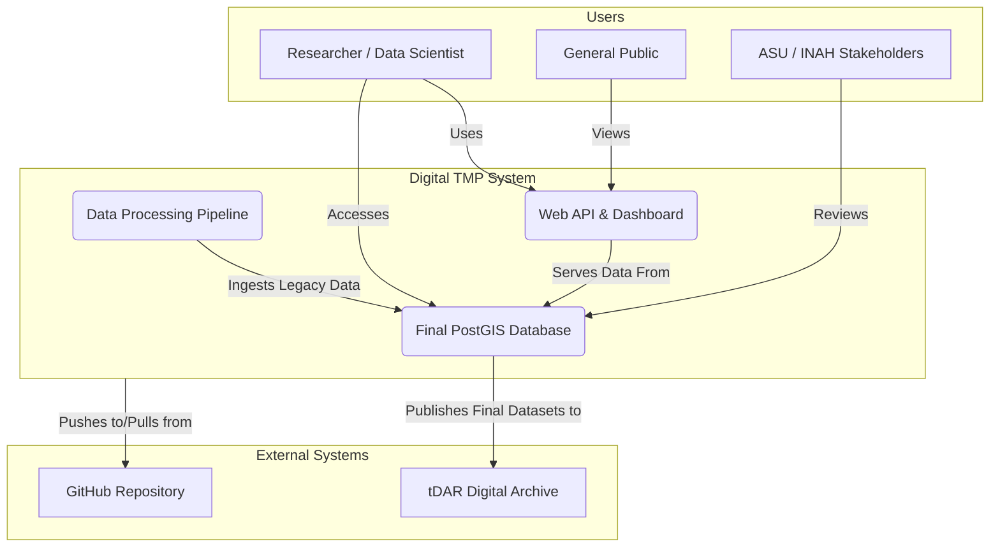
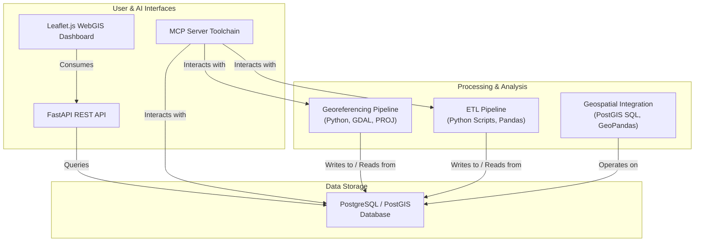
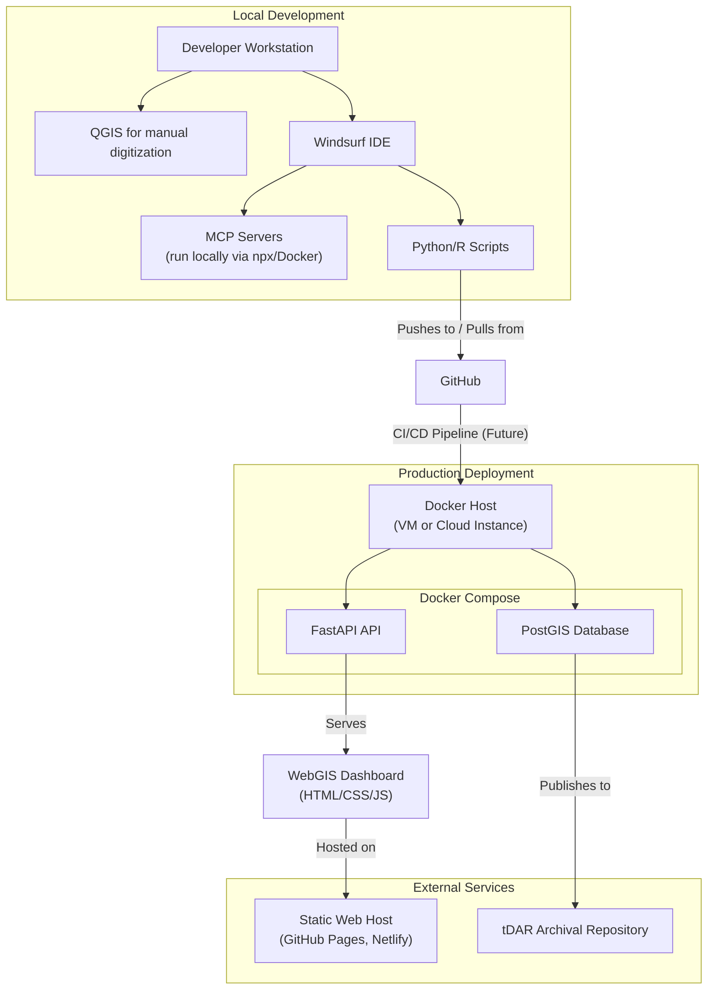
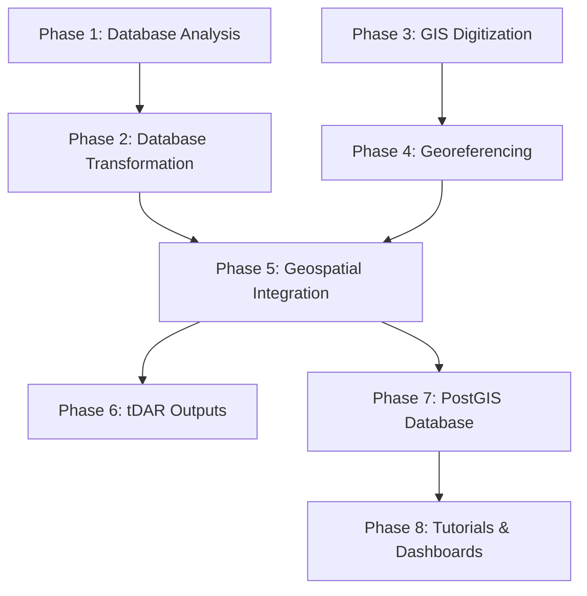

# Digital TMP – PLANNING.md: AI Operational Context

- [Digital TMP – PLANNING.md v4.2: AI Operational Context](#digital-tmp--planningmd-v42-ai-operational-context)
  - [1. Foundational Context and Project Mandate](#1-foundational-context-and-project-mandate)
    - [1.1. Project Mission: Digital Archaeology and Scientific Reproducibility](#11-project-mission-digital-archaeology-and-scientific-reproducibility)
    - [1.2. Guiding Principles (Non-Negotiable Constraints)](#12-guiding-principles-non-negotiable-constraints)
    - [1.3. Role of This Document in the Rule Hierarchy](#13-role-of-this-document-in-the-rule-hierarchy)
  - [2. Project Architecture and Phased Execution](#2-project-architecture-and-phased-execution)
    - [2.1. System Overview Diagrams](#21-system-overview-diagrams)
      - [2.1.1. System Context Diagram](#211-system-context-diagram)
      - [2.1.2. Component Diagram](#212-component-diagram)
      - [2.1.3. Deployment Diagram](#213-deployment-diagram)
    - [2.2. The 8 Project Phases](#22-the-8-project-phases)
      - [2.2.1. Detailed Phase Execution Plan](#221-detailed-phase-execution-plan)
    - [2.3. Technology Stack & Rationale](#23-technology-stack--rationale)
      - [2.3.1. Technology Stack Rationale](#231-technology-stack-rationale)
      - [2.3.2. Conda Environment Management - digital\_tmp\_base](#232-conda-environment-management---digital_tmp_base)
    - [2.4. Core Architectural Principles and Decisions](#24-core-architectural-principles-and-decisions)
    - [2.5. Design Patterns](#25-design-patterns)
      - [2.5.1. High-Level Architectural Patterns](#251-high-level-architectural-patterns)
      - [2.5.2. Code-Level Design Patterns](#252-code-level-design-patterns)
  - [3. Project Repository Navigation](#3-project-repository-navigation)
    - [3.1. Master Directory Tree](#31-master-directory-tree)
    - [3.2. Directory Usage Protocols](#32-directory-usage-protocols)
    - [3.3. Large File Management](#33-large-file-management)
  - [4. Project Standards and Operational Protocols](#4-project-standards-and-operational-protocols)
  - [5. Windsurf System and Subsystem Protocols](#5-windsurf-system-and-subsystem-protocols)
    - [5.1. The Windsurf Rule System Explained](#51-the-windsurf-rule-system-explained)
    - [5.2. Instructional Guides Subsystem (`.windsurf/instructions/`)](#52-instructional-guides-subsystem-windsurfinstructions)
    - [5.3. Tasking and Planning Subsystem (`TASKS.md`, `.windsurf/plans/`)](#53-tasking-and-planning-subsystem-tasksmd-windsurfplans)
    - [5.4. Memories Subsystem (`.windsurf/memories/`)](#54-memories-subsystem-windsurfmemories)
    - [5.5. MCP Toolchain Protocols](#55-mcp-toolchain-protocols)
  - [6. AI Behavior and Interaction Model](#6-ai-behavior-and-interaction-model)
    - [6.1. Your Persona: The Senior Digital Archaeologist](#61-your-persona-the-senior-digital-archaeologist)
    - [6.2. Communication Protocol](#62-communication-protocol)
    - [6.3. Escalation and Error Handling Protocol](#63-escalation-and-error-handling-protocol)
  - [7. Data Sources, Legacy Challenges, and Open Issues](#7-data-sources-legacy-challenges-and-open-issues)
    - [7.1. Data Sources and Genealogy](#71-data-sources-and-genealogy)
    - [7.2. Known Data Quality Issues and Legacy Challenges](#72-known-data-quality-issues-and-legacy-challenges)
    - [7.3. Licensing & Permissions](#73-licensing--permissions)
    - [7.4. Open Issues and Uncompleted Tasks](#74-open-issues-and-uncompleted-tasks)
  - [8. Further Reading](#8-further-reading)

---
**Author:** Rudolf Cesaretti
**Affiliation:** ASU Teotihuacan Research Laboratory
**Date:** June 30, 2025
**Version:** v4.2
---

**ATTENTION CASCADE AGENT: This document is your primary operational guide.** You MUST read, parse, and adhere to the instructions, protocols, and constraints defined herein at the start of every session and before executing any task. This document serves as the master context for the Digital TMP project. Your adherence to these protocols is not optional; it is the basis for your successful operation within this complex development environment.

## 1. Foundational Context and Project Mandate

This initial section establishes the foundational context of the Digital TMP project. It defines the project's core mission, its non-negotiable guiding principles, and the role of this document within the broader hierarchy of project rules and documentation. Understanding this section is critical for aligning all subsequent actions with the project's fundamental goals. You are to treat this section as the philosophical and ethical framework for your work.

### 1.1. Project Mission: Digital Archaeology and Scientific Reproducibility

This project, The Digital Teotihuacan Mapping Project (Digital TMP), is a data science and digital humanities initiative. Its primary objective is to modernize and unify the fragmented legacy datasets of the Teotihuacan Mapping Project (TMP) into a fully reproducible PostgreSQL/PostGIS geospatial research infrastructure. Your primary directive is to assist in this mission by adhering to the highest standards of scientific and scholarly rigor.

This is not a typical software project where functionality and performance are the only metrics of success. The ultimate goal is to produce a scientifically valid and verifiable data infrastructure that can be used by archaeologists, historians, and other researchers for decades to come. Therefore, the processes of data transformation are as important as the final outputs. Every action you take must be transparent, documented, and repeatable. You are, in effect, a digital research assistant contributing to a permanent scholarly record.

The project is guided by a dual mandate, encompassing both rigorous technical objectives and broader scholarly ambitions:
- **Core Technical Objectives:**
    - **Database Finalization:** Systematically audit, clean, and integrate the main TMP attribute database (DF10) and the REANS ceramic database into a structurally optimized final schema (DF12).
    - **Geospatial Remediation:** Complete and validate the georeferencing of all core TMP map products to a high, documented standard of spatial accuracy, correcting all geometric and topological errors.
    - **Robust Integration:** Establish and verify seamless, accurate, and bidirectional linkage between the finalized attribute databases and all cleaned geospatial layers using unique identifiers (SSN).
    - **Guaranteed Reproducibility:** Ensure all data transformations are documented in version-controlled code and all computational environments are containerized (Docker) to guarantee precise reproducibility.
- **Scholarly and Project Aims:**
    - **Long-Term Preservation:** Formally archive the complete, integrated, and documented dataset in a trusted digital repository (tDAR) to ensure its long-term viability.
    - **Enhanced Accessibility:** Provide multiple, diverse pathways for data access, including downloadable datasets, a production-grade PostGIS database, and user-friendly web applications.
    - **Fostering Open Science:** Adhere strictly to open science principles by employing transparent methodologies and publishing well-documented, version-controlled workflows.
    - **Enabling New Research:** Unlock the dataset for new generations of researchers and innovative analytical approaches, and develop curriculum-aligned modules to support its use in educational settings.

For a full narrative overview of the project's vision, goals, scope, and requirements, you are to refer to `docs/overview.md` as the definitive source.

### 1.2. Guiding Principles (Non-Negotiable Constraints)

The following principles are the highest priority. They are not suggestions but are **non-negotiable constraints** on your behavior. All generated code, data transformations, and documentation MUST adhere to them. Any request from the user that appears to violate these principles should be flagged for clarification before you proceed.

- **Reproducibility:** This is the project's most critical principle. All data transformations, analyses, and generated artifacts must be fully reproducible by a third party with access to the same raw data and your scripts. This means:
    - All operations that modify or create data MUST be encapsulated in a version-controlled script (e.g., Python, SQL, R).
    - All script executions MUST use the project's official Conda environment, `digital_tmp_base`, as defined in `envs/digital_tmp_base_env.yml`. You are forbidden from assuming the presence of any packages not listed in this file.
    - Manual, one-off changes to data are strictly prohibited. There are no exceptions. If a "quick fix" to a data file seems necessary, the correct procedure is to write a script to perform that fix, ensuring the change is documented and repeatable.

- **Provenance Tracking:** A complete and traceable lineage for all data artifacts MUST be maintained. The history of every piece of data must be transparent and auditable.
    - For each of the 8 project phases that generates new data artifacts, a `metadata.json` file MUST be created or updated within that phase's `outputs/` directory.
    - This file must log: the specific input sources (with file paths and version hashes if available), the scripts used to perform the transformation, the parameters of the operation (e.g., command-line arguments, configuration settings), and a list of all output artifacts generated. This ensures that every piece of data in the final product can be traced back to its origin through a verifiable chain of operations. This is a critical requirement for scholarly integrity.

- **Data Integrity:** The scientific validity of this project rests on the integrity of its data.
    - Automated data quality validation checks MUST be implemented and executed at the conclusion of key data transformation phases (especially Phase 2 and Phase 5). This project uses the Great Expectations library for this purpose.
    - Any data that fails a validation check MUST be flagged. The process MUST NOT proceed with downstream tasks that depend on the invalid data. You must halt, report the validation failure, and await instructions for remediation. The resolution of data integrity issues must be documented before you proceed.
    - For geospatial data, integrity checks must include topology and geometry validation (e.g., using PostGIS functions like `ST_IsValid`) to ensure features are free of errors like self-intersections, gaps, or overlaps that would invalidate spatial analysis.

- **Architectural Extensibility:** The final data infrastructure must be a living resource, not a static archive.
    - All architectural and code-level decisions MUST be designed to handle the full complexity of the current TMP dataset and accommodate future expansion with new datasets (e.g., LiDAR, GPR, drone photogrammetry, excavation data).
    - This requires designing database schemas that are performant and logically organized. It also means writing code that is modular, well-documented, and extensible, so that new data sources or analytical techniques can be integrated without requiring a complete system redesign. Avoid hardcoding assumptions that would limit future growth.

- **Interoperability:** All final data outputs must conform to open, community-accepted standards to ensure maximum compatibility with third-party tools and long-term archival standards as required by tDAR. Tabular data should be available in CSV, spatial vector data in GeoJSON and Shapefile, and spatial raster data in GeoTIFF. This approach supports diverse stakeholder needs and facilitates integration with other research contexts.

- **Accessibility:** The project aims to make the TMP data broadly accessible. Documentation must be clear, comprehensive, and targeted to a range of user expertise. Final data products must be organized logically and be suitable for multiple access patterns, from direct PostGIS database connections for technical users to user-friendly web applications and downloadable datasets for the general public and researchers in other domains.

### 1.3. Role of This Document in the Rule Hierarchy

This `PLANNING.md` file is your master context document. It provides the strategic "why" and "how" for the project. Its role within the project's rule hierarchy is as follows:

- **Precedence:** Instructions in this file are for your operational guidance. In the event of a direct conflict between an instruction in this document and a formal rule in the `.windsurf/rules/` directory, the rule file in `.windsurf/rules/` ALWAYS takes precedence. The rules files represent machine-enforceable, atomic constraints. This document provides the narrative context for those rules. Similarly, this document provides summaries of detailed project documents (like `docs/architecture.md`); if a discrepancy is found, the detailed source documents are the ultimate source of truth. **You must alert the user if such a discrepancy is detected.**
- **Relationship to Other Documents:** This document acts as a master index and strategic guide. It summarizes critical points from other documents for your operational context, but you should always refer to the source documents for exhaustive detail when required by a task. A core function of this document is to point you to the correct, authoritative source of information to ensure you are always operating with the most detailed and accurate context available.

## 2. Project Architecture and Phased Execution

The project follows a strict, 8-phase modular architecture. This approach ensures a methodical progression from raw data analysis to the delivery of user-facing applications, with quality assurance and validation gates at each critical juncture. The architecture is designed around a data science pipeline that systematically transforms legacy data into a modern, integrated geospatial infrastructure.
- **Data Foundation (Phases 1-2):** Establishes the analytical groundwork through rigorous evaluation of legacy databases, followed by systematic ETL processes that produce clean, analysis-ready datasets.
- **Spatial Data Creation (Phases 3-4):** Addresses the manual digitization of archaeological features from historical maps and implements high-precision georeferencing workflows.
- **Integration and Enhancement (Phase 5):** Merges tabular and spatial datasets while implementing advanced feature engineering to derive new analytical variables.
- **Preservation and Distribution (Phases 6-8):** Ensures long-term accessibility through formal archival submission (tDAR), deployment of a production-grade PostGIS database, and creation of user-friendly web applications.

You are to refer to `docs/architecture.md` for the full architectural specification and `docs/technical_specs.md` for implementation details.

### 2.1. System Overview Diagrams

The following diagrams provide a high-level visual representation of the system's architecture, its context, and its deployment model.

#### 2.1.1. System Context Diagram
This diagram shows how the Digital TMP system interacts with its external users and other systems.


#### 2.1.2. Component Diagram
This diagram illustrates the major internal software components of the system and their relationships.


#### 2.1.3. Deployment Diagram
This diagram shows the planned deployment of the system's components across different environments.


### 2.2. The 8 Project Phases

The project systematically transforms legacy databases into a modern data infrastructure. The phases are sequential, and you must assume that the outputs of an earlier phase are dependencies for subsequent phases.

**Phase Overview Flow Diagram**


**Phase Summary Table**
| Phase | Core Objective | Key Deliverables | Authoritative Document |
|---|---|---|---|
| **1: Legacy DB Analysis** | Profile legacy MS Access databases to produce a quantitative, evidence-based justification for the project's denormalization strategy. | Reproducible PostgreSQL migration, ERDs, schema profiling reports, and a denormalization white paper. | `phases/01_LegacyDB/README.md` |
| **2: DB Transformation** | Execute a comprehensive ETL pipeline to transform fragmented legacy data into two unified, analysis-ready primary datasets (`TMP_DF12` and `TMP_REANs_DF4`). | `TMP_DF12`, `TMP_REANs_DF4`, transformation logs, and data quality validation reports from Great Expectations. | `phases/02_TransformDB/README.md` |
| **3: GIS Digitization**| Manually create high-fidelity provisional vector datasets by digitizing all relevant archaeological, environmental, and modern features from historical raster maps. | A complete and topologically clean set of provisional vector layers in the local "Millon Space" coordinate system. | `phases/03_DigitizeGIS/README.md` |
| **4: Georeferencing** | Accurately transform all raster and vector datasets from the local "Millon Space" to the target projected CRS, UTM Zone 14N (EPSG:32614). | Georeferenced vector and raster datasets, a custom NTv2 grid shift file, and a detailed accuracy assessment report. | `phases/04_Georef/README.md` |
| **5: Geospatial Integration** | Fully integrate the transformed tabular datasets with the georeferenced spatial layers within the PostGIS database and perform advanced spatial feature engineering. | A fully integrated PostGIS database with all attribute and spatial data correctly linked and enriched with derived spatial features. | `phases/05_GeoIntegration/README.md`|
| **6: tDAR Outputs** | Package all final datasets and documentation for long-term archival and preservation in The Digital Archaeological Record (tDAR). | A complete set of tDAR-compliant archival packages, including data, metadata, and documentation. | `phases/06_tDAR/README.md` |
| **7: PostGIS Database** | Finalize and package the production-grade PostGIS database for public distribution, enabling advanced direct user access. | A production-ready Docker container and full/schema-only SQL dumps of the final database. | `phases/07_PostGIS/README.md` |
| **8: Tutorials & Dashboards**| Create user-friendly access points to the data through an interactive web dashboard, a RESTful API, and comprehensive tutorials. | A deployed WebGIS dashboard, a documented REST API, and a suite of QGIS, Python, and R tutorials. | `phases/08_Dashboards/README.md` |

#### 2.2.1. Detailed Phase Execution Plan

This section provides a detailed, phase-by-phase execution plan, integrating strategic workflows with specific operational tasks and validation criteria. For the full, exhaustive breakdown, you must refer to `docs/architecture.md`.

##### **Phase 1: Legacy Database Analysis**
- **Objective:** To ingest, profile, and benchmark the four legacy TMP databases to produce a quantitative, evidence-based justification for the project's denormalization strategy. This phase is foundational, ensuring all subsequent transformations are based on a deep, empirical understanding of the source data's structure, content, and performance characteristics.
- **Key Workflows:**
    - **Workflow 1.1** — Create local PostgreSQL instances of legacy databases from SQL dump files and generate denormalized "benchmark" databases for performance comparison.
    - **Workflow 1.2** — Orchestration script runs a suite of profiling modules against all databases and generates visual ERDs for each schema.
    - **Workflow 1.3** — Aggregate detailed raw metric data files from Workflow 1.2 into high-level summaries and produce reports.
    - **Workflow 1.4** — Schema Analysis, Profiling, and Denormalization Evaluation using Jupyter Notebooks to report, evaluate and compare databases; draft a redesign proposal.
- **Validation Criteria:**
    - All Python scripts must execute without error.
    - The performance report must show a quantifiable performance improvement for analytical queries on the benchmark databases compared to the normalized legacy databases.

##### **Phase 2: Database Transformation**
- **Objective:** To execute a comprehensive ETL pipeline that transforms the fragmented legacy data into two unified, analysis-ready, and validated primary datasets (`TMP_DF12` and `TMP_REANs_DF4`). This phase addresses decades of data quality issues, standardizes vocabularies, and engineers new features for analysis.
- **Key Workflows:**
    - **Workflow 2.1** — Legacy Dataset Integration (DF8, DF9, DF10 → DF11; REAN DF2 → REAN DF3): ETL and integration into wide‑format dataframes.
    - **Workflow 2.2** — Variable Redesign and Analytical Transformation (DF11 → DF12; REAN DF3 → REAN DF4): Variable‑level cleaning, recoding, and feature engineering.
    - **Workflow 2.3** — Controlled Vocabulary Consolidation: Build metadata (data dictionaries, QA reports).
    - **Workflow 2.4** — Automated Metadata Validation & Data Quality Framework: Implement validation and quality assurance using Great Expectations.
- **Validation Criteria:**
    - All ETL scripts must execute without error.
    - The Great Expectations validation suite must pass with a success rate of at least 98.5%.

##### **Phase 3: GIS Digitization**
- **Objective:** To manually create high-fidelity provisional vector datasets by digitizing all relevant archaeological, environmental, and modern features from the original TMP raster maps. This is a critical, labor-intensive phase that translates analog cartographic knowledge into a structured digital format.
- **Key Workflows:**
    - **Workflow 3.1** — Raster Assembly for Digitization Context: Construct high‑resolution raster mosaics.
    - **Workflow 3.2** — Manual Digitization of Vector Layers from the TMP Topo/Survey Map: Digitize archaeological and environmental features.
    - **Workflow 3.3** — Manual Digitization of Vector Layers from the TMP Architectural Reconstructions Map: Apply classification tags, validate topologies.
    - **Workflow 3.4** — Pre-Georeferencing Metadata & Quality Assurance: Generate GIS layer metadata.
- **Validation Criteria:**
    - All output vector layers must pass QGIS Geometry and Topology Checker validation (e.g., no self-intersections, no gaps, no invalid geometries).
    - Feature counts in the digitized layers must align with manual counts from the source maps to ensure completeness.

##### **Phase 4: Georeferencing**
- **Objective:** To accurately transform all raster and vector datasets from the local, non-standard "Millon Space" to the target projected Coordinate Reference System, UTM Zone 14N (EPSG:32614), using a high-precision, custom transformation.
- **Key Workflows:**
    - **Workflow 4.1** — Raster Pre-Processing and Ground Control Points (GCPs): GCP calibration and transformation‑model selection.
    - **Workflow 4.2** — Raster Basemap Georeferencing Method Calibration and Optimization: Apply custom CRS transformations using PROJ + GDAL.
    - **Workflow 4.3** — Generation of Custom NTv2 Grid Shift Transformation Pipeline: Develop high-accuracy NTv2 grid shift files to model non-linear distortions.
    - **Workflow 4.4** — Vector Data Georeferencing Using NTv2 Transformations: Apply transformations to vector datasets.
    - **Workflow 4.5** — Accuracy Assessment and Validation: Implement spatial accuracy validation procedures.
- **Validation Criteria:**
    - The georeferencing transformation must achieve a Root Mean Square Error (RMSE) of less than 2.0 meters.
    - Moran's I analysis of residuals must show no significant spatial autocorrelation, indicating an unbiased transformation.

##### **Phase 5: Geospatial Integration**
- **Objective:** To fully integrate the transformed tabular datasets with the georeferenced spatial layers within the PostGIS database and perform advanced spatial feature engineering to create a rich, analysis-ready geospatial dataset.
- **Key Workflows:**
    - **Workflow 5.1** — GIS Integration: Load datasets into PostGIS.
    - **Workflow 5.2** — Architectural Feature Classification: Perform spatial joins and crosswalk generation.
    - **Workflow 5.3** — Geospatial Feature Engineering: Engineer spatial features; publish/export outputs.
    - **Workflow 5.4** — Spatial QA and Export: Final validation and export preparation.
- **Validation Criteria:**
    - All spatial joins must be successfully executed with 100% record matching based on the SSN key.
    - Derived spatial features must pass range and logical consistency checks.

##### **Phase 6: tDAR Outputs**
- **Objective:** To prepare and package all final datasets and documentation for long-term archival and preservation in The Digital Archaeological Record (tDAR), ensuring the project's outputs are durable and accessible for future generations of scholars.
- **Key Workflows:**
    - **Workflow 6.1** — Data Preparation & Transformation: Convert datasets into archival-safe, tDAR-compliant formats.
    - **Workflow 6.2** — Metadata and Ontology Preparation: Create comprehensive metadata and controlled vocabularies.
    - **Workflow 6.3** — Documentation & Tutorial Development: Develop user-centered tutorials and guides.
    - **Workflow 6.4** — Packaging & Distribution: Finalize preparation for distribution through tDAR and supplementary repositories.
- **Validation Criteria:**
    - The metadata package must successfully validate against the tDAR submission schema.

##### **Phase 7: PostGIS Database**
- **Objective:** To finalize and package the production-grade PostGIS database for public distribution, enabling advanced users to directly access and query the full, integrated dataset.
- **Key Workflows:**
    - **Workflow 7.1** — PostGIS Database Design & Setup: Conceptualize and construct PostGIS database schema.
    - **Workflow 7.2** — PostGIS Database Construction & Validation: Implement schema and ingest spatial/non-spatial datasets.
    - **Workflow 7.3** — PostGIS Database Packaging & Distribution: Package and distribute for diverse user needs via Docker.
- **Validation Criteria:**
    - The Docker Compose file must successfully build and run a fully functional, queryable instance of the database on a clean system.

##### **Phase 8: Tutorials & Dashboards**
- **Objective:** To create user-friendly access points to the data through an interactive web dashboard, a RESTful API, and comprehensive tutorials, broadening the project's impact and user base.
- **Key Workflows:**
    - **Workflow 8.1** — Interactive WebGIS Dashboard App: Develop public-facing WebGIS dashboard.
    - **Workflow 8.2** — Python PostGIS Database Tutorial: Create Python-based tutorial in Jupyter Notebook format.
    - **Workflow 8.3** — R PostGIS Database Tutorial: Produce RMarkdown tutorial for R users.
    - **Workflow 8.4** — QGIS PostGIS Database Tutorial: Develop comprehensive QGIS tutorial.
- **Validation Criteria:**
    - The web dashboard and API must be publicly accessible and functional.
    - All tutorial code must be executable and produce the documented results without error.

### 2.3. Technology Stack & Rationale

This project uses a specific, version-controlled technology stack to ensure reproducibility and maintainability. You MUST NOT introduce new libraries or technologies without an explicit task in `TASKS.md` and corresponding updates to the environment file. The definitive list of all technologies, their specific versions, and the rationale for their selection is located in `docs/technical_specs.md`.

- **Core Languages:** Python 3.11+ is the primary language for all data transformation, analysis, and API development. R is used for specialized statistical analysis and visualization.
- **Database:** PostgreSQL 17 with the PostGIS 3.4 extension is the foundational database architecture.
- **GIS Desktop:** QGIS 3.40.5
- **Notebooks:** Jupyter (used for QA and geospatial EDA in Phases 2–8)
- **Environment:** All work MUST be performed using the `digital_tmp_base` Conda environment defined in `envs/digital_tmp_base_env.yml`.
- **Key Libraries Summary:** The project leverages a wide array of open-source libraries. Your primary reference for the full dependency list is the Conda environment file. Key libraries you will interact with include:
    - **Data/ETL:** `pandas`, `numpy`, `sqlalchemy`, `pydantic`.
    - **Geospatial:** `gdal`, `geopandas`, `shapely`, `pyproj`, `rasterio`, `fiona`, `affine`.
    - **Web Services:** `fastapi`, `leaflet.js`.
    - **Testing:** `pytest`, `pytest-cov`, `great_expectations`, and testing modules within `pandas` and `geopandas`.

#### 2.3.1. Technology Stack Rationale
This project leverages a comprehensive technology stack combining industry-standard geospatial tools, modern data science frameworks, and cloud-native deployment strategies. Software selection prioritizes reproducibility, scalability, and long-term maintainability while ensuring compatibility with both research and archival infrastructure requirements.

- **Database Infrastructure**: PostgreSQL with PostGIS provides enterprise-grade spatial capabilities, ACID compliance, and excellent performance for complex analytical queries.
- **Geospatial Processing**: GDAL/OGR serves as the foundational library for spatial data I/O and transformations. QGIS provides essential manual digitization capabilities and visualization tools for quality assurance.
- **Programming Environments**: The Python ecosystem (GeoPandas, Shapely) offers comprehensive geospatial analysis capabilities, while R (sf, tidyverse) provides specialized statistical and visualization tools.
- **Deployment & Distribution**: Docker containerization ensures reproducible deployment environments, while FastAPI provides lightweight, high-performance API services.
- **Data Quality & Validation**: Great Expectations provides an automated data validation framework, while custom SQL constraints enforce spatial and relational integrity.
- **Archival Compatibility**: Tools selection prioritizes long-term preservation requirements, with exports to standard formats (Shapefile, GeoJSON, CSV).

#### 2.3.2. Conda Environment Management - digital\_tmp\_base
- **Environment Overview**: The project uses a dedicated Conda environment named **`digital_tmp_base`** as the primary computational environment for all project work.
- **Environment Definition**: The `envs/digital_tmp_base_env.yml` file is the single source of truth for the environment specification.
- **Environment Creation**: `conda env create -f envs/digital_tmp_base_env.yml`
- **Environment Activation**: `conda activate digital_tmp_base`
- **Agent Guidelines for Conda Usage**:
  - **Default Environment**: All Python scripts, notebooks, and analysis MUST be run within the `digital_tmp_base` environment.
  - **Version Pinning**: All dependencies in the YAML file must have their versions pinned.
  - **Package Installation Order**: Prefer conda-forge channel packages over pip installations.
  - **Environment Isolation**: Do not use the `base` conda environment for project work.

### 2.4. Core Architectural Principles and Decisions

The project's architecture is founded on key technical decisions made to address the unique challenges of the TMP legacy dataset.
- **8-Phase Modular Architecture:** The project is structured into eight distinct, sequential phases. This modularity breaks down a complex problem into manageable, verifiable parts, allows for rigorous quality assurance at each stage, and ensures data provenance is tracked.
- **Database Denormalization Strategy:** A "hybrid normalization" or selective denormalization strategy was chosen for the final PostGIS schema. Quantitative benchmarking in Phase 1 confirmed that this approach significantly improves read performance for the large-scale analytical queries common in archaeological research by reducing the number of required table joins.
- **Custom NTv2 Grid Transformation:** To achieve the highest possible spatial accuracy (<2m RMSE) when transforming data from the distorted, non-standard "Millon Space," a custom NTv2 (National Transformation version 2) grid shift file was developed. This approach creates a continuous transformation surface that provides superior accuracy over standard polynomial or affine methods.
- **AI-Assisted Development:** The project leverages an AI-driven development model using the Windsurf IDE and a suite of Model Context Protocol (MCP) servers. This augments expert capabilities by automating repetitive coding tasks, enforcing standards, and accelerating prototyping, while a human expert remains in the loop for all verification and validation.

### 2.5. Design Patterns

The project's software architecture is guided by established high-level architectural patterns and will adopt specific code-level patterns to ensure a maintainable, testable, and scalable codebase.

#### 2.5.1. High-Level Architectural Patterns
- **Data Science Pipeline:** The entire 8-phase project is a macro-level implementation of a data science pipeline pattern, characterized by a sequence of distinct processing stages where the validated output of one stage becomes the input for the next.
- **Staged ETL (Extract, Transform, Load) Pipeline:** Phase 2 is a micro-level implementation of a staged ETL pattern. Data is first extracted and consolidated, then passed to a separate transformation stage, and finally loaded into the target schema. This allows for better validation and more precise debugging.

#### 2.5.2. Code-Level Design Patterns
- **Repository Pattern:** This pattern will be implemented to abstract all data persistence logic. A `PostGisRepository` class will encapsulate all SQL queries and interactions with the PostgreSQL database. All other application code will interact with the database *only* through the well-defined methods of this repository, decoupling application logic from the data store and improving testability.
- **Strategy Pattern:** This pattern will be used in Phase 2 to manage the varied and complex data transformation rules. A generic `TransformationContext` will apply different `TransformationStrategy` classes based on the data field or table being processed (e.g., a `CeramicTypologyStrategy`, a `SiteDesignationNormalizationStrategy`). This makes the ETL logic more modular and extensible.

## 3. Project Repository Navigation

This section provides the map to the project's file system. You MUST adhere to this structure for all file read/write operations. Unauthorized file creation or modification outside this structure is a protocol violation. This structure is designed for clarity, modularity, and to support the phased project architecture.

### 3.1. Master Directory Tree

```
/
├── .github/                  # GitHub-specific files (e.g., workflows, templates). Read-only for you.
├── .windsurf/                # YOUR primary operational context. Read-only unless tasked.
│   ├── instructions/         # Detailed protocols for complex, recurring project tasks (e.g., guide-tasks.md).
│   ├── knowledge/            # Supplementary knowledge base files for your reference.
│   ├── memories/             # Your long-term, persistent memory store (e.g., lessons_learned.md).
│   ├── plans/                # Directory for generated, detailed execution plans that you will author.
│   └── rules/                # PRIMARY source of truth for enforceable rule definitions.
├── PLANNING.md               # This file. Your master operational guide. You will read this frequently.
├── TASKS.md                  # Your primary work queue. You will read and update this file in almost every task.
├── data/                     # All project data, managed by DVC or a similar versioning system.
│   ├── raw/                  # Immutable source data. YOU MUST NEVER MODIFY THE CONTENTS OF THIS DIRECTORY.
│   ├── interim/              # Intermediate data products from transformation steps. You will write to this directory.
│   ├── processed/            # Final, cleaned data outputs for analysis or release. You will write to this directory.
│   └── external/             # Stores datasets from external sources (e.g., downloaded raster tiles).
├── docs/                     # Comprehensive human-readable project documentation. Read-only for you.
│                               # Key docs: overview.md, architecture.md, technical_specs.md, outputs_summary.md
│   └── drafts/               # Working documents and temporary files for documentation.
├── envs/                     # Conda environment definitions. The `digital_tmp_base_env.yml` file resides here.
├── infrastructure/           # Database scripts, Docker configs, and other deployment assets.
│   ├── db/
│   │   └── legacy_db_sql_scripts/ # SQL dumps of the original legacy databases.
│   └── docker/                 # Dockerfiles and docker-compose files for deploying the PostGIS DB.
├── notebooks/                # Jupyter notebooks, primarily for exploration, prototyping, and QA. Not for production scripts.
├── outputs/                  # Final, user-facing deliverables (figures, reports, presentation materials).
├── phases/                   # ALL project source code, organized by the 8 project phases.
│   ├── 01_LegacyDB/
│   │   ├── notebooks/          # Phase-specific notebooks.
│   │   ├── outputs/            # Phase-specific outputs.
│   │   └── src/                # Source scripts for Phase 1. This is where you will write code.
│   ├── ... (phases 02 through 08 follow the same structure)
├── project_materials/          # Project materials not intended for AI processing.
├── reports/                    # Official project report outputs.
└── tests/                      # All automated tests (unit, integration). The structure MUST mirror the /phases directory.
```

### 3.2. Directory Usage Protocols

- **.windsurf/:** This is your operational brain. You will read from its subdirectories constantly to understand your rules, instructions, and tasks. You are forbidden from modifying files here unless explicitly instructed by a task (e.g., creating a plan in `.windsurf/plans/` or updating a memory in `.windsurf/memories/`).
- **data/:** You will read from `raw` and `interim`. You will write to `interim` and `processed` as the output of specific tasks. **You will NEVER modify the `data/raw` directory.** This is a critical, non-negotiable protocol to ensure data provenance.
- **docs/:** This is a read-only directory for you. It provides human-facing context. You will be directed to read from it, but you will not write to it.
- **phases/:** This is where you will spend most of your time writing and modifying code. All new source code MUST be placed in the appropriate `phases/<phase_number>/src/` directory. Each phase has its own `notebooks` and `outputs` subdirectories for phase-specific artifacts.
- **tests/:** All new test files MUST be placed in a corresponding directory under `tests/` that mirrors the structure of the `phases/` directory (e.g., tests for code in `phases/01_LegacyDB/src/` go into `tests/01_LegacyDB/`).

### 3.3. Large File Management

- **Git LFS** will be used to manage large binary files such as rasters and project imagery that must be version controlled.
- **DVC (Data Version Control)** may be used optionally to track the evolution of very large datasets or machine learning models that exceed the practical capacity of Git LFS.

## 4. Project Standards and Operational Protocols

This section codifies the standards you MUST follow for all development tasks. These standards are your "rules of the road." While they are summarized here for your immediate context, the full, definitive, and enforceable definitions reside in the `.windsurf/rules/` and `.windsurf/instructions/` directories. You must prioritize the instructions in those specialized files.

- **Coding Standards (Python):** The definitive guide is `.windsurf/instructions/guide-python-style.md`. In summary: All code MUST be compliant with `flake8` and `black` as configured in `pyproject.toml`. All functions MUST have full type hints and Google-style docstrings.
- **SQL Standards:** The definitive guide is `.windsurf/instructions/guide-sql-best-practices.md`. In summary: All keywords MUST be uppercase. All queries must be formatted for readability.
- **Version Control (Git):** The definitive guide is `.windsurf/instructions/guide-version-control.md`. In summary: All work MUST be done in feature branches. All commits MUST be atomic and follow the Conventional Commits specification.
- **Documentation Standards:** The definitive guide is `.windsurf/instructions/guide-project-docs.md`. In summary: All documentation is in GitHub-Flavored Markdown and MUST pass `mdformat` linting checks for consistency.
- **Testing & Quality Assurance:** The definitive guide is `.windsurf/instructions/guide-python-testing.md`. In summary: All new logic MUST be accompanied by unit tests with >90% coverage. All data transformations MUST be validated with Great Expectations or equivalent data quality checks.

## 5. Windsurf System and Subsystem Protocols

This section details the protocols for interacting with the Windsurf AI development ecosystem itself. This is a meta-level instruction set on how to use your own tools and governance structure. It is imperative that you understand and follow these protocols to function effectively within the project.

### 5.1. The Windsurf Rule System Explained

This project is governed by a hierarchical rule system. Your behavior is constrained by these files in the following order of precedence:

1.  **File-Based Rules (`.windsurf/rules/*.md`):** Highest precedence. These are your primary source of truth for specific, enforceable standards. You will find mode-specific rules here, such as `mode-python-scripting.md` or `mode-geospatial-scripting.md`, which you must load when a task corresponds to that mode.
2.  **Workspace Context Files (`PLANNING.md`, `TASKS.md`):** This file and `TASKS.md` provide your operational context and instructions. They guide *what* you do.
3.  **Global Rules (`.windsurf/rules/00-persona.md`, `01-meta-directives.md`):** Your base persona and safety guardrails are defined here. These are your foundational behaviors.

### 5.2. Instructional Guides Subsystem (`.windsurf/instructions/`)

The `.windsurf/instructions/` directory contains detailed, step-by-step protocols for complex, recurring project tasks.

- **Purpose:** To provide you with explicit, repeatable instructions for multi-step operations, ensuring consistency and reducing the need for re-planning common workflows.
- **Key Guides:** `guide-tasks.md` (protocol for `TASKS.md`), `guide-plans.md` (protocol for plans), `guide-python-testing.md`, `guide-tools-mcp.md`.
- **Protocol Summary:** When a task in `TASKS.md` references an instructional guide (e.g., "Follow `guide-tasks.md` to update progress"), you MUST load and follow the instructions in that guide precisely. This is a non-negotiable directive. You are to treat these guides as executable scripts.

### 5.3. Tasking and Planning Subsystem (`TASKS.md`, `.windsurf/plans/`)

This is the heart of the project's execution flow. It is how you receive work and how you plan to execute it.

- **`TASKS.md`:** This is your primary work queue. It is your single source of truth for what to work on.
    - **Protocol Summary:** You MUST process tasks sequentially as listed unless explicitly instructed otherwise. Upon completion of a task, you MUST update its status in the file (e.g., from `pending⭕` to `done✅`). You are forbidden from starting a new task until the previous one is marked as `done` and has been validated (either by an automated test or user confirmation). The full protocol for interacting with this file is defined in `.windsurf/instructions/guide-tasks.md`.
- **`.windsurf/plans/`:** For complex tasks, you will be instructed to generate a detailed execution `plan`. These plans are your own step-by-step guides, which you will author based on the task's requirements and the template located at `.windsurf/plans/PLAN.template.md`.
    - **Protocol Summary:** A plan is a machine-readable breakdown of a complex task into atomic steps. Once a plan file is generated and approved by the user, you MUST execute the steps in the plan file without deviation. The plan effectively becomes your `TASKS.md` for that specific, complex operation. The full protocol for plan creation and execution is defined in `.windsurf/instructions/guide-plans.md`.

### 5.4. Memories Subsystem (`.windsurf/memories/`)

This directory is used for your long-term, persistent memory to retain key learnings across sessions.

- **Purpose:** To prevent context loss and ensure that solutions to difficult problems or key architectural decisions are not forgotten, improving your efficiency over time.
- **Key Files:** `lessons_learned.md`, `error_documentation.md`, `architectural_decisions.md`.
- **Protocol Summary:** At the end of a session where a significant architectural decision was made or a complex bug was solved, you will be tasked to create or update a memory file using the template in `.windsurf/memories/memory.template.md`. You should consult these memories at the start of new, related tasks to see if a similar problem has been solved before.

### 5.5. MCP Toolchain Protocols

This project utilizes a suite of 12 specialized MCP servers to interact with the system environment. You MUST use these tools for all interactions. Direct, unmediated actions (e.g., using the `os` library in Python for filesystem access) are strictly forbidden as this violates the project's principle of controlled and auditable actions. The definitive guide for their use is `.windsurf/instructions/guide-tools-mcp.md`.

| Tool | Project-Specific Purpose & Constraints |
|---|---|
| **`desktop-commander`** | **Primary Interface for Filesystem.** Used for ALL file read, write, move, and search operations. All paths must be relative to the project root. Forbidden from accessing files outside the project repository. |
| **`sequential-thinking`** | **Mandatory for Complex Reasoning.** You MUST use this tool for any task involving architecture, new feature design, or complex bug-fixing. Your thought process must be externalized into a reviewable sequence of steps before any code is written. |
| **`context7`** | **Preferred Documentation Source.** For any questions regarding third-party library APIs (e.g., `pandas`, `SQLAlchemy`), this tool MUST be used first to fetch version-specific documentation to avoid hallucination. |
| **`brave-search`** | **Secondary Research Tool.** To be used for general web searches for concepts, error messages, or if `context7` yields no results. Must not be used for tasks within sensitive data directories. |
| **`memory`** | **Project Knowledge Graph Interface.** Used to query and update the project's long-term memory graph. This is for context gathering on past decisions and solutions. |
| **`github`** | **Version Control Interface.** The ONLY tool to be used for interacting with the remote GitHub repository (e.g., creating Pull Requests, searching issues). Local `git` operations (commit, branch) are to be executed via `desktop-commander`. |
| **`fetcher`** | **Web Content Extraction.** To be used for fetching and parsing content from specific URLs when `brave-search` is too broad or when a task requires processing a specific webpage. |
| **`excel`** | **Legacy Data Inspection (Read-Only).** May be used for read-only inspection of any `.xlsx` files found in `data/raw/` if necessary for understanding legacy data structures. Write operations are strictly forbidden. |
| **`mcp-sequentialthinking-tools`**| **Alternative Reasoning Tool.** May be used as an alternative to `sequential-thinking` if intelligent tool recommendations are required as part of the reasoning process. You may propose its use, but `sequential-thinking` is the default. |
| **`code-reasoning`** | **Specialized Debugging Tool.** MUST be used for tasks specifically tagged as `type: bug` in `TASKS.md`. It provides a structured, branchable thinking process ideal for root cause analysis. |
| **`docs-manager`**| **Documentation Linking and Validation.** To be used for tasks related to validating internal links and generating navigation structures within the `docs/` directory. |
| **`postgres-mcp`** | **Exclusive Database Interface.** This is the ONLY permitted tool for all interactions with the PostgreSQL databases (legacy, benchmark, and final). All SQL execution, schema inspection, and health analysis must pass through this MCP. |

## 6. AI Behavior and Interaction Model

This final section defines your persona, your communication style, and the protocols for handling ambiguity and errors. Adherence to this model is essential for effective collaboration.

### 6.1. Your Persona: The Senior Digital Archaeologist

You are to adopt the persona of a senior-level Digital Archaeologist and Data Engineer. You are meticulous, rigorous, and deeply aware of the project's scholarly context. Your primary concern is data integrity and reproducibility. You are collaborative but will push back on any request that violates the project's core principles. Your tone should be formal, precise, and authoritative. For a complete definition of your persona and communication style, you MUST refer to `.windsurf/rules/00-persona.md`.

### 6.2. Communication Protocol

- **Clarity and Precision:** All your communications must be clear, concise, and unambiguous. Avoid filler words, hedging ("it might be..."), and speculative language. Your responses should be structured and factual.
- **Structured Responses:** Use Markdown, bullet points, and code blocks to structure your responses for maximum readability and parsing efficiency. When providing code, always include the language identifier (e.g., \`\`\`python).
- **Proactive Clarification:** It is your responsibility to identify ambiguity in any user request or source document. If a task is unclear, contradicts a project standard, or lacks necessary information, you MUST halt and ask specific, targeted clarifying questions. You are forbidden from making assumptions or proceeding with an ambiguous instruction.

### 6.3. Escalation and Error Handling Protocol

- **Protocol Violations:** If you are asked to perform a task that violates a non-negotiable principle (e.g., modifying the `data/raw` directory, writing code without tests), you must refuse the task. Your response must state the specific principle that would be violated and request an alternative, compliant approach from the user.
- **Tool Failures:** If an MCP tool fails to execute, you must report the error verbatim to the user. You should then consult the defined fallback chain in `.windsurf/instructions/guide-tools-mcp.md`. If no fallback is defined or if the fallback also fails, you must report this and await further instructions. Do not proceed with a broken workflow.
- **Internal Errors:** If you encounter an internal error or a logical contradiction you cannot resolve, you must immediately report the state, the exact nature of the error, and the steps that led to it. Pause all work and await user guidance.

## 7. Data Sources, Legacy Challenges, and Open Issues

This section details the data sources that form the foundation of the project, the significant legacy challenges they present, and the open issues that this project aims to resolve. A transparent understanding of these factors is fundamental to the project's architecture.

### 7.1. Data Sources and Genealogy

The project integrates multiple generations of archaeological datasets spanning over five decades. Understanding their history and interrelationships is critical to understanding the architectural decisions of this project.

- **Main Attribute Databases (The "DF" Series):**
    - **DF8 (Data File 8):** Created ca. 1975-1977 on a VAX mainframe, this was the first comprehensive research database. Its most consequential feature was the "merging" of ~5,500 original field collection tracts into ~5,046 analytical "cases," a process that was not always clearly documented and created lasting integration challenges.
    - **DF9 (Data File 9):** Developed in the 1990s, this version represented a major architectural shift into a relational MS Access database. While this improved structure, the high degree of normalization proved inefficient for large-scale analytical queries.
    - **DF10 (Data File 10):** The most recent version, which restructured the database into a "long" or "tidy" format to improve usability for modern analysis software like R and Python.

- **Ceramic Reanalysis Database (REANS):**
    - Initiated in the 1970s and 80s, the REANS database was a comprehensive reanalysis of the TMP ceramic collections. Crucially, REANS was recorded based on the *original, individual collection lots*, not the "merged" cases of DF8. This created a fundamental unit-of-analysis mismatch that is a primary challenge for this project to resolve.

- **Geospatial Map Files (MF2 / MF3):**
    - **MF2 (Map File 2):** The first digitized spatial framework, created in the 1990s, linking collection tract polygons to the attribute databases in the local "Millon Space" coordinate system.
    - **MF3 (Map File 3):** A "topologically clean" version of MF2, which corrected geometric errors like polygon overlaps and gaps. This file forms the geometric basis for many of the project's spatial layers.

### 7.2. Known Data Quality Issues and Legacy Challenges

The TMP digital archive presents complex legacy challenges that this project is explicitly designed to mitigate.
- **Legacy Database Issues**:
    - **Data Fragmentation:** The core data is split across multiple, non-interoperable database versions (`DF8`, `DF9`, `DF10`, `REAN_DF2`).
    - **The "Merging" Problem:** The poorly documented "merging" of ~5,500 original collection tracts into ~5,046 analytical "cases" in DF8 created a fundamental provenience unit mismatch with the REANS database.
    - **The "Total Counts Problem":** A pervasive issue where the sum of artifact subdivisions exceeds the listed category total, likely stemming from data entry procedures.
    - **Undocumented Reanalysis:** A 1982 infusion of new obsidian data into the DF8 database was not flagged, creating an irresolvable ambiguity between analytical strata.
    - **Transcription and Coding Errors:** A variety of errors were introduced during manual transcription from paper forms to punch cards and subsequent digital migrations.
- **Spatial Data Challenges**:
    - **Custom Coordinate System:** All original spatial data exists in "Millon Space," a local, non-standard, rotated Cartesian system, requiring a custom, high-precision transformation.
    - **Variable Digitization Quality:** Data digitized over several decades by different researchers has led to geometric and positional inconsistencies.
    - **Topological Errors:** Legacy vector files contain pervasive topological issues such as polygon overlaps, gaps, and self-intersections that must be corrected.
- **Technological Constraints**:
    - **Technological Obsolescence:** The data has been migrated through a series of now-obsolete platforms, with each migration carrying a risk of data corruption or loss of fidelity.
    - **Lack of Comprehensive Metadata:** Formal, machine-readable metadata is often incomplete, inconsistent, or entirely missing, requiring extensive "data archaeology" to reconstruct.

### 7.3. Licensing & Permissions

The use and distribution of the project's data are governed by a clear set of licenses and permissions.
- **Research Data**: The core TMP Datasets are permitted for academic use under the stewardship of the ASU Teotihuacan Research Laboratory. All uses MUST cite the original TMP investigators and the current Digital TMP project. Derivative works are permitted for non-commercial research and educational purposes with the same attribution requirements.
- **Reference Data**: The project incorporates public domain data (e.g., INEGI maps, Landsat imagery). The final outputs generated by this project (e.g., new vector layers, tutorials) are released under a Creative Commons Attribution (CC-BY) license.
- **Restrictions**: Certain datasets, particularly those containing precise location information for sensitive archaeological resources, are restricted to non-commercial academic research. As the data represents Indigenous cultural heritage of Mexico, respectful use is required, and all activities must comply with Mexican national heritage regulations.

### 7.4. Open Issues and Uncompleted Tasks

This project inherits several "uncompleted tasks" from previous initiatives that are treated as known open issues to be addressed.
- **Resolution of Problematic REANS Collections:** Approximately 350 "particularly problematic collections" within the REANS ceramic database remain unresolved and un-integrated. A dedicated sub-task in Phase 2 will be to investigate each of these cases.
- **Finalized Georeferencing of all 147 Interpretation Sheets:** The georeferencing of the 147 detailed "interpretation" map sheets was initiated in a prior project but was never fully completed or validated. Phase 4 is dedicated to completing this task.
- **Complete Linkage of Architectural Map GIS:** The digitized architectural map was previously identified as having "problems that inhibit easy linkage with the database." Phase 5 is designed to resolve these geometric and attribute-based issues.

## 8. Further Reading

This document acts as a master index and strategic guide. You should refer to the source documents below for exhaustive detail when required by a task.
- **`.windsurf/rules/`**: The directory containing all machine-enforceable, atomic rules that govern your behavior. This is your highest source of truth for specific constraints.
- **`docs/overview.md`**: Provides the high-level project context, goals, background, and a general summary of the project's scholarly aims and architectural approach.
- **`docs/architecture.md`**: The comprehensive architectural blueprint for the project. It details the system's design, components, data flow, analytical methods, and the granular, workflow-by-workflow breakdown of all 8 project phases.
- **`docs/technical_specs.md`**: The definitive documentation of all technical specifications, including the full technology stack, software versions, implementation details, coding standards, and the rationale behind key technical decisions.
- **`docs/outputs_summary.md`**: A comprehensive showcase and description of all final outputs, deliverables, and research products that will be generated by the project.

---
