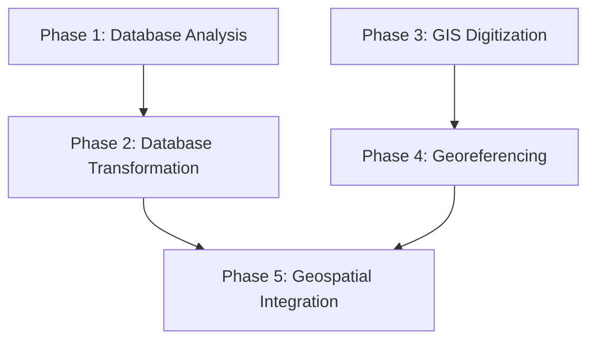

# Project Architecture (Draft v0.0 -- 4/22/2025)

This project uses a modular structu/re based on three tiers:

- **Phases**: Major units of the project
- **Workflows**: Processes within each phase
- **Tasks**: Smallest unit of execution

## Project Architecture Summary

This project progresses through five methodologically distinct phases: database analysis and transformation (Phases 1–2), GIS raster digitization and alignment (Phases 3–4), and full geospatial integration (Phase 5). Each phase builds sequentially toward a reproducible, multi-format archaeological database.

## Phase Overview Table

| Phase | Description | Inputs | Outputs |
|-------|-------------|--------|---------|
| Phase 1: Database Analysis | Analyze structure of legacy MS Access databases to determine optimal schema | 4 MS Access DBs | PostgreSQL migration + schema decision document |
| Phase 2: Database Transformation | ETL and feature engineering to produce analytical tabular data | PostgreSQL tables | TMP_DF12 and TMP_REANs_DF4 |
| Phase 3: GIS Digitization | Manual digitization of raster maps into vector layers | Raster tiles | Digitized GIS vector layers |
| Phase 4: Georeferencing | High-precision georeferencing and CRS transformation | Digitized rasters, GCPs | Aligned raster/vector data |
| Phase 5: Geospatial Integration | Merge tabular + spatial data in PostGIS + conduct feature engineering | GIS layers, TMP_DF12, REANs_DF4 | Integrated geospatial DB + engineered features |

## Software Used by Phase UNFINISHED!!!

**In some cases this is yet undetermined!!**

| Phase | Tools |
|-------|-------|
| Phase 1: Database Analysis | WHAT TOOLS?? R?? PYTHON?? SQL?? SOFTWARE?? (DOCKER, JUPYTER, QGIS, ARCGIS, POSTGIS, POSTGRESQL?? ...) R PACKAGES?? PYTHON LIBS?? |
| Phase 2: Database Transformation | WHAT TOOLS?? R?? PYTHON?? SQL?? SOFTWARE?? (DOCKER, JUPYTER, QGIS, ARCGIS, POSTGIS, POSTGRESQL?? ...) R PACKAGES?? PYTHON LIBS??  |
| Phase 3: GIS Digitization | WHAT TOOLS?? R?? PYTHON?? SQL?? SOFTWARE?? (DOCKER, JUPYTER, QGIS, ARCGIS, POSTGIS, POSTGRESQL?? ...) R PACKAGES?? PYTHON LIBS?? |
| Phase 4: Georeferencing | WHAT TOOLS?? R?? PYTHON?? SQL?? SOFTWARE?? (DOCKER, JUPYTER, QGIS, ARCGIS, POSTGIS, POSTGRESQL?? ...) R PACKAGES?? PYTHON LIBS??  |
| Phase 5: Geospatial Integration | WHAT TOOLS?? R?? PYTHON?? SQL?? SOFTWARE?? (DOCKER, JUPYTER, QGIS, ARCGIS, POSTGIS, POSTGRESQL?? ...) R PACKAGES?? PYTHON LIBS??  |

## Detailed Overview of Project Architecture 

### Phase 1: Database Analysis*

**Description:**  
This phase assesses the structure, schema, and contents of four legacy databases used in the Teotihuacan Mapping Project (TMP). The goal is to migrate each database into PostgreSQL and critically analyze their schema design, data completeness, and interoperability. A major deliverable is a written comparative analysis of these PostgreSQL databases, with the aim of determining the optimal database organization. 

****NOTE:*** *This evaluation recommends a unified, denormalized structure optimized for analysis and integration with geospatial data. In the present draft of this report, I argue that A) each of the databases can be represented as a single tabular wide-format dataframe, 2) that this denormalized wide-format is optimal given that the data needs no pivoting or updating, and 3) that the desired TMP database should be fully denormalized for analysis and geospatial integration. Thus, the analysis of the databases serves as the basis for planning Phase 2.*

**Inputs:**
- SQL scripts to replicate legacy TMP databases
  - DF8: `TMP_DF8.sql` and `TMP_DF8_create.sql`
  - DF9: `TMP_DF9.sql` and `TMP_DF9_create.sql`
  - DF10: `TMP_DF10.sql` and `TMP_DF10_create.sql`
  - Ceramic Reanalysis (REAN): `TMP_REAN_DF2.sql` and `TMP_REAN_DF2_create.sql`
 
**Outputs:**
- PostgreSQL versions of each database
- Database schema comparisons (Entity Relationship Diagrams [ERDs], tables)
- Written analysis supporting denormalization decision
- Recommendation to proceed with fully denormalized wide-format structure

**Tools & Techniques:**
- PostgreSQL 17
- Python-based connection, manipulation and analysis of pgsql RODBCS using libraries such as pandas, SQLAlchemy, psycopg2, pyodbc, sqlparse, etc.
- Yet-undetermined python libraries for producing publication-quality figures/visualizations of schema diagrams/ERDs

#### Workflow 1.1. Setup Legacy TMP Databases on Local PostgreSQL Server

**Overview:**  
This workflow creates and populates four legacy TMP databases (`DF8`, `DF9`, `DF10` and `REANs DF2` on a local PostgreSQL server using .sql scripts. These SQL scripts were written to carefully replicate/migrate/convert legacy Microsoft Access (.mdb and .accdb) databases into PostgreSQL 17 (effectively database dumps) to ensure schema fidelity, handle data type coercion, prepare and populate the tables for structured analysis. 

converts Microsoft Access 2016 databases into . It ensures . In the subsequent workflow, each migrated database will be evaluated for completeness, normalization structure, and integration potential.

**Tasks:**

- create and populate the four legacy TMP databases on the local PostgreSQL server using the .sql files and the sqlalchemy package
- test the connection to the TMP databases on the PostgreSQL server
- Verify successful database setup by querying the databases
- Run validation checks on the TMP database schemas
- test harness for verifying row counts & key uniqueness after migration.

#### Workflow 1.2. Evaluation and Redesign of the TMP Database

**Overview:**  
This workflow critically evaluates the structure and schema of the four PostgreSQL databases migrated in Workflow 1.1. It uses visual diagrams, schema comparisons, and analysis of key variables to recommend a unified, denormalized schema for analysis.

**Tasks:**

Metadata report on each database (`TMP_DF8`, `TMP_DF9`, `TMP_DF10`, and `TMP_REAN_DF2`)
1. Analysis and reporting for each individual database, involving:
  - Analytics of databases + metadata review via Python/SQL, producing a well-structured technical report supported by tables and figures
  - Figures = beautiful, professional and easy to digest schema diagrams
  - Tables = summaries of key database dimensions/metrics + metadata)
  - [NEED TO DETERMINE WHAT INFORMATION TO REPORT ABOUT EACH DATABASE, INCLUDING STANDARD METADATA + SUMMARY INFO PLUS METRICS THAT ANTICIPATE THE SUBSEQUENT COMPARISON OF THE DATABASES]
 Comparative analysis of the database schemas + tables structure, involving:
2. Comparative analytics of databases + metadata review via Python/SQL, producing a well-structured written comparative analysis supported by tables (and possibly figures)
  - [NEED TO DETERMINE THEORETICALLY-INFORMED AND CONTEXT-APPROPRIATE METRICS + KEY DIMENSIONS OF COMPARISON FOR DATABASE REPORTS]
  - The written analysis should include narrative explanation of the database evolution from DF8 to DF9 to DF10 in terms of schema/organizational differences, variable changes and variable name changes between database versions (complete with supporting database analytics)
  - This written analysis is supposed to lead up to the subsequent database redesign proposal/plan, anticipating it by providing key quantitative metrics that justify its conclusions (see below)
3. Recommendation report justifying the denormalized wide-format schema in light of project goals, objectives and desired outputs (with reference to database theory and methods)
  - Need to revise, edit and expand the draft of the TMP database redesign proposal/plan, which argues for denormalization of the TMP database.
  - At present, the denormalization decision rationale is argued purely qualitatively, lacking quantitative metrics. We need to determine what quant metrics to use and employ to persuasively argue for wide-format denormalization -- ideally, drawing on metrics already laid out in the preceeding parts of Workflow 1.2. Included in these metrics should be strategic project design concerns such as scalability, size and speed of the database.
  - In addition, we need to come up with a plan for how to connect the core TMP databases (`TMP_DF8`, `TMP_DF9`, `TMP_DF10`) with the ceramic reanalysis database (`TMP_REAN_DF2`) based on approximate ceramic type associations between the two. On the other hand, the core TMP databases and the REANs database both share the same primary key (SSN) and structure (SSNs == collection units == rows), so the matter of the equivalence between the core db's ceramic variables and the REANs db's ceramic variables may not be relevant at this stage(?)
  

### Phase 2: Database Transformation

**Description:**  
This phase transforms the structured PostgreSQL outputs of Phase 1 into analysis-ready, wide-format dataframes. It consists of three key workflows: extracting and reshaping tabular data from multiple databases, cleaning and engineering variables for analytical use, and generating rich metadata for data validation and documentation. The emphasis is on producing standardized, denormalized datasets that are easy to integrate with geospatial outputs and suitable for statistical and ML modeling.

**Inputs:**
- PostgreSQL schemas for DF8, DF9, DF10, and REANs DF2
- Written schema analysis and denormalization strategy from Phase 1

**Outputs:**
- TMP_DF12: wide-format integrated dataset of DF8–DF10
- TMP_REANs_DF4: cleaned and validated REANs dataset
- Metadata documentation (codebooks, validation reports)

**Tools & Techniques:**
- R (`DBI`, `dplyr`, `tidyverse`, `odbc`)
- Python (`pandas`, `sqlalchemy`, `psycopg2`)
- SQL (data transformation and joins)
- YAML, Markdown, Excel for metadata
- Custom ETL and validation scripts

#### Workflow 2.1. ETL of TMP databases to wide-format dataframes

**Overview:**  
This workflow extracts, transforms, and loads the four PostgreSQL databases into two wide-format dataframes, DF11 (TMP datasets) and REANs_DF3. This involves querying, flattening, cleaning, and merging database tables. The focus is on producing fully denormalized datasets optimized for exploratory and statistical analysis, while preserving variable fidelity across source systems.

- Connect to PostgreSQL and query DF8, DF9, DF10, and REANs DF2 tables
- Flatten multi-table structures into unified, wide-format tables
- Match variable names between DF8, DF9 and DF10 using metadata spreadsheet
- Clean and align columns across DF8–DF10 → output DF11
- Clean and validate REANs DF2 → output REANs_DF3
- Reconcile and cross-validate overlapping or shared variables between datasets
- Standardize field names, formats, and categorical encodings

**Outputs:**
- DF11: provisional integrated dataset (DF8, DF9, DF10)
- REANs_DF3: validated and cleaned REANs dataset

**Tasks:**

- Query and extract data from PostgreSQL databases in R or Python (using ODBC or a native connector)
- Data wrangling to transform and integrate the extracted data into two wide-format dataframes: DF11 [== integration of DF8, DF9, DF10] & REANs DF3 [== validated REANs DF2]
    - Data cleaning, validation and cross-validation of the transformed data; systematic comparison of column values
- Outputs are two (n=2) integrated and cross-validated dataframes
    - A provisional integrated, validated and cross-validated TMP dataset, “DF11”
    - A provisional validated REANs Dataset, “REAN_DF3”

#### Workflow 2.2. DF12 Dataset Construction

**Overview:**  
This workflow performs variable-by-variable evaluation, transformation, and enhancement of the provisional dataframes from Workflow 2.1. Variables are cleaned, reformatted, renamed, merged, and engineered to maximize their analytical value. Invalid or redundant fields are removed, and the datasets are restructured into coherent, domain-aligned formats.

**Tasks:**
- Evaluate each variable for validity, format, and utility
- Clean or reformat text, categorical, and numeric fields
- Merge related variables and split overloaded columns
- Derive new variables via aggregation, binning, or transformation
- Drop fields that are redundant, obsolete, or analytically irrelevant
- Restructure column order, apply consistent naming conventions

**Outputs:**
- TMP_DF12: clean, wide-format, analysis-ready TMP dataset
- TMP_REANs_DF4: cleaned and aligned REANs dataset

#### Workflow 2.3. Metadata Construction

**Overview:**  
This workflow constructs metadata and documentation for the TMP_DF12 and TMP_REANs_DF4 datasets. It includes the creation of data dictionaries, variable definitions, value mappings, and validation templates. This metadata enables future data users to understand, audit, and automate quality checks on the datasets.

**Tasks:**
- Build structured data dictionary including field names, types, descriptions, and units
- Apply variable and value labels (R `labelled`, Python metadata dictionaries)
- Document allowed value ranges, NA handling, and coding schemes
- Validate datasets against metadata definitions using libraries/packages that facilitate automated data validation, reporting, and changes tracking using data dictionary
- Export metadata to machine-readable (YAML/JSON) and human-readable (Markdown/Excel) formats

**Outputs:**
- Metadata files for TMP_DF12 and TMP_REANs_DF4
- QA summary reports
- Codebook for publication or archiving

### Phase 3: GIS Digitization**

**NOTE IN MILLON SPACE!!!!!!!!!!!!!!!!!**

**Description:**  
This phase involves the manual digitization of raster map layers to produce georeferenced vector datasets representing archaeological, environmental, and modern features from the Teotihuacan Mapping Project (TMP). Because the original raster maps are not machine-readable and contain complex symbology, digitization was conducted manually using QGIS. The goal is to extract semantically meaningful features for spatial analysis, including archaeological structures, survey zones, land use classifications, and other field-recorded data.

*****NOTE:*** *Due to the characteristics of the TMP raster maps, the digitization workflows undertaken in Phase 3 were largely performed manually using QGIS 3.40.5. As such, Workflows 3.2. and 3.3. can only be documented using text, tables and figures, as well as examination and visualization of their outputs (the digitized GIS layers) in Python or R.*
**Description:**  

**Inputs:**
- TMP Topo/Survey raster tiles (scanned at 1:2,000 scale)
- TMP Architectural Reconstruction raster tiles
- Annotated project field documentation (for feature interpretation)

**Outputs:**
- Cleaned, validated vector layers representing archaeological and environmental features
- Intermediate raster mosaics used for digitization and analysis
- GIS metadata for each output layer

**Tools & Techniques:**
- QGIS 3.40.5 (manual digitization)
- QGIS Topology Checker plugin
- Raster calibration and snapping tools
- R (`sf`, `tmap`) and Python (`geopandas`, `shapely`) for QA, visualization, and post-processing

#### Workflow 3.1. Raster Construction

**Overview:**  
This workflow assembles individual raster tiles into seamless, analysis-ready mosaics. These rasters serve as the visual base for all digitization work. Special care is taken to retain resolution, remove scan artifacts, and preserve geolocation hints (e.g. scale bars, hand-drawn grid references).

**Tasks:**
- Aggregate individual raster tiles into two base layers:  
  - TMP Topo/Survey Raster  
  - TMP Architectural Reconstruction Raster
- Align and trim raster edges to unify coverage
- Adjust contrast/brightness for interpretability
- Export high-resolution mosaics for digitization use

**Outputs:**
- `tmp_topo_mosaic.tif`  
- `tmp_architectural_mosaic.tif`

#### Workflow 3.2. Digitizing Features from the TMP Topo/Survey Map

**Overview:**  
This workflow manually digitizes archaeological, survey, and environmental features from the Topo/Survey raster. Features are identified and traced using QGIS, with classification and attribute tables constructed using TMP field documentation. Digitization is constrained by topological rules to maintain spatial validity.

**Tasks:**
- Edit and Finalize TMP collection unit polygon layer
- Digitize 'on-site' archaeological features:  
  - Floors
  - Walls
  - Taludes and Tableros
  - Plazas
  - Pits
  - Mounds
  - Stone concentrations
  - Sherd concentrations
  - Obsidian concentrations
  - Excavations
  - Staircases
  - Sherd dumps
- Digitize 'off-site' zones and survey annotations:  
  - Not Surveyed + No Permission
  - Survey tracts with 'Nada' (“N”) surface artifact densities
  - Survey tracts with 'Almost Nada' (“AN”) surface artifact densities
- Digitize environmental and modern land use features:  
  - Terraces
  - Tepetate
  - Drains
  - Dams
  - Borrow pits
  - Jagueys, reservoirs
  - Buildings
  - Built-up areas
  - Canals, rivers, barrancas
  - Roads, railroads, power lines
  - Alfalfa
  - Orchards
  - Levelled
  - “Destroyed”
  - Altered
  - Eroded
  - Silted
- Apply consistent feature tagging schema
- Validate topology and check for overlaps, gaps, dangling edges

**Outputs:**
- `collection_units.geojson`  
- `arch_features_topo.geojson`  
- `survey_annotations.geojson`  
- `land_use_topo.geojson`

#### Workflow 3.3. Digitizing Features from the TMP Architectural Reconstructions Map

**Overview:**  
This workflow traces architectural structures reconstructed from field data and historical interpretations. It involves reconciling multiple versions of polygons, interpreting drawn annotations, and applying Sherfield’s classification scheme (e.g. “Map Assignations”).

**Tasks:**
- Load and inspect Architectural Reconstruction raster in QGIS
- Analyze differences between architectural polygon versions
- Implement polygon re-digitization of Sherfield's 2023 line features in the urban core using Sherfield’s classification and zone boundary rules (“Map Assignations System”)
- Digitize and finalize building outlines, courtyards, and reconstructed features
- Resolve overlaps and inconsistencies with Topo/Survey digitized layers

**Outputs:**
- `arch_reconstruction_polygons.geojson`  
- Classification fields per Sherfield’s taxonomy

#### Workflow 3.4. GIS Layers Metadata Construction

**Overview:**  
This workflow produces standardized metadata for all GIS vector layers created in this phase. It includes field definitions, CRS metadata, source documentation, and topology validation results. These metadata files support data publication on tDAR and internal QA.

**Tasks:**
- Define schema for each GIS layer (field names, types, allowed values)
- Assign appropriate CRS metadata (EPSG codes, projection info)
- Document layer provenance and digitization protocols
- Validate topology (e.g., with QGIS Topology Checker)
- Export metadata in GeoJSON, FGDC, and Markdown/CSV formats

**Outputs:**
- `gis_metadata_topo_layers.yaml`  
- `metadata_reconstruction_layers.md`  
- Validation logs (geometry type, validity checks, overlaps)

### Phase 4: Georeferencing

**NOTE IN MILLON SPACE!!!!!!!!!!!!!!!!!**

**Description:**  
This phase develops and implements a high-precision georeferencing workflow to spatially align the digitized raster and vector layers produced in Phase 3. The georeferencing process incorporates ground control points (GCPs), raster transformation techniques, and spatial error evaluation. The goal is to ensure that all spatial data layers can be integrated and cross-referenced with high spatial fidelity.

**Inputs:**
- Raster outputs from Phase 3 (Topo/Survey, Reconstruction maps)
- Manually collected GCPs from survey and aerial imagery
- QGIS GCP layer and calibration outputs

**Outputs:**
- Spatially-aligned raster layers
- Transformation metadata (CRS definitions, NTv2 shift grids)
- Validated raster/vector layers ready for integration

**Tools & Techniques:**
- QGIS Georeferencer plugin
- GDAL Warp + gdal_translate
- PROJ custom CRS definitions
- Spatial autocorrelation analysis (R, Python)

#### Workflow 4.1. Georeferencing Model Calibration

**Overview:**  
This workflow processes manually collected GCPs to calibrate and optimize raster alignment using a variety of transformation models. The GCP error distributions are analyzed and refined iteratively to produce a robust georeferencing transformation pipeline.

**Tasks:**
- Download/Import/Setup GCP-Reference Photogrammetry Raster Layers
- Import, read and process GCPs manually taken in QGIS
- Comprehensive analysis of GCP residual error and spatial autocorrelation
  - Preliminary GCP Error Evaluation
  - Residual Error Distribution Analysis
  - Spatial Mapping of Residual Errors
  - Selection + removal of GCPs based on diagnostics
- Raster Processing and GCP Attachment
  - Convert finalized GCPs to GDAL format
  - Attach GCPs to raster
- Sensitivity analysis to evaluate transformation performance under different interpolation and resampling methods 
    - Optimized raster georeferencing using GDAL.Warp with multithreading and parallel processing for transformations
    - Recursive Georeferencing Error Assessment & Visualization under different methods (transformation and resampling methods)
- Select optimal georeferencing method via final comparative analysis of method performance

#### Workflow 4.2. Custom Transformation Pipeline

**Overview:**  
Build and implement a custom CRS transformation pipeline using PROJ with NTv2 grid shift capabilities. This includes defining local projection parameters, performing grid shift interpolation, and applying transformations to both raster and vector data.

**Tasks:**
- Custom CRS definitions and transformation pipelines with integrated grid shift (NTv2) export and local PROJ database updates
  - Calculate NTv2 shift grid via bivariate interpolation of GCPs, placed into local proj directory
  - Define custom CRS for 'Millon Space' using PROJ tools
  - Define custom transformation using PROJ tools
  - Define custom transformation PROJ pipeline using custom 'Millon Space' CRS and NTv2 shift grid
  - Apply custom transformation pipeline to all geospatial layers (likely a function with flexible parameters)
- Final Error assessment with diagnostics reporting and visuals
- Corrective Rubber-Sheeting if necessary

### Phase 5: Geospatial Integration

**Description:**  
This phase integrates the analytical dataframes and spatial layers created in previous phases into a single geospatially-enabled PostgreSQL/PostGIS database. It includes spatial cross-referencing, feature engineering, classification, and the construction of outputs suitable for external publication or API access.

**Inputs:**
- TMP_DF12 and TMP_REANs_DF4 (Phase 2)
- Digitized and georeferenced vector layers (Phases 3 and 4)

**Outputs:**
- Unified geospatial database (PostGIS)
- Spatially-linked analytical tables
- Engineered spatial features
- GIS-ready output layers for tDAR/publication

**Tools & Techniques:**
- PostgreSQL/PostGIS
- Python (`psycopg2`, `geopandas`, `shapely`)
- SQL (spatial joins, CTEs, subqueries)
- R (`sf`, `dplyr`)

#### Workflow 5.1. GIS Integration
**Overview:**  
This workflow merges all digitized spatial features with TMP collection units and tabular datasets. It aligns attribute tables with geospatial layers and produces GIS-ready outputs for use in external platforms (e.g. tDAR).

**Tasks:**
- Join TMP_DF12 and TMP_REANs_DF4 with TMP survey collection unit polygon layer
- Export GIS layers and database (TMP_DF12, TMP_REANs_DF4) (csv??) files for tDAR archival and distribution (raster: [format??]; vector: ESRI shapefiles, and possibly and Geopackages or GeoJSON)

- Reconciliation of overlapping or duplicate geometries

#### Workflow 5.2. PostGIS Database Construction

**Overview:**  
Setup and populate a PostGIS database that integrates all project data. This forms the analytical and distributional backend for the project.

**Tasks:**
- Initialize PostGIS schema
- Load TMP_DF12 and TMP_REANs_DF4 (phase 2 outputs) as spatially-enabled tables; OR as attribute tables of TMP survey collection unit polygon layer
- Load all Phase 3–4 GIS layers as PostGIS geometry tables
- Set up indexes, constraints, spatial relationships

#### Workflow 5.3. Architectural Feature Classification

**Overview:** 
Reclassify architectural features using spatial overlays and heuristic rules informed by prior classifications. This enhances interpretability and analytical depth.

**Tasks:**
- Define hierarchical architectural-functional interpretation classification schema
- Analyze data to construct classification algorithm based on collection unit architectural and functional interpretations
- Spatially cross-reference architectural features with collection units (one-to-many link between architectural features and collection units)
- Calculate proportional overlaps or weights
- Compare and align with existing/prior architectural data classifications schemes; denote structures with changed classification
- Compare to architectural variables and GIS architectural features for added input data
- Possibly add derived fields from TMP_DF12/REANs_DF4 to architectural features per proportional weightings??
- Create/update metadata for revised architectural feature polygon layer+data

#### Workflow 5.4. Geospatial Feature Engineering and Cross-Validation

**Overview:**  
Construct new variables from spatial geometry (area, adjacency, topological traits), and validate/revise existing database fields using spatial comparison.

**Tasks:**
- Compute geometry-derived metrics (e.g., area, proximity, elevation zone)
- Add new spatially-derived variables (coordinates in CRSs; GIS features quantification; etc.)
- Revise existing spatial metadata variables (coordinates, locations, etc.)
- Compare spatial data-derived fields to original TMP values
- Flag inconsistencies or errors for revision
- Cross-validate + refine/edit/correct TMP variables using GIS features data (GIS features quantification vs. database variable values)
- Store revised and new engineered features in TMP_DF12 for analysis

