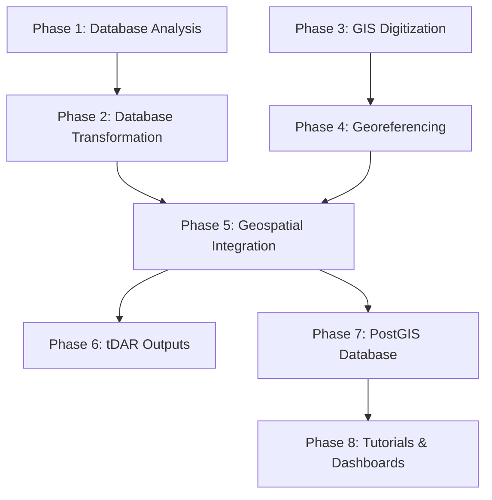

# Digital TMP - Project Architecture (Draft v1.3 -- 6/11/2025)

---
**Author:** Rudolf Cesaretti
**Affiliation:** ASU Teotihuacan Research Laboratory
**Date:** June 11, 2025
---

This project uses a modular structure based on three tiers:

- **Phases**: Major units of the project
- **Workflows**: Processes within each phase
- **Tasks**: Smallest unit of execution

---

## Project Architecture Summary

This project progresses through eight (n = 8) methodologically distinct phases that systematically transform legacy archaeological databases into a modern, integrated geospatial data infrastructure. The architecture follows a data science pipeline approach, beginning with legacy database analysis and transformation (Phases 1–2), advancing through spatial data creation and georeferencing (Phases 3–4), achieving full geospatial integration with advanced feature engineering (Phase 5), preparing archival-ready outputs for long-term preservation (Phase 6), implementing a production-grade PostGIS database (Phase 7), and culminating in user-facing applications and comprehensive tutorials (Phase 8).

Each phase builds sequentially toward a fully reproducible, multi-format archaeological database that serves diverse stakeholder needs—from advanced researchers requiring programmatic access to public audiences seeking interactive visualization tools. The architecture emphasizes reproducibility, scalability, and interoperability, incorporating modern data science practices including automated validation, version control, containerized deployment, and comprehensive metadata management. The resulting infrastructure transforms the Teotihuacan Mapping Project's legacy data into a contemporary geospatial research platform while maintaining full provenance and enabling future extensibility.

---

## Phase Overview

The Digital TMP project architecture represents a comprehensive data modernization initiative that addresses the complex challenges of integrating legacy archaeological databases with contemporary geospatial technologies. The eight-phase approach ensures systematic quality control, maintains data provenance, and produces multiple distribution formats to serve diverse research and public engagement needs.

**Data Foundation (Phases 1-2)** establishes the analytical groundwork through rigorous evaluation of legacy MS Access databases, followed by systematic ETL processes that produce clean, analysis-ready datasets. These phases implement database profiling, schema optimization, and controlled vocabulary standardization to ensure data quality and analytical coherence.

**Spatial Data Creation (Phases 3-4)** addresses the manual digitization of archaeological features from historical maps and implements high-precision georeferencing workflows. These phases overcome the limitations of legacy cartographic materials through custom transformation pipelines and establish spatial accuracy standards for all subsequent analyses.

**Integration and Enhancement (Phase 5)** merges tabular and spatial datasets while implementing advanced feature engineering to derive new analytical variables. This phase leverages spatial relationships to enhance interpretive capacity and validates all integrated outputs through automated quality assurance protocols.

**Preservation and Distribution (Phases 6-8)** ensure long-term accessibility through multiple complementary approaches: formal archival submission to tDAR, deployment of a production-grade PostGIS database, and creation of user-friendly web applications. These phases balance preservation requirements with contemporary access patterns, providing pathways for both technical users requiring full analytical capabilities and public audiences seeking interactive exploration tools.

The architecture incorporates modern data science principles throughout, including reproducible computational environments (Docker containers), automated validation frameworks, version-controlled workflows, and comprehensive documentation standards. This approach ensures that the resulting infrastructure can accommodate future technological evolution while maintaining backward compatibility and data integrity.

---

### Phase Overview Summary Table

| Phase | Description | Inputs | Outputs |
|-------|-------------|--------|---------|
| Phase 1: Database Analysis | Systematic evaluation and profiling of legacy TMP databases to inform optimal schema design and transformation strategies | 4 SQL Database Dumpt files written from comprehensive analysis of the original MS Access DBs | PostgreSQL migration, ERDs, schema profiling reports, denormalization white paper |
| Phase 2: Database Transformation | Comprehensive ETL and feature engineering to produce analysis-ready tabular datasets with standardized vocabularies | PostgreSQL tables, controlled vocabularies | TMP_DF12, TMP_REANs_DF4, transformation logs, validation reports |
| Phase 3: GIS Digitization | Manual digitization of archaeological, environmental, and modern features from historical raster maps | Raster basemaps, legacy documentation | Digitized vector layers, provisional attribute schemas, digitization metadata |
| Phase 4: Georeferencing | High-precision georeferencing using custom NTv2 transformations and spatial accuracy validation | Digitized vectors, GCPs, raster tiles | Spatially-aligned datasets, transformation grids, accuracy assessments |
| Phase 5: Geospatial Integration | Integration of tabular and spatial data with advanced feature engineering and architectural classification | GIS layers, TMP_DF12, REANs_DF4 | Fully integrated geospatial datasets, derived spatial attributes, classification schemes |
| Phase 6: tDAR Outputs | Preparation and packaging of archival-ready datasets with comprehensive metadata for long-term preservation | Integrated datasets, metadata | tDAR-compliant packages, controlled vocabularies, documentation, tutorials |
| Phase 7: PostGIS Database | Design and deployment of production-grade spatial database with optimized schemas and performance tuning | Integrated geospatial datasets | PostGIS database, Docker containers, SQL dumps, API endpoints |
| Phase 8: Tutorials & Dashboards | Development of user-facing applications and comprehensive tutorials for diverse analytical workflows | PostGIS database, static exports | WebGIS dashboard, REST API, Python/R/QGIS tutorials |

---

### Phase Overview Flow Diagram

---

## Software Used by Phase

The project leverages a comprehensive technology stack combining industry-standard geospatial tools, modern data science frameworks, and cloud-native deployment strategies. Software selection prioritizes reproducibility, scalability, and long-term maintainability while ensuring compatibility with both research and archival infrastructure requirements.

| Phase | Core Technologies | Specialized Tools & Libraries |
|-------|-------------------|-------------------------------|
| **Phase 1: Database Analysis** | **PostgreSQL 17, Python 3.11+** | SQLAlchemy, psycopg2, Pandas, SQLParse (schema parsing), Graphviz (ERD generation), Jupyter Notebooks |
| **Phase 2: Database Transformation** | **PostgreSQL 17, Python 3.11+** | Pandas, GeoPandas, SQLAlchemy, Great Expectations (validation), dbt (optional), Jupyter Notebooks, regex libraries |
| **Phase 3: GIS Digitization** | **QGIS 3.40.5** | QGIS Topology Checker, Geometry Validation tools, Python (GeoPandas, Shapely) for QA/visualization |
| **Phase 4: Georeferencing** | **QGIS 3.40.5, GDAL 3.6+ (tested on 3.6.2 ▼ †), PROJ 9.0+** | QGIS Georeferencer, gdal\_warp, gdal\_translate, pyproj, custom NTv2 grid tools, spatial statistics libraries (R/Python) |
| **Phase 5: Geospatial Integration** | **PostgreSQL 17 + PostGIS 3.4, Python 3.11+** | GeoPandas, Shapely, psycopg2, rasterstats, QGIS (visualization), SQL spatial functions |
| **Phase 6: tDAR Outputs** | **PostgreSQL + PostGIS, GDAL, Python/R** | ogr2ogr, GeoPandas, sf (R), tidyverse (R), Pandoc (documentation), LaTeX/Markdown, 7-Zip |
| **Phase 7: PostGIS Database** | **PostgreSQL 17 + PostGIS 3.4, Docker** | ogr2ogr, raster2pgsql, psycopg2, SQLAlchemy, FastAPI, Docker Compose, pg_dump utilities |
| **Phase 8: Tutorials & Dashboards** | **FastAPI, Leaflet.js, Python 3.11+, R 4.3+** | Folium, Plotly, sf, ggplot2, tmap, DBI, RPostgreSQL, Jupyter Notebooks, RMarkdown, QGIS |

† GDAL 3.8+ offers marginal performance improvements and new drivers but is optional for this project.

### Technology Stack Rationale

**Database Infrastructure**: PostgreSQL with PostGIS provides enterprise-grade spatial capabilities, ACID compliance, and excellent performance for complex analytical queries. Version 17 offers enhanced spatial indexing and improved JSON handling for metadata management.

**Geospatial Processing**: GDAL/OGR serves as the foundational library for spatial data I/O and transformations, ensuring compatibility across diverse formats. QGIS provides essential manual digitization capabilities and visualization tools for quality assurance. All required functionality is fully supported on **GDAL 3.6 series**; later versions (≥ 3.8) are advantageous only for optional utilities (e.g. > All required functionality is fully supported on **GDAL 3.6 series**; later versions (≥ 3.8) are advantageous only for optional utilities (e.g.\xA0`gdal_footprint`) or new web‑tile drivers and are therefore not mandated.

**Programming Environments**: Python ecosystem (GeoPandas, Shapely, Folium) offers comprehensive geospatial analysis capabilities, while R (sf, tidyverse) provides specialized statistical and visualization tools for archaeological analysis. Both environments support reproducible research through Jupyter Notebooks and RMarkdown.

**Deployment & Distribution**: Docker containerization ensures reproducible deployment environments, while FastAPI provides lightweight, high-performance API services. Leaflet.js enables cross-platform web mapping without external dependencies.

**Data Quality & Validation**: Great Expectations and dbt (optional) provide automated data validation frameworks, while custom SQL constraints enforce spatial and relational integrity throughout the pipeline.

**Archival Compatibility**: Tools selection prioritizes long-term preservation requirements, with exports to standard formats (Shapefile, GeoJSON, CSV) ensuring compatibility with future technological environments.

---

## Detailed Overview of Project Architecture 

---

### Phase 1: Legacy Database Profiling & Architectural Analysis

**Description:**
This foundational phase focuses on the systematic, quantitative evaluation of the four legacy TMP databases (`DF8`, `DF9`, `DF10`, `REAN_DF2`) to produce actionable, data-driven insights that will inform their eventual transformation and integration. The architecture for this phase is organized into four distinct, sequential workflows that move from initial setup and data generation to final analysis and recommendation.

Through an automated pipeline, this phase performs deep database profiling, generates structural visualizations, and conducts a rigorous quantitative analysis of the legacy schemas. The primary objective is to produce a defensible, evidence-based argument for the optimal target architecture for Phase 2. The outcomes directly inform schema redesign decisions, justify the project's denormalization strategy, and establish a reproducible technical baseline for validating all future data transformations. The final deliverable is a white paper that presents this evidence and formally recommends a unified, wide-format, analysis-ready database structure.

**Inputs:**

- **Legacy Database Dumps**: Complete SQL dump scripts for `TMP_DF8`, `TMP_DF9`, `TMP_DF10`, and `TMP_REAN_DF2`.
- **Corrected ETL Queries**: Two hand-authored SQL scripts (`flatten_df9.sql`, `flatten_df9_text_nulls.sql`) for transforming the `TMP_DF9` database into wide-format benchmarks.
- **Historical Documentation**: Any existing data dictionaries or notes associated with each legacy database.

**Outputs:**
- **PostgreSQL Databases**: Six fully instantiated local PostgreSQL databases (4 legacy, 2 benchmark).
- **Entity-Relationship Diagrams**: A set of high-quality SVG diagrams, including full-schema ERDs for all databases and focused, subsystem-level ERDs for the complex `TMP_DF9`.
- **Raw Quantitative Metrics**: A comprehensive set of granular metric files (~40 files) detailing every aspect of the databases, from table sizes to column-level data profiles. Persisted to `outputs/metrics/`.
- **Aggregated Summary Reports**: A machine-readable `comparison_matrix.csv` and a human-readable `comparison_report.md` that synthesize all raw metrics.
- **Executed Analytical Notebooks**: A set of six individual and one comparative Jupyter Notebooks containing all charts, tables, and analysis.
- **Denormalization White Paper (v3)**: The final narrative report presenting the quantitative justification for the recommended schema redesign.

**Tools & Techniques:**
- **Databases**: PostgreSQL (v17+)
- **Programming**: Python 3.11+
- **Core Python Libraries**: Pandas, SQLAlchemy, Psycopg2
- **Pipeline Scripts**: A suite of five orchestrator scripts (`00_` to `04_`) and a modular `profiling_modules` package.
- **Schema Visualization**: Graphviz
- **Analysis Environment**: Jupyter Notebooks with Plotly for interactive visualizations.

---

#### Workflow 1.1: Environment & Database Setup

**Overview:**
This initial workflow establishes the controlled, reproducible environment for the entire analytical phase. It automates the creation of PostgreSQL instances for all four legacy databases and, critically, generates two denormalized "benchmark" databases from the most complex legacy schema (`TMP_DF9`). These benchmarks serve as the performance baseline against which the legacy structures are quantitatively measured, forming the core of the argument for denormalization.

**Tasks:**
- **Design & Author SQL**: Design and author the complex ETL queries (`flatten_df9.sql`, `flatten_df9_text_nulls.sql`) required to transform the `TMP_DF9` schema into analysis-ready wide-format tables.
- **Develop Python Scripts**: Develop, document, and refine the robust, idempotent Python orchestration scripts (`00_setup_databases.py`, `01_create_benchmark_dbs.py`) responsible for automating all database creation and population tasks.
- **Configure Environment**: Configure the `src/config.ini` file with the correct local PostgreSQL credentials and file paths for all inputs and outputs.
- **Execute Database Instantiation**: Execute the `00_setup_databases.py` script to automatically create and populate the four legacy TMP databases from their source `.sql` dump files.
- **Execute Benchmark Creation**: Execute the `01_create_benchmark_dbs.py` script to run the flattening queries and create the two wide-format benchmark databases (`tmp_benchmark_wide_numeric`, `tmp_benchmark_wide_text_nulls`).
- **Develop Test Suite**: Implement a formal `pytest` suite to unit-test the logic of the setup scripts, with a focus on configuration parsing and error handling.
- **Validate Environment**: Conduct post-execution validation using a database client (e.g., `psql`) to confirm the successful creation and population of all six databases and their constituent tables.

---

#### Workflow 1.2: Metric & Artifact Generation

**Overview:**
This workflow is the primary automated data-gathering engine of Phase 1. Using a modular and extensible `profiling_modules` package, a single orchestrator script connects to each of the six databases and executes a comprehensive suite of profiling tasks. This process gathers a rich dataset covering every aspect of the databases, from high-level statistics to granular, column-level data profiles. In parallel, a dedicated script generates visual diagrams of each schema.

**Tasks:**
- **Define Metrics**: Compile the exhaustive **Master List of Profiling Metrics** by synthesizing project requirements, data engineering best practices, and the specific analytical goals of the denormalization argument.
- **Develop Profiling Engine**: Develop the modular `profiling_modules` Python package, creating distinct, testable modules for each category of metric (basic, schema, profile, interop, performance).
- **Develop Orchestration Scripts**: Develop and document the main pipeline orchestrator (`02_run_profiling_pipeline.py`) and the enhanced ERD generation script (`03_generate_erds.py`), including logic for strategic, focused ERD creation.
- **Configure Dependencies**: Populate the `sql/canonical_queries.sql` file with representative queries for benchmarking and ensure the external `Graphviz` dependency is installed and accessible in the system PATH.
- **Execute Profiling Pipeline**: Execute the `02_run_profiling_pipeline.py` script to systematically run all profiling functions against all six databases, generating the full set of raw metric files in `outputs/metrics/`.
- **Execute ERD Generation**: Execute the `03_generate_erds.py` script to produce all full-schema and focused, subsystem-level ERD diagrams in SVG format.
- **Develop Test Suite**: Implement a comprehensive `pytest` suite for the `profiling_modules` package, using a temporary test database fixture to validate the correctness of each metric calculation function.
- **Validate Outputs**: Verify the successful creation of all expected raw metric files (~40) and ERD diagrams (9) in their respective `outputs/` subdirectories.

---

#### Workflow 1.3: Aggregation & Synthesis

**Overview:**
This workflow addresses the challenge of information overload by taking the dozens of granular metric files produced in the previous workflow and synthesizing them into concise, high-level reports. A discovery-driven script automatically finds and processes all available metric data, ensuring that the final reports are always synchronized with the generated data. This stage transforms the raw data into a format suitable for high-level comparison and analysis.

**Tasks:**
- **Design Aggregation Strategy**: Design a dynamic, discovery-driven aggregation strategy to synthesize numerous raw metric files into a cohesive summary, mapping detailed metrics (e.g., row counts per table) to high-level reportable items (e.g., "Total Estimated Rows").
- **Develop Synthesizer Script**: Develop and document the `04_run_comparison.py` script to automatically load, process, aggregate all generated metrics, and resiliently handle any missing metric files from a partial pipeline run.
- **Execute Aggregation**: Execute the `04_run_comparison.py` script to process all files in `outputs/metrics/`.
- **Generate Summary Reports**: The execution will produce the two key summary deliverables: `comparison_matrix.csv` (machine-readable) and `comparison_report.md` (human-readable).
- **Develop Test Suite**: Implement a `pytest` suite using a temporary file system fixture (`tmp_path`) to create fake input metric files and validate that the aggregation logic is correct and that the output reports are generated as expected.
- **Validate Reports**: Manually and programmatically inspect the generated `comparison_matrix.csv` and `comparison_report.md` files to ensure correctness, completeness, and proper formatting.

---

#### Workflow 1.4: Analysis, Reporting, & Recommendation

**Overview:**
This is the final, human-in-the-loop workflow where all the generated data, artifacts, and reports are brought together for interpretation and synthesis. Using a set of powerful Jupyter Notebook templates, the analyst performs deep-dive and comparative analyses to build the final, evidence-based argument and formal recommendation for the white paper.

**Tasks:**
- **Design Notebook Templates**: Design and develop two comprehensive Jupyter Notebook templates (`template_individual_db_analysis.ipynb`, `template_comparative_analysis.ipynb`) with pre-built data loading, advanced interactive visualizations (e.g., radar plots, performance factor charts), and guided analytical prompts.
- **Execute Individual Analyses**: Utilize the individual analysis template by creating six copies and running each one to produce a detailed, standardized analytical report for each of the six databases.
- **Execute Comparative Analysis**: Utilize the comparative analysis template to conduct the final cross-database comparison, synthesizing all results into a single, persuasive narrative.
- **Perform Smoke Tests**: Implement automated "smoke tests" using `nbconvert` or `papermill` to ensure the notebook templates can execute from top to bottom without error against the real data.
- **Synthesize Final Recommendation**: Perform the final human-in-the-loop analysis to interpret the generated visualizations, answer the analytical prompts in the notebooks, and formulate the final, data-driven recommendation for the Phase 2 architecture.
- **Draft Final White Paper**: Synthesize all quantitative findings, visualizations, and analytical narratives from the executed notebooks into a revised and expanded `Phase1_WhitePaper_v3.md`, solidifying the final architectural recommendation.

---

### Phase 2: TMP Data Integration

**Description:**
Phase 2 focuses on the systematic consolidation and transformation of the legacy TMP datasets into a unified, analysis-ready relational framework. This process is executed in a staged approach, beginning with the integration of complementary information from three versions of the legacy database (DF8, DF9, DF10) to produce a provisional consolidated dataset (DF11). In addition, the REANs DF2 database is cleaned, redesigned and validated,  to produce a provisional consolidated dataset (REANs DF3). Building upon this foundation, the phase advances to an intensive, variable-by-variable redesign and transformation of the integrated data, culminating in the final DF12 and REAN DF4 datasets. This process ensures that the resulting datasets are analytically robust, semantically coherent, and optimized for spatial integration and long-term archival dissemination. The phase concludes with the implementation of an automated metadata validation and data quality framework to enforce rigorous data integrity and documentation standards.

**Inputs:**

- Validated PostgreSQL instances of the legacy TMP databases (DF8, DF9, DF10).
- Schema profiling reports and ER diagrams produced in Phase 1.
- Historical data dictionaries and controlled vocabularies.
- Integration and transformation scripts developed during Phase 1.

**Outputs:**

- Provisional integrated dataset (DF11).
- Final analysis-ready dataset (DF12).
- Comprehensive controlled vocabulary glossaries and lookup tables.
- Detailed Variable Transformation Log documenting all modifications and engineering steps.
- Automated data validation and quality reports.

**Tools & Techniques:**

- PostgreSQL and PostGIS for data integration and relational management.
- Python (Pandas, GeoPandas, SQLAlchemy) for ETL scripting and variable transformation.
- Great Expectations or dbt for automated data quality validation.
- Jupyter Notebooks for reproducible data transformation workflows.
- Draw\.io or Lucidchart for data model visualizations.

---

#### Workflow 2.1. Legacy Dataset Integration (DF8, DF9, DF10 → DF11; REAN DF2 → REAN DF3)

**Overview:**
This workflow performs the integration of complementary information from the three core legacy TMP database versions into a unified, provisional dataset (DF11). The process resolves schema inconsistencies, harmonizes attribute naming conventions, and ensures relational integrity across previously disparate datasets. This provisional dataset provides a coherent structural foundation for the subsequent redesign and analytical enhancement workflows.

**Tasks:**

- Conduct schema alignment by analyzing discrepancies between DF8, DF9, and DF10 using recommendations, profiling reports and ER diagrams from Phase 1.
- Flatten multi-table structures into unified, wide-format tables
- Clean and validate REANs_DF2 → output REANs_DF3
- Develop attribute crosswalk tables to standardize variable names, data types, and categorical value formats across legacy datasets using metadata tables.
- Reconcile and cross-validate overlapping or shared variables between datasets
- Implement automated ETL pipelines in Python to merge legacy datasets, ensuring data provenance is maintained through source tracking fields.
- Resolve duplicate records and structural conflicts using rule-based resolution strategies, prioritizing the most authoritative and complete data sources.
- Produce and archive the provisional DF11 and REANs_DF3 datasets along with detailed integration logs documenting all merging decisions and unresolved issues requiring future review.

---

#### Workflow 2.2. Variable Redesign and Analytical Transformation (DF11 → DF12; REAN DF3 → REAN DF4)

**Overview:**
This critical workflow undertakes a comprehensive, variable-by-variable redesign and transformation of the provisional DF11 dataset to maximize its analytical utility. Variables are systematically evaluated for data quality, relevance, and interpretability. Transformation processes include cleaning, recoding, consolidation, and the engineering of new variables to reflect domain-relevant analytical concepts. The final output of this workflow is the DF12 dataset, fully standardized and optimized for spatial and statistical analysis.

**Tasks:**
- Conduct variable-level evaluations to assess data completeness, analytical significance, and redundancy.
- Engineer new variables through consolidation and decomposition of complex fields, the creation of ordinal scales, and the restructuring of categorical variables (aggregation, binning, transformation) to align with analytical frameworks. 
- Clean or reformat text, categorical, and numeric fields. Apply advanced data cleaning techniques using regular expressions, string normalization, and programmatic logic to resolve legacy data inconsistencies (e.g., parsing and standardizing `site` and `subsite` designations).
- Introduce new analytic variables such as counts of sites, locations, and subsites per collection unit to enhance the interpretability of archaeological patterns.
- Transform nominal variables into ordinal scales where appropriate, enhancing their utility in statistical and machine learning models (e.g., recoding architectural quality variables).
- Remove redundant, obsolete, or low-information variables, fully documenting all deletions and modifications in the Variable Transformation Log. Merge related variables, split overloaded columns, and drop fields that are redundant, obsolete, or analytically irrelevant.
- Restructure column order, apply consistent naming conventions
- Produce the finalized DF12 dataset, accompanied by complete transformation documentation and controlled vocabulary glossaries.
- Clean REAN_DF3, perform variable redesign and metadata construction in the same manner as for DF11/DF12, above, and align REAN_DF3 with DF12 by SSN. Missing rows (SSNs) from REANs dataset are left NULL. The finalized REAN dataset, "REAN_DF4", is accompanied by complete transformation documentation and controlled vocabulary glossaries.

---

#### Workflow 2.3. Controlled Vocabulary Consolidation

**Overview:**
This workflow formalizes the controlled vocabularies applied to the DF12 and REAN_DF4 datasets, ensuring semantic consistency and analytical coherence across all categorical variables. These controlled vocabularies facilitate standardized data interpretation and support interoperability with external metadata schemas, including tDAR archival standards.

**Tasks:**

- Consolidate categorical value sets across legacy datasets into unified controlled vocabulary tables.
- Apply final vocabulary mappings to all categorical fields in the DF12 & REAN_DF4 datasets, ensuring consistency in terminology and coding structures.
- Produce comprehensive glossaries of controlled vocabularies, formatted as both human-readable PDFs and structured CSV lookup tables for programmatic use.
- Ensure that controlled vocabularies are aligned with tDAR metadata requirements and that all vocabulary documentation is referenced appropriately in dataset metadata records.

---

#### Workflow 2.4. Automated Metadata Validation & Data Quality Framework

**Overview:**
This workflow implements an automated framework for data validation and metadata compliance, integrating data quality assurance directly into the project’s ETL pipelines. The framework enforces schema integrity, relational consistency, and metadata completeness through the application of formal validation rules and automated reporting mechanisms. This ensures that the DF12 dataset and all future data products meet rigorous standards for analytical reliability and long-term reproducibility.

**Tasks:**

- Integrate data validation frameworks such as `Great Expectations` or `dbt` into the data transformation pipelines to enforce schema, content, and metadata compliance.
- Define validation rules covering key integrity checks, including schema structure, variable-level constraints (e.g., null checks, uniqueness, value ranges), and relational dependencies (e.g., foreign key enforcement).
- Automate metadata completeness checks, ensuring that all datasets are accompanied by fully populated metadata at the project, dataset, and file levels.
- Embed validation steps into CI/CD workflows using GitHub Actions or Prefect, enforcing automated data quality gates during development and deployment.
- Generate reproducible data quality and profiling reports for each dataset release, archiving these reports alongside the datasets to ensure transparency and auditability.
- Establish data lineage and transformation traceability through version-controlled logs and structured documentation, ensuring that all modifications to the data can be fully reconstructed and justified.

---

## Phase 3: Geospatial Data Creation & Digitization

**Description:**
Phase 3 is dedicated to the manual creation of new geospatial vector datasets derived from previously non-existent spatial representations of critical archaeological and historical data. The digitized features include archaeological, environmental, and modern features from the Teotihuacan Mapping Project (TMP). Operating within a pre-georeferenced context, this phase focuses on the labor-intensive process of manually digitizing spatial features using QGIS, guided by assembled raster basemaps including scanned maps, aerial imagery, and legacy documentation. Because the original raster maps are not machine-readable and contain complex symbology, digitization was conducted manually using QGIS. The goal is to extract semantically meaningful features for spatial analysis, including archaeological structures, survey zones, land use classifications, and other field-recorded data.

The primary objective of this phase is to produce high-fidelity provisional spatial layers that accurately represent archaeological site boundaries, architectural features, excavation units, and other relevant spatial phenomena documented by the TMP. These datasets will subsequently undergo georeferencing in Phase 4 and full spatial integration and attribute enrichment in Phase 5.

*****NOTE:*** *Due to the characteristics of the TMP raster maps, the digitization workflows undertaken in Phase 3 were largely performed manually using QGIS 3.40.5. As such, Workflows 3.2. and 3.3. can only be documented using text, tables and figures, as well as examination and visualization of their outputs (the digitized GIS layers) in Python or R.*
**Description:**  

**Inputs:**

- Assembled raster basemaps (e.g., scanned survey maps, aerial photographs, historical site plans).
- Legacy TMP documentation and cartographic resources.
- Legacy TMP vector data layers (especially Sherfield's Architectural reconstruction polygons and Robertson's survey collection units)
- QGIS project templates for standardized digitization environments.

**Outputs:**

- Provisional vector datasets (polygons, lines, and points) representing TMP archaeological features.
- Cleaned and topologically validated shapefiles with standardized provisional attribute schemas.
- Digitization metadata records documenting source materials, accuracy considerations, and workflow decisions.

**Tools & Techniques:**

- QGIS 3.40.5 for manual digitization and spatial quality assurance.
- Raster basemap preprocessing using GDAL and QGIS Raster Tools.
- QGIS Topology Checker and Geometry Validation tools for pre-georeferencing QA.
- Structured file naming conventions and attribute schema templates for provisional shapefiles.
- Python (`geopandas`, `shapely`) for QA, visualization, and post-processing

---

### Workflow 3.1: Raster Assembly for Digitization Context

**Overview:**
This workflow focuses on the preparation and assembly of raster basemaps that serve as the visual and contextual foundation for the digitization of new vector layers. These basemaps include a combination of scanned historical maps, aerial imagery, and previously undocumented legacy resources. Proper organization and preprocessing of these raster files are critical to ensure consistency and accuracy during the manual digitization process.

**Tasks:**

- Collect and catalog all relevant raster basemaps, including scanned TMP survey maps, excavation records, and aerial photographs.
- Align and trim raster edges to unify coverage
- Aggregate individual raster tiles into two base layers:  
  - TMP Topo/Survey Raster  
  - TMP Architectural Reconstruction Raster
- Preprocess raster files using GDAL and QGIS to enhance visual clarity and remove distortions where possible.
- Assemble QGIS project templates that overlay relevant basemaps, standardizing symbology, layer ordering, and digitization scales.
- Export high-resolution mosaics for digitization use
- Document the provenance of all raster sources and their intended use in the digitization workflows.

---

### Workflow 3.2: Manual Digitization of Vector Layers from the TMP Topo/Survey Map

**Overview:**
This workflow carries out the manual creation of new vector datasets through detailed digitization of archaeological, survey, and environmental features visible from the Topo/Survey raster basemap. Digitization is performed systematically using QGIS, with careful attention paid to spatial accuracy, feature delineation, and provisional attribute consistency. Digitization is constrained by topological rules to maintain spatial validity.

**Tasks:**
- Edit and Finalize TMP collection unit polygon layer
- Manually digitize spatial features corresponding to 'on-site' archaeological features:  
  - Floors
  - Walls
  - Taludes and Tableros
  - Plazas
  - Pits
  - Mounds
  - Stone concentrations
  - Sherd concentrations
  - Obsidian concentrations
  - Excavations
  - Staircases
  - Sherd dumps
- Manually digitize spatial features corresponding to 'off-site' zones and survey annotations:  
  - Not Surveyed + No Permission
  - Survey tracts with 'Nada' (“N”) surface artifact densities
  - Survey tracts with 'Almost Nada' (“AN”) surface artifact densities
- Manually digitize spatial features corresponding to environmental and modern land use features:  
  - Terraces
  - Tepetate
  - Drains
  - Dams
  - Borrow pits
  - Jagueys, reservoirs
  - Buildings
  - Built-up areas
  - Canals, rivers, barrancas
  - Roads, railroads, power lines
  - Alfalfa
  - Orchards
  - Levelled
  - “Destroyed”
  - Altered
  - Eroded
  - Silted
- Create separate vector layers for each thematic category (e.g., site boundaries, architectural features, excavation units) to maintain organizational clarity.
- Apply provisional attribute schemas using standardized field names and data types to ensure consistency across all vector layers.
- Adopt structured file naming conventions to facilitate easy identification and version control of provisional shapefiles.
- Produce provisional metadata records for each vector layer, noting digitization scale, source basemaps used, and any known uncertainties or interpretive decisions made during feature delineation.

---

### Workflow 3.3. Manual Digitization of Vector Layers from the TMP Architectural Reconstructions Map

**Overview:**  
This workflow carries out the manual editing of legacy vector datasets through detailed digitization of archaeological features from the Architectural Reconstructions  raster basemap (architectural structures reconstructed from field data and historical interpretations). Digitization is performed systematically using QGIS, with careful attention paid to spatial accuracy, feature delineation, and provisional attribute consistency. It involves reconciling multiple versions of polygons, interpreting drawn annotations, and applying Sherfield’s classification scheme (e.g. “Map Assignations”). Digitization is constrained by topological rules to maintain spatial validity.

**Tasks:**
- Load and inspect Architectural Reconstruction raster in QGIS
- Analyze differences between architectural polygon versions
- Implement polygon re-digitization of Sherfield's 2023 line features in the urban core using Sherfield’s classification and zone boundary rules (“Map Assignations System”)
- Resolve overlaps and inconsistencies with Topo/Survey digitized layers
- Apply provisional attribute schemas using standardized field names and data types to ensure consistency across all vector layers.
- Adopt structured file naming conventions to facilitate easy identification and version control of provisional shapefiles.
- Produce provisional metadata records for each vector layer, noting digitization scale, source basemaps used, and any known uncertainties or interpretive decisions made during feature delineation.

---

### Workflow 3.4: Pre-Georeferencing Metadata & Quality Assurance

**Overview:**
This workflow implements a set of quality assurance protocols to validate the structural integrity and internal consistency of the digitized vector datasets prior to georeferencing in Phase 4. Although the datasets do not yet possess real-world spatial reference systems, it is essential to ensure topological correctness and attribute schema standardization at this stage to facilitate efficient downstream processing.

**Tasks:**

- Perform geometry validation checks using the QGIS Geometry Validity and Topology Checker tools to identify and correct invalid geometries, such as self-intersecting polygons or gaps between adjacent features.
- Ensure that polygons are properly closed, lines are correctly snapped where appropriate, and point features are accurately placed relative to basemap features.
- Standardize provisional attribute fields across vector layers, applying consistent field names, data types, and placeholder values as needed.
- Produce automated spatial metadata summaries documenting feature counts, geometry types, and bounding box extents for each provisional layer.
- Archive validated provisional vector datasets and metadata documentation in a version-controlled environment, preparing them for georeferencing in Phase 4.

---

### Phase 4: Georeferencing

**Description:**  
This phase develops and implements a high-precision georeferencing workflow to spatially align the digitized raster and vector layers produced in Phase 3. The georeferencing process incorporates ground control points (GCPs), raster transformation techniques, and spatial error evaluation. The goal is to ensure that all spatial data layers can be integrated and cross-referenced with high spatial fidelity.

**Inputs:**
- Raster outputs from Phase 3 (Topo/Survey, Reconstruction maps)
- Manually collected GCPs from survey and aerial imagery
- QGIS GCP layer and calibration outputs

**Outputs:**
- Spatially-aligned raster layers
- Transformation metadata (CRS definitions, NTv2 shift grids)
- Validated raster/vector layers ready for integration

**Tools & Techniques:**
- QGIS Georeferencer plugin
- GDAL Warp + gdal_translate
- PROJ custom CRS definitions
- Spatial autocorrelation analysis (R, Python)

---

### Workflow 4.1: Raster Pre-Processing and Ground Control Points (GCPs)

**Overview:**
This workflow focuses on preparing the data for the georeferencing of historical raster basemaps by using modern sattelite imagery to create a dense set of Ground Control Points (GCPs) matched to the TMP Survey maps in Millon Space, and then manually testing their adequacy in QGIS. 

**Tasks:**

- Download/Import/Setup GCP-Reference Photogrammetry Raster Layers used for taking GCPs
- Manually take GCPs in QGIS, export them as points
- Import, read and process GCPs manually taken in QGIS
- Preprocess raster basemaps to enhance clarity and prepare them for transformation.
- Convert finalized GCPs to GDAL format and attach to raster basemaps
- Test projective transformations using GCPs and GDAL tools, with Lanczos resampling to optimize image quality.

---

### Workflow 4.2: Raster Basemap Georeferencing Method Calibration and Optimization

**Overview:**
This workflow consolidates and refines the existing set of high-density GCPs, which form the foundation for all subsequent georeferencing transformations. High-order projective transformations and advanced resampling techniques are employed to minimize spatial distortion and preserve cartographic integrity. The process ensures that GCP datasets are free from outliers and adequately distributed to support high-accuracy spatial transformations. This workflow also implements formal spatial accuracy validation procedures to assess the effectiveness of the georeferencing transformations. Validation results are documented in technical reports, ensuring transparency and supporting confidence in the spatial integrity of all transformed datasets.

**Tasks:**

- Sensitivity analysis to evaluate transformation performance under different interpolation and resampling methods 
  - Optimized raster georeferencing using GDAL. Warp with multithreading and parallel processing for transformations
  - Recursive Georeferencing Error Assessment & Visualization under different methods (transformation and resampling methods)
    - Calculate Root Mean Square Error (RMSE) across all GCP residuals to quantify georeferencing accuracy.
    - Produce spatial error heatmaps and residual plots to visually assess the distribution and magnitude of spatial errors.
    - Conduct spatial autocorrelation analysis (e.g., Moran’s I) to identify non-random patterns in residual spatial errors.
    - Compile validation results into formal accuracy reports, included as part of the project’s technical documentation deliverables.
  - Select optimal georeferencing method via final comparative analysis of method performance
- Validate transformed rasters through side-by-side overlays in QGIS, ensuring alignment with known control features.
- Document transformation parameters and produce accompanying metadata records.

---

### Workflow 4.3: Generation of Custom NTv2 Grid Shift Transformation Pipeline

**Overview:**
Build and implement a custom CRS transformation pipeline using PROJ with NTv2 grid shift capabilities. This includes defining local projection parameters, performing grid shift interpolation, and applying transformations to both raster and vector data. This critical workflow develops high-accuracy NTv2 grid shift transformation files (`.gsb`), enabling precise, reproducible georeferencing of both raster and vector datasets. This formalizes the transformation process, ensuring that all spatial data can be accurately transformed between Millon Space and modern coordinate systems.

**Tasks:**
- Define custom CRS for 'Millon Space' using PROJ tools
- Apply Thin Plate Spline (TPS) interpolation to the refined GCP dataset to model spatial distortions inherent in the Millon Space system.
- Generate NTv2 grid shift files using GDAL tools and custom Python scripts.
- Register the resulting `.gsb` files with PROJ and QGIS environments to enable direct application of transformations across analytical workflows.
- Include NTv2 transformation files as formal project deliverables, accompanied by technical documentation detailing their development and application.
- Define custom transformation PROJ pipeline using custom 'Millon Space' CRS and NTv2 shift grid

---

### Workflow 4.4: Vector Data Georeferencing Using NTv2 Transformations

**Overview:**
This workflow applies the NTv2 transformations to all provisional vector datasets, converting them into real-world coordinate systems with high spatial accuracy. Following transformation, datasets are validated for geometry correctness and spatial integrity.

**Tasks:**
- Apply NTv2 grid shift transformations to provisional vector datasets using GDAL and pyproj libraries.
- Perform post-transformation geometry validation, correcting any invalid or anomalous geometries resulting from transformation processes.
- Standardize CRS definitions across all transformed datasets, assigning EPSG:32614 for analytical outputs.
- Archive transformed datasets and document all transformation parameters for reproducibility.

---

### Workflow 4.5: Accuracy Assessment and Validation

**Overview:**
This workflow implements formal spatial accuracy validation procedures to assess the effectiveness of the georeferencing transformations. Validation results are documented in technical reports, ensuring transparency and supporting confidence in the spatial integrity of all transformed datasets.

**Tasks:**

- Final Error assessment with diagnostics reporting and visuals
  - Calculate Root Mean Square Error (RMSE) across all GCP residuals to quantify georeferencing accuracy.
  - Produce spatial error heatmaps and residual plots to visually assess the distribution and magnitude of spatial errors.
  - Conduct spatial autocorrelation analysis (e.g., Moran’s I) to identify non-random patterns in residual spatial errors.
  - Compile validation results into formal accuracy reports, included as part of the project’s technical documentation deliverables.
- Corrective Rubber-Sheeting if necessary

---

### Workflow 4.6: Export of Georeferenced Datasets in Final CRSs

**Overview:**
This final workflow prepares all georeferenced datasets for distribution and analytical use. Production datasets are maintained in EPSG:32614 for advanced analysis, while final dissemination datasets are exported in EPSG:4326 to ensure compatibility with WebGIS platforms and public data repositories.

**Tasks:**

- Export production datasets in EPSG:32614 for advanced spatial analysis and integration into the PostGIS environment.
- Prepare public-facing datasets in EPSG:4326, simplifying geometries and compressing files for efficient WebGIS deployment and tDAR archival.
- Produce accompanying metadata and CRS transformation documentation for all exported datasets.
- Archive final datasets in version-controlled repositories and prepare them for integration into Phases 5 and 6.

---

## Phase 5: Geospatial Integration

**Description:**
Phase 5 establishes the spatial foundation for all downstream analytical and distributional workflows by integrating the cleaned, transformed non-spatial dataset (DF12) with its corresponding georeferenced spatial geometries. This process yields a unified, fully spatialized dataset (DF13) that is both analytically enriched and technically prepared for inclusion in geospatial infrastructures such as the PostGIS database (Phase 7), archival systems (Phase 6), and interactive web applications (Phase 8). In addition to attribute-spatial joining, this phase introduces derived spatial attributes through spatial feature engineering and the incorporation of relevant external GIS layers. The final outputs are comprehensively validated and exported in both internal and dissemination-ready coordinate reference systems, ensuring analytical robustness and interoperability. 

**Inputs:**

- DF12: Final transformed non-spatial relational dataset.
- Georeferenced vector layers from Phase 4.
- External GIS datasets (e.g., DEMs, infrastructure layers, land cover).
- QGIS project templates and layer symbology guides.

**Outputs:**

- Fully integrated spatial dataset with analytical attributes and geometry.
- Final classification of architectural features polygons via spatial cross-referencing against the underlying spatially-integrated DF12 architectural interpretations data.
- Updated version of DF12 with new and updated spatial variables
- Spatial metadata records and join documentation for reproducibility.

**Tools & Techniques:**

- PostgreSQL 17
- QGIS and GDAL for visualization and spatial layer management.
- Python for data/base operations (`psycopg2`, `pandas`, `shapely`) spatial analysis and transformation (GeoPandas, rasterstats, shapely, pyproj) .
- SQL (PostGIS functions) for spatial feature engineering and validation.

---

#### Workflow 5.1. GIS Integration

**Overview:**  
This workflow merges all digitized spatial features with TMP collection units and tabular datasets. It aligns attribute tables with geospatial layers and produces GIS-ready outputs for use in external platforms (e.g. tDAR).

**Tasks:**
- Preliminary validation and QA of spatial data layers; Reconciliation of any overlapping or duplicate geometries
- Join TMP_DF12 and TMP_REANs_DF4 with TMP survey collection unit polygon layer

---

#### Workflow 5.2. Architectural Feature Classification

**Overview:** 
This workflow involves the final classification of architectural features polygons via spatial overlays against the underlying spatially-integrated DF12 architectural interpretations data and heuristic rules informed by prior classifications. This enhances interpretability and analytical depth.

**Tasks:**
- Define hierarchical architectural-functional interpretation classification schema
- Analyze data to construct classification algorithm based on collection unit architectural and functional interpretations
- Spatially cross-reference architectural features with collection units (one-to-many link between architectural features and collection units)
- Calculate proportional overlaps or weights
- Compare and align with existing/prior architectural data classifications schemes; denote structures with changed classification
- Compare to architectural variables and GIS architectural features for added input data
- Possibly add derived fields from TMP_DF12/REANs_DF4 to architectural features per proportional weightings??
- Create/update metadata for revised architectural feature polygon layer+data

---

#### Workflow 5.3. Geospatial Feature Engineering 

**Overview:**  
This workflow enriches the integrated datasetthrough the creation of derived spatial attributes that are relevant for archaeological analysis. These include geometric measurements, locational descriptors, and spatial complexity indicators.

**Tasks:**
- Compute geometry-derived metrics (e.g., area, shape complexity indices, adjacency measures, and topological characteristics)
- Generate spatial entropy and density metrics to capture spatial heterogeneity in archaeological phenomena.
- Add new spatially-derived variables (coordinates in CRSs; GIS features quantification; etc.)
- Revise existing spatial metadata variables (coordinates, locations, etc.)
- Compare spatial data-derived fields to original TMP values
- Flag inconsistencies or errors for revision
- Cross-validate + refine/edit/correct TMP variables using GIS features data (GIS features quantification vs. database variable values)
- Export all derived features as persistent attributes in DF12 and document them in an updated data dictionary.

---

### Workflow 5.4: Spatial QA and Export

**Overview:**
This final workflow validates the integrated spatial dataset and prepares it for archival, dissemination, and database deployment. It ensures internal consistency, CRS uniformity, and completeness of metadata.

- Conduct final geometry and attribute validations.
- Ensure all spatial layers use the same CRSs (Millon Space or final ESPG CRS).
- Produce spatial metadata records summarizing geometric properties, CRS history, etc.
- Archive final datasets alongside full documentation in preparation for Phase 6 and deployment in the PostGIS database (Phase 7).

---

### Phase 6: tDAR Outputs

**Description:**
Phase 6 focuses on the preparation, transformation, and packaging of the project’s spatial and non-spatial datasets for long-term archival and dissemination through The Digital Archaeological Record (tDAR). Given tDAR’s emphasis on data preservation, discoverability, and accessibility, this phase ensures that all data products meet strict archival standards and are accompanied by comprehensive metadata and documentation. Special attention is given to overcoming format limitations inherent in archival platforms and ensuring that data remain usable and intelligible to future researchers across disciplines.

**Inputs:**

- Fully processed spatial and non-spatial datasets from Phases 1–5.
- Controlled vocabularies and ontological frameworks developed during data integration and schema design.
- Methodological reports, technical documentation, and data dictionaries produced throughout the project lifecycle.

**Outputs:**

- Archival-ready datasets converted into tDAR-compliant formats, including Shapefiles, CSV files, and compressed GeoTIFF subsets.
- Complete metadata documentation at the project, dataset, and file levels.
- Supporting controlled vocabulary files and explanatory glossaries.
- External repository links for datasets exceeding tDAR’s file size limitations, accompanied by persistent DOIs.
- User tutorials and technical guides to facilitate dataset integration and reuse.

**Tools & Techniques:**

- PostgreSQL/PostGIS for final spatial data validation and export.
- GDAL and ogr2ogr for format conversion and CRS standardization.
- QGIS for spatial data visualization, clipping, and validation.
- Python (GeoPandas, Pandas, psycopg2) and R (sf, tidyverse) for automated data transformations and controlled vocabulary preparation.
- LaTeX/Markdown for structured documentation; Draw\.io for producing schema and relationship diagrams.
- Zenodo and Figshare for hosting large datasets not suitable for direct tDAR upload.

---

#### Workflow 6.1. Data Preparation & Transformation

**Overview:**
This workflow addresses the conversion of finalized datasets into archival-safe, tDAR-compliant formats. Given the technical limitations of ESRI Shapefiles, particularly with respect to attribute field length restrictions and data types, the workflow includes the development of supplementary CSV tables and attribute crosswalks to preserve the completeness of the original datasets.

**Tasks:**

- Transform spatial vector datasets into Shapefile format, applying standardized field name truncation protocols and creating detailed attribute name crosswalks.
- Produce linked CSV files containing extended attribute tables that cannot be accommodated directly within Shapefiles, ensuring that each file includes unique identifiers for relational joining.
- Clip and compress large GeoTIFF raster datasets to create thematically focused, size-constrained subsets suitable for archival upload.
- Where appropriate, generate derived raster products representing analytical results rather than raw imagery, further reducing file sizes while preserving interpretive value.
- Validate all spatial data geometries and coordinate reference systems using PostGIS and QGIS tools to ensure compliance with archival quality standards.

---

#### Workflow 6.2. Metadata and Ontology Preparation

**Overview:**
This workflow focuses on the systematic creation of metadata and the preparation of controlled vocabularies to accompany all datasets submitted to tDAR. Comprehensive metadata ensures that future users can accurately interpret the datasets, understand their provenance, and integrate them into new research contexts. While tDAR does not directly support formal ontological models, this project provides controlled vocabularies and glossaries in CSV and PDF formats to maintain semantic clarity and consistency across all archived materials.

**Tasks:**

- Prepare project-level metadata capturing the overarching research context, spatial and temporal coverage, investigation types, funding sources, and cultural affiliations.
- Develop dataset-level metadata for each data package, documenting dataset contents, spatial coverage, data collection methodologies, file formats, and creator attribution.
- Create file-level metadata for each individual file, including detailed descriptions of file content, spatial reference systems, data schemas, and variable definitions.
- Produce CSV files for all controlled vocabularies used within the datasets (e.g., material types, artifact classifications, architectural feature categories).
- Generate a comprehensive glossary document mapping abbreviated attribute field names used in Shapefiles to their full descriptive names, supplemented by detailed explanations of each variable.
- Create visual entity-relationship diagrams (ERDs) using Draw\.io or equivalent software, illustrating the relationships between datasets and controlled vocabularies to assist users in reconstructing complex data relationships.

---

#### Workflow 6.3. Documentation & Tutorial Development

**Overview:**
This workflow addresses the creation of comprehensive documentation and instructional materials to accompany all archived datasets. These resources serve to enhance dataset transparency, facilitate effective reuse, and ensure that both technical and non-technical audiences can understand and work with the archived materials. In addition to formal project documentation, this workflow emphasizes the creation of user-centered tutorials and guides for integrating, visualizing, and analyzing the datasets using common GIS and statistical platforms.

**Tasks:**

- Draft ReadMe files for each dataset package, providing concise overviews of dataset contents, file structures, and usage recommendations.
- Develop detailed data dictionaries documenting all variables contained in the datasets, including variable names, full descriptions, data types, units of measurement, and any applicable value codes.
- Prepare a methodological report detailing data collection protocols, processing workflows, analytical transformations, and known data limitations, ensuring full transparency regarding dataset provenance.
- Produce provenance and versioning reports documenting changes across dataset iterations, providing version histories, and specifying recommended citation formats.
- Create tutorials for rejoining CSV attribute tables with Shapefiles using QGIS and ArcGIS, including step-by-step instructions and annotated screenshots.
- Develop concise “Quick Start” guides for loading and exploring the datasets in common GIS environments, highlighting key analytical workflows and visualization options.
- Where possible, produce visual supplements such as slide decks or brief instructional videos to further support dataset comprehension and use.

---

#### Workflow 6.4. Packaging & Distribution

**Overview:**
This workflow finalizes the preparation of all datasets and documentation for distribution through tDAR and supplementary repositories. Given the platform’s limitations regarding file sizes and supported formats, this workflow ensures that datasets are logically organized, appropriately compressed, and clearly documented. For large datasets that cannot be hosted directly on tDAR, external repositories are utilized, and persistent identifiers are generated to ensure permanent discoverability and citation. This ensures that the full scope and resolution of the project’s outputs remain accessible while complying with tDAR’s preservation requirements.

**Tasks:**
- Establish a standardized, versioned naming convention for all files and folders to facilitate clarity and long-term data management.
- Organize datasets into logical archival packages, bundling spatial data, metadata, controlled vocabularies, and supporting documentation into cohesive units.
- Utilize 7-Zip or comparable archival tools to produce compressed, preservation-ready submission packages, ensuring all accompanying documentation is included.
- Upload datasets compliant with tDAR’s file size and format requirements (Shapefiles, CSVs, clipped/derived GeoTIFFs, PDF documentation) directly to the platform, completing all necessary metadata fields during the submission process.
- For datasets exceeding tDAR’s limitations, upload files to external repositories such as Zenodo or Figshare, generate persistent DOIs, and reference these identifiers in the tDAR metadata records.
- Conduct a final review of all uploaded materials to ensure the completeness and accuracy of metadata, documentation, and dataset accessibility before finalizing the tDAR submissions.

---

### Phase 7: PostGIS Database

**Description:**
This phase entails the design, implementation, and deployment of a PostGIS-enabled relational database to serve as the analytical and distributional backend for the project. The database will integrate previously processed geospatial datasets and metadata, enabling complex spatial queries, analytical workflows, and efficient data dissemination through multiple distribution mechanisms. This architecture ensures both reproducibility for advanced research users and accessibility for public stakeholders.

**Inputs:**
- Integrated geospatial datasets and metadata from preceding project phases.
- Controlled vocabularies and ontological structures derived from tDAR outputs.

**Outputs:**
- Operational PostGIS TMP Database with fully integrated spatial and non-spatial data.
- Packaged database deliverables, including a Docker container, SQL dump files, and public-friendly static file exports (GeoJSON, CSV, GeoTIFF).
- API endpoints and an interactive WebGIS dashboard providing curated access to project data.

**Tools & Techniques:**
- PostgreSQL with PostGIS Extension
- Docker for containerized deployment and reproducibility
- `ogr2ogr` and `raster2pgsql` for efficient data import processes
- `psycopg2`, `SQLAlchemy`, and `GeoPandas` for programmatic data handling
- FastAPI for RESTful API development
- Leaflet.js for WebGIS Dashboard implementation

---

#### Workflow 7.1. PostGIS Database Design & Setup

**Overview:**
This workflow focuses on the conceptualization and construction of the PostGIS database schema, incorporating both spatial and non-spatial datasets. The design process emphasizes relational integrity, spatial indexing for optimized query performance, and alignment with metadata structures derived from tDAR ontologies. The resulting schema will support advanced spatial analyses while remaining accessible for integration with external tools and public dissemination platforms.

**Tasks:**

- Identify and define primary spatial entities relevant to the project, including but not limited to archaeological sites, artifacts, excavation units, surveys, and architectural features.
- Integrate metadata and controlled vocabularies from tDAR as reference and lookup tables to ensure standardized data categorization and semantic consistency.
- Develop a normalized relational schema that supports efficient data storage while minimizing redundancy. Where appropriate, selectively denormalize data structures to enhance read performance for anticipated analytical workloads.
- Implement spatial indexing strategies using GIST indexes for geometry columns and BRIN indexes for handling large, ordered datasets to improve query efficiency.
- Establish primary key and foreign key constraints to enforce relational integrity and support robust spatial joins and aggregations.
- Where complex spatial topologies are required, implement PostGIS Topology models to accurately represent hierarchical and adjacency relationships between spatial features.
- Create SQL views and materialized views to simplify frequent and computationally intensive queries, facilitating faster access to common analytical results.

---

#### Workflow 7.2. PostGIS Database Construction & Validation

**Overview:**
This workflow addresses the practical implementation of the database schema and the systematic ingestion of spatial and non-spatial datasets. The process ensures that all data are spatially enabled, properly validated, and optimized for analytical and distributional purposes. Validation procedures are incorporated to maintain data integrity, while performance optimization focuses on efficient query execution and resource utilization.

**Tasks:**

- Initialize the PostgreSQL database instance and enable the necessary PostGIS extensions, including `postgis` for spatial data types and functions, and `pgrouting` for advanced spatial network analysis if applicable.
- Load Phase 2 outputs (TMP_DF12 and TMP_REANs_DF4) as spatially enabled tables. Where appropriate, integrate these datasets as attribute tables linked to the TMP survey collection unit polygon layer to maintain relational coherence.
- Import all Phase 3–4 GIS layers as PostGIS geometry tables, using `ogr2ogr` for vector datasets stored in GeoPackage format and `raster2pgsql` for raster datasets stored in GeoTIFF format. Apply tiling during raster imports to improve query performance and rendering efficiency.
- Conduct thorough coordinate reference system (CRS) validation, ensuring that all datasets are transformed to a unified spatial reference system (e.g., WGS84 or UTM Zone 14N) using `ST_Transform` and `pyproj` where necessary.
- Establish spatial indexes using GIST on geometry columns and BRIN for large attribute tables, thereby facilitating efficient spatial queries and minimizing I/O overhead.
- Define and enforce database constraints, including NOT NULL, UNIQUE, and FOREIGN KEY constraints, to maintain data integrity and prevent relational inconsistencies.
- Validate spatial geometries using PostGIS functions such as `ST_IsValid` and repair invalid geometries through `ST_MakeValid`.
- Perform query profiling and optimization using `EXPLAIN ANALYZE` to identify performance bottlenecks. Create materialized views for high-demand analytical queries to reduce computation time during data access.

---

#### Workflow 7.3. PostGIS Database Packaging & Distribution

**Overview:**
This workflow ensures that the completed PostGIS database is systematically packaged and distributed to accommodate diverse user needs, including researchers requiring full analytical capabilities and public users seeking simplified access to project data. Multiple distribution strategies are implemented to balance technical accessibility, long-term reproducibility, and ease of integration with existing analytical workflows and visualization platforms.

**Tasks:**

**A. Packaging for Technical Users**
- Generate comprehensive SQL dump files using `pg_dump`:
  - `schema_only.sql` to provide a lightweight, structural reference for users who wish to explore or extend the database schema without large data transfers.
  - `full_data.sql` to deliver a complete version of the database including all spatial and non-spatial records for advanced research use.
- Develop a Docker container that includes the fully configured PostgreSQL/PostGIS database. This container ensures exact replication of the database environment, facilitating long-term reproducibility and ease of deployment across various platforms.
- Provide detailed deployment documentation, including Docker Compose files and restoration scripts, to support rapid deployment by technical users.

**B. Packaging for Non-Technical and Public Users**
- Export spatial datasets in widely supported formats, including GeoJSON and CSV for vector data and GeoTIFF for raster data, using `ogr2ogr` and standard SQL queries.
- Package static datasets with accompanying metadata documentation, including descriptions of file contents, coordinate reference systems, data provenance, and version history.
- Organize static files into versioned archival packages to facilitate citation and long-term reference.

**C. API and Web-Based Access**
- Deploy a lightweight RESTful API using FastAPI to serve curated datasets in GeoJSON and CSV formats, enabling programmatic access to key project data without requiring full database downloads.
- Build and deploy a WebGIS dashboard using Leaflet.js, providing interactive map-based visualization of key spatial datasets. The dashboard will include data filtering capabilities, interactive querying, and direct download links for static datasets.
- Host the API and dashboard on low-cost cloud platforms or through GitHub Pages to ensure long-term accessibility and minimal maintenance overhead.

---

### Phase 8: Tutorials & Dashboards

**Description:**
This phase focuses on developing comprehensive tutorials and an interactive WebGIS dashboard to facilitate the effective use and exploration of the PostGIS database. These resources are intended to support both technical and non-technical users by providing accessible pathways for database interaction, spatial analysis, and data visualization. Through multiple tutorial formats and an intuitive WebGIS interface, the project ensures wide accessibility and encourages further analytical engagement with the distributed datasets.

**Inputs:**

- Fully operational PostGIS Database (Dockerized instance, SQL dump files, and static data exports).
- Packaged static datasets in GeoJSON, CSV, and GeoTIFF formats.

**Outputs:**

- Public-facing WebGIS dashboard providing interactive visualization of project data.
- RESTful API offering curated data access in common formats.
- Comprehensive tutorials demonstrating database setup, data ETL processes, and analytical workflows in Python, R, and QGIS.

**Tools & Techniques:**

- Python (`GeoPandas`, `psycopg2`, `SQLAlchemy`, `Folium`, `Plotly`)
- R (`sf`, `DBI`, `RPostgreSQL`, `ggplot2`)
- QGIS (Desktop GIS Application)
- FastAPI (RESTful API development)
- Leaflet.js (WebGIS dashboard)
- Jupyter Notebooks and RMarkdown for tutorials

---

#### Workflow 8.1. Interactive WebGIS Dashboard App

**Overview:**
This workflow focuses on the development and deployment of a public-facing WebGIS dashboard to facilitate interactive exploration of spatial datasets. The dashboard will integrate seamlessly with the packaged data outputs and REST API, enabling both expert and lay audiences to visualize, query, and download project data through a user-friendly interface.

**Tasks:**

- Design and implement the frontend visualization platform using Leaflet.js, ensuring responsiveness and intuitive navigation for diverse audiences.
- Develop RESTful API endpoints using FastAPI to serve curated spatial datasets in GeoJSON and CSV formats, supporting both the dashboard’s dynamic visualizations and external API clients.
- Integrate interactive features within the dashboard, including spatial filtering, attribute-based querying, and visualization of key metrics (e.g., artifact densities, architectural features).
- Implement direct download functionality for static datasets, allowing users to easily acquire prepackaged data subsets without requiring API interaction or database access.
- Host the dashboard and API using a cloud platform’s free tier or through static site hosting solutions such as GitHub Pages, minimizing operational costs and ensuring long-term availability.
- Provide accompanying documentation and user guides accessible directly from the dashboard interface.

---

#### Workflow 8.2. Python PostGIS Database Tutorial

**Overview:**
This workflow delivers a Python-based tutorial in Jupyter Notebook format, guiding users through the process of setting up a local PostGIS database, performing ETL operations, and conducting spatial analyses. The tutorial emphasizes practical, reproducible workflows using widely adopted Python libraries for geospatial analysis.

**Tasks:**

- Create a Jupyter Notebook tutorial that provides detailed instructions for installing and configuring a PostGIS database using Docker, including environment setup and container deployment scripts.
- Demonstrate database connection management using `psycopg2` and `SQLAlchemy` for executing SQL queries within Python environments.
- Provide step-by-step examples of data ingestion using `GeoPandas` and visualization using `Folium` and `Plotly`.
- Include example spatial analyses, such as calculating artifact densities, proximity analysis of archaeological features, and visualization of spatial patterns using interactive maps.
- Package the tutorial with preprocessed sample datasets to facilitate immediate hands-on experimentation and learning.
- Provide instructions for extending the workflow to integrate user-provided datasets.

---

#### Workflow 8.3. R PostGIS Database Tutorial

**Overview:**
This workflow produces an RMarkdown tutorial designed to instruct users in establishing connections to the PostGIS database, performing data extraction and transformation tasks, and conducting spatial analyses using R’s geospatial data science ecosystem. The tutorial is structured to serve both as a learning tool and a practical analytical template for research applications.

**Tasks:**

- Provide detailed instructions for connecting to the PostGIS database using the `DBI` and `RPostgreSQL` packages, including secure credential management and efficient query execution.
- Demonstrate spatial data manipulation using the `sf` package, including reading and writing spatial data, transforming coordinate systems, and performing spatial joins.
- Incorporate examples of spatial analysis workflows, such as point pattern analysis, kernel density estimation, and spatial autocorrelation testing.
- Use `ggplot2` and `tmap` for producing publication-quality spatial visualizations directly from queried data.
- Include preconfigured code snippets for generating downloadable CSV and GeoJSON outputs from R environments.
- Provide fully annotated RMarkdown files to enable users to reproduce the workflow and modify it for project-specific applications.

---

#### Workflow 8.4. QGIS PostGIS Database Tutorial

**Overview:**
This workflow delivers a comprehensive, visually guided tutorial for using QGIS to connect to and interact with the PostGIS database. Designed for users with varying levels of GIS expertise, the tutorial facilitates direct spatial analysis and visualization using QGIS’s intuitive graphical user interface. It enables non-programmatic access to project datasets and supports advanced spatial querying and data export for further analysis in external tools.

**Tasks:**

- Develop a step-by-step PDF tutorial detailing the installation of QGIS and the configuration of a PostGIS database connection through the QGIS Data Source Manager.
- Provide illustrated instructions for loading both vector and raster datasets directly from the PostGIS database into QGIS, including guidance on managing CRS transformations and spatial layer styling.
- Demonstrate the use of QGIS’s graphical query builder to perform spatial and attribute-based filtering without requiring manual SQL queries.
- Include examples of advanced spatial operations using QGIS tools, such as buffer analysis, spatial joins, and raster zonal statistics.
- Provide instructions for exporting query results and map outputs in multiple formats (CSV, GeoJSON, Shapefile, and high-resolution PNG/PDF maps).
- Incorporate screenshots and workflow diagrams to enhance clarity and usability of the tutorial.
- Package the tutorial with pre-configured QGIS project files (\*.qgs) that link directly to sample datasets, allowing users to explore project data immediately upon completing the setup steps.

---

