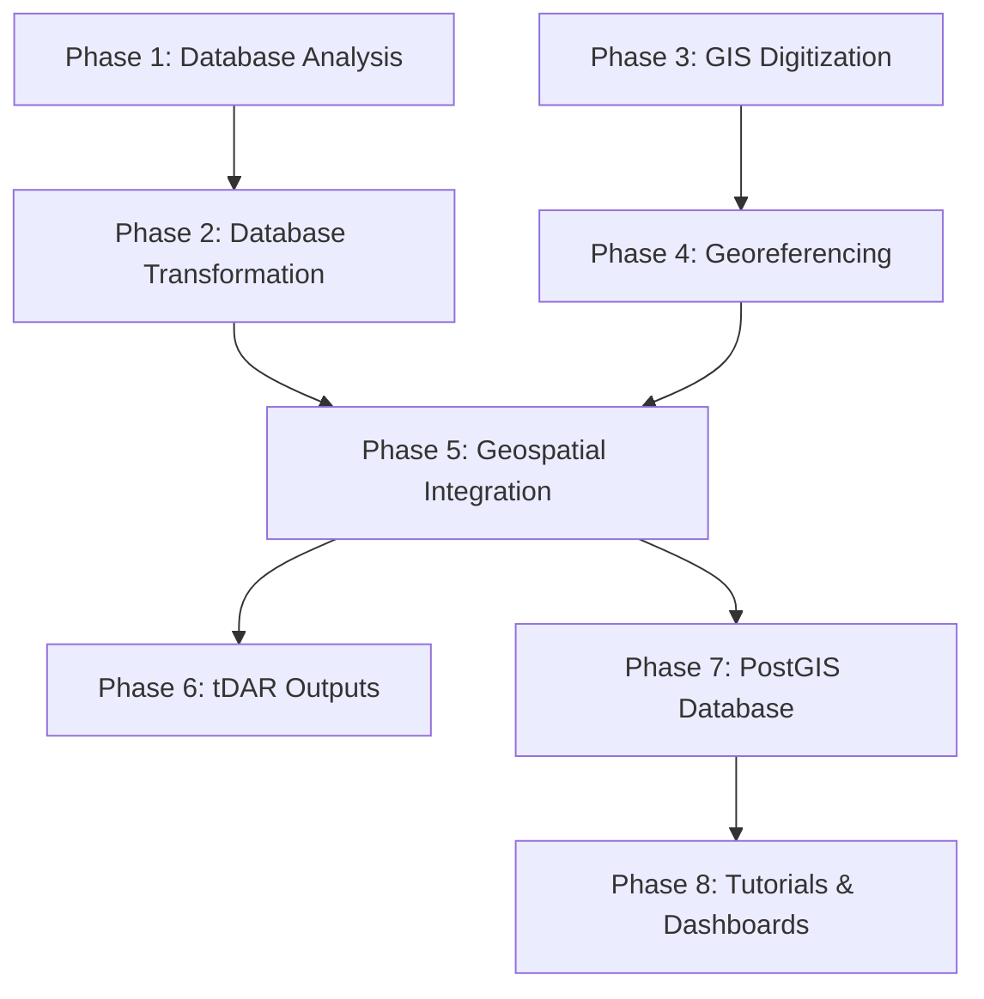

# Digital TMP - Project Overview (Draft v1.1 -- 5/23/2025)

---
**Author:** Rudolf Cesaretti
**Affiliation:** ASU Teotihuacan Research Laboratory
**Date:** May 23, 2025
---

# Abstract [⚠ !FLAG - ABSTRACT NEEDS EDITS! ⚠]

This project presents the integration, modernization, and digital publication of one of the most significant archaeological datasets in the Americas: the Teotihuacan Mapping Project (TMP). Originally led by René Millon in the 1960s, the TMP remains the only full-surface archaeological survey ever conducted for the ancient city of Teotihuacan, encompassing over 5,000 surface collection units across approximately 37.5 square kilometers. Its outputs—1:2,000-scale photogrammetric base maps, extensive artifact counts, and architectural overlays—form the empirical foundation of decades of Mesoamerican research. Yet, despite its legacy, the TMP’s dataset remains fragmented across obsolete file formats, incompatible schemas, and spatial systems that prevent integration with modern digital tools.

The Digital TMP Project initiative addresses this longstanding problem by executing a structured, multi-phase digital transformation pipeline. It systematically converts analog archives and legacy software outputs (including DF8, DF9, and REANS2 databases) into a unified PostgreSQL/PostGIS platform. Vector GIS files—originally digitized in MapInfo and housed in a local “Millon Space” coordinate system—are re-digitized, validated, and georeferenced to global CRS standards (WGS84, UTM Zone 14N). The outcome is a modular, reproducible, and open-access geospatial database supporting SQL-based queries, shapefile and GeoJSON exports, and spatial analyses across artifact, architectural, and typological datasets.

Designed to support a wide spectrum of users, this project benefits archaeologists, GIS analysts, policy planners, and educators. For scholars, it enables new investigations of ceramic distribution, spatial clustering, urban infrastructure, and residential zoning. For INAH and urban planners, the high-accuracy vector base layers serve as tools for heritage conservation and zoning around the site. For students and the broader public, the project will provide interactive maps, reproducible notebooks, and classroom-ready datasets hosted online.

In addition to scholarly infrastructure, this initiative functions as a digital preservation strategy. By unifying and publishing the TMP’s outputs with persistent identifiers and formal metadata, the project safeguards a dataset increasingly threatened by physical degradation and institutional loss. Moreover, the platform is extensible: future excavations, drone photogrammetry, geophysical scans, and legacy INAH materials can be added to the normalized spatial schema.

This project thus represents not only a digital rescue of the TMP’s data corpus but also a long-overdue realization of Millon’s original vision—one made actionable through modern data science, GIS workflows, and a commitment to open research. By creating a scalable infrastructure for integrating archaeological data from Teotihuacan, it invites collaboration, transparency, and innovation in the study of ancient urbanism.

---

# 1. Background [⚠ !FLAG - BACKGROUND NEEDS EDITS! ⚠]

The Teotihuacan Mapping Project (TMP) represents one of the most ambitious and methodologically innovative urban-scale archaeological undertakings of the 20th century. Initiated in 1962 under the direction of René Millon, the TMP sought to document, with unprecedented precision and breadth, the entirety of Teotihuacan—the largest and most influential ancient city in Mesoamerica.

Millon's vision was grounded in the understanding that comprehending the urban character of Teotihuacan, its societal structure, and its rise to prominence required a detailed map of the entire city. He envisioned that an accurate, detailed map was an indispensable precondition for any intensive study of urbanization at Teotihuacan, allowing investigation into settlement patterns, population distribution, and the nature of this ancient urban center. This was a "big problem" that required a comprehensive approach—only by mapping the city in its entirety could its true extent, density of construction, and relationships between constituent parts be determined.

The project was ambitious in scope, ultimately covering approximately 20 square kilometers of the ancient city core, though the survey to define its limits encompassed a larger area of roughly 35-38 square kilometers. The methodology involved creating a photogrammetric base map from low-altitude aerial surveys conducted in April and September 1962, followed by detailed ground surveys where archaeological remains were systematically recorded and surface collections made across approximately 5,000 provenience tracts.

The TMP employed a rigorous 500×500 meter grid system, termed "sectors," oriented 15°25′ east of true north to align with the Avenue of the Dead. From the outset, it was clear that the project's research questions—concerning urban settlement patterns, population distribution, social composition, craft production, and external relations—necessitated the collection of vast amounts of diverse data. This included systematic collection of nearly one million artifacts from approximately 5,046 individual archaeological cases, along with detailed architectural descriptions and field observations recorded on standardized Site Survey Record (SSR) forms.

The scale and complexity of this data collection underscored the need for systematic management and analysis, a challenge that led to early adoption of computerization within the project beginning in 1965 with George Cowgill's involvement—making the TMP a pioneer in computer-aided archaeological analysis.

## 1.1. What Data Was Collected  [⚠ !FLAG -- INCORRECT / BAD ⚠]

The TMP generated several distinct but interrelated classes of data:

- **Surface Collection Data**: Each of the 5,046 tracts was surveyed for artifacts visible on the ground. These included ceramic fragments, lithics (especially obsidian), figurines, groundstone tools, and occasional bone and shell materials.
- **Observational and Architectural Data**: Surveyors completed Site Survey Records (SSRs) for each tract, documenting architectural remains, construction materials, vegetation cover, drainage features, slope, and site integrity. These forms often contained field sketches, interpretive notes, and complex observations not easily translatable into structured formats.
- **Mapping and Photogrammetric Data**: The project relied on a grid-based coordinate system overlaid on a large-scale aerial base map. This grid divided the city into 500 × 500 meter “sectors,” oriented 15°25′ east of true north to match the city’s Avenue of the Dead alignment. The base map, created from stereoscopic aerial photos taken in 1962, served both as a survey aid and analytical platform.
- **Excavation and Ethnoarchaeological Records**: Though limited in scope compared to the surface survey, TMP investigators also conducted test excavations in key areas and collected ethnographic observations of modern land use and irrigation practices, tying the ancient city into broader temporal frameworks.

## 1.2. The TMP Digital Data Ecosystem: A Multi-Generational Evolution

The transition from analog data to digital structures began in the 1970s and has continued through successive waves of research at Arizona State University’s Teotihuacan Research Lab. The TMP’s electronic data ecosystem comprises multiple generations of databases and GIS files. This transition from analog field records to digital databases represents one of the longest-running and most complex data management efforts in archaeology. The TMP's electronic data ecosystem comprises multiple generations of databases spanning over five decades, each addressing specific technological limitations and analytical needs of its era.

### 1.2.1 Early Digital Foundations (DF1-DF8, 1965-1977)

The TMP's engagement with electronic data processing began in 1965, when George Cowgill joined the project and, with René Millon, secured grants for pioneering computer-aided archaeological analysis. The initial Data Files 1 through 4 (DF1-DF4) were preliminary, incomplete datasets created primarily for methodological exploration and statistical technique development while data coding was still underway. These files served as testbeds for early analyses using programs like SYMAP, but were inherently non-representative due to their sequential, non-random construction.

The transition to comprehensive digital records required monumental effort. By the late 1960s, approximately 50,000 IBM punch cards were manually transcribed from coding forms—a dataset sufficient to fill the back seat of a Volkswagen beetle. These cards were read by an IBM 7094 computer at Harvard University Computing Center and transferred to magnetic tape, creating Data File 5 (DF5). Subsequent versions (DF6-DF7) involved complex FORTRAN programming for editing and reformatting, though the single-program approach proved problematic and led to occasional unintended data loss.

Data File 8 (DF8), developed between 1975-1977, marked a critical juncture as the first stable, comprehensive electronic representation of TMP survey results. DF8 contained 5,050 cases (including 4 dummy records) described by 291 variables, encompassing administrative data, locational information, architectural observations, and artifact tabulations. A significant technical advancement was the implementation of "random access" file structure for the VAX mainframe version, allowing direct navigation to specific data locations rather than sequential processing required by earlier tape-based files.

DF8 incorporated several key improvements: completion of record merging for cases considered single archaeological units, inclusion of approximately 300 cases absent in DF6, and addition of previously missing ceramic data. However, it retained limitations from early computing constraints, including short data fields (2-4 characters) and flat-file structure that limited complex querying capabilities.

### 1.2.2 The Ceramic Reanalysis Project (REANS, 1973-1983)

Concurrent with DF8 development, a comprehensive ceramic reanalysis was undertaken to address critical deficiencies in the original artifact analyses. By 1971, it was clear that the original ceramic tabulations omitted crucial information about vessel forms and decorative modes, and Evelyn Rattray began questioning some chronological interpretations based on her study of TMP stratigraphic excavations.

The decade-long reanalysis project (ca. 1973-1983) was directed by Rattray under Cowgill's general oversight, with analyses conducted by Rattray herself, Andrea and Ángela Ávila, and TMP technicians Pedro Baños and Zeferino Ortega. Results were initially recorded on detailed "Reans Data Sheets," then transcribed to "Reanalysis Code Sheets" by Mary R. Hopkins for computer entry performed by Eva Zilberman and Diane Menyuk.

The resulting REANS database provided vastly increased detail in ceramic information compared to DF8, with terminology and categories closely aligned with Rattray's (2001) published ceramic typology. However, the creation process was beset by technical challenges including transcription errors, difficulty merging reanalysis records with DF8/DF9 cases (approximately 300 remain unmatched), and complications from removed objects and incomplete documentation.

REANS represents a partial reanalysis rather than complete replacement of original data, leading to discrepancies in ceramic phase totals between databases. For instance, REANS generally shows significant increases in Patlachique counts and decreases in Tzacualli compared to DF8/DF9, reflecting reclassification of sherds under evolved criteria.

### 1.2.3 Relational Database Evolution (DF9, 1990s)

Data File 9 (DF9), developed primarily by Ian Robertson in the 1990s, represented a paradigmatic shift from mainframe flat-files to PC-based relational database systems. Initially implemented in Paradox and later Microsoft Access, DF9 moved beyond DF8's structural limitations to enable sophisticated data relationships and more efficient querying.

DF9 retained DF8's core content—5,046 cases described by approximately 300 data fields—while incorporating significant improvements: error identification and correction, relational database structure advantages, and most importantly, integration with digitized spatial data. Robertson created electronic maps of collection tract boundaries (initially MF2, later the topologically clean MF3) that could be directly linked to DF9 attribute data, enabling GIS-supported spatial analyses and visualizations previously impossible.

A Microsoft Access application, "TMP Datafile 9 Browser.mdb," was developed as a user-friendly interface providing case-by-case data access integrated with map visualization tools. Despite these advances, DF9 retained data fields largely based on 1960s-1970s typologies and continued to face integration challenges with REANS due to persistent provenience unit incompatibilities.

### 1.2.4 Recent Database Updates (DF10, 2022+)

Data File 10 (DF10), initiated by Anne Sherfield in 2022, represents the most recent effort to enhance TMP data accessibility and usability. Building on the DF9 lineage, DF10 aims to address known structural complexities and data quality issues through systematic database reorganization and comprehensive documentation of inherited problems.

Key DF10 changes include:
- **Structural normalization**: Consolidation of 15 DF9 code tables into unified structures, reduction of zero-value prevalence through "long" table formats
- **Variable modifications**: Strategic removal of problematic variables (e.g., `lastBuildPhase` based on programming errors, `stoneCut` with no data), renaming for clarity, and merging of unreliably distinguished categories
- **Data integrity documentation**: Systematic identification of the "Total Counts Problem" where subdivision sums exceed category totals, highlighting areas requiring return to original records
- **Enhanced metadata**: Explicit documentation of known limitations, missing data patterns, and pathways for future refinement

### 1.2.5. GIS Data [⚠ !FLAG ⚠]

Robertson’s digitization of the TMP map sheets in the late 1990s (known as MF2) produced the first vector GIS file of the TMP’s surface collection units. These polygon shapefiles—one per tract—were traced from raster scans of the original 1:2,000 TMP base maps and encoded within the TMP’s “Millon Space” coordinate system.

Another key output of the TMP was a set of architectural interpretation overlays—red-ink drawings layered onto transparent sheets atop the 1:2,000 maps. These traced outlines of buildings, walls, and plazas have since been digitized and converted into vector GIS layers across multiple versions. Despite variation in digitization precision and interpretation fidelity, these files represent the most detailed spatial model of Teotihuacan’s urban architecture available today.

## 1.3. Spatial Reference System and Technical Challenges [⚠ !FLAG ⚠]

A major technical challenge in modernizing the TMP dataset lies in its original coordinate system. “Millon Space” is a custom, site-centered Cartesian framework with no link to standard geodetic datums. While internally consistent and analytically effective in the 1960s–90s, this system cannot interface with modern GPS, remote sensing, or GIS workflows without complex georeferencing procedures—a key objective of the current project.

Additionally, the digitized datasets (MF2, architectural GIS, REANS2, etc.) were constructed at different times, for different goals, by rotating personnel. As a result, integration is hindered by inconsistent spatial precision, mismatched IDs, and divergent schema definitions.

## 1.4. Toward Integration and Reproducibility [⚠ !FLAG ⚠]

The TMP datasets—spanning over four decades of data entry, analysis, and reanalysis—require a consolidated approach to achieve interoperability, reproducibility, and public accessibility. This project addresses those challenges by employing a phased methodology of database analysis, GIS digitization, coordinate transformation, and relational integration.

It represents not only a technical endeavor but also a scholarly imperative: to preserve, unify, and expand one of the most important archaeological datasets in the Americas for future generations of researchers and collaborators.

---

# 2. Problems & Motivations [⚠ !FLAG ⚠]

Despite its landmark status in archaeological research, the Teotihuacan Mapping Project presents a complex array of legacy challenges that must be resolved to unlock its full scholarly potential. These issues span data structure, technological obsolescence, spatial alignment, and systemic fragmentation—most stemming from the project's sheer historical depth and multigenerational development.

### 2.1. Fragmentation and Interoperability Failures [⚠ !FLAG ⚠]

The most fundamental challenge facing the TMP digital archive is fragmentation. Over the course of 40+ years, different researchers, graduate students, and institutional teams have produced a patchwork of datasets—each with distinct structures, formats, and analytical aims. The primary artifact database (DF8), the GIS vector files (MF1 and MF2), and the ceramic reanalysis database (REANS2) were all developed independently, often using inconsistent variable definitions or spatial keys.

This fractured landscape has severely hindered cross-referencing and system-wide querying. For example, while the REANS2 database includes enhanced ceramic typologies, it does not natively link to the spatial units encoded in MF2. Similarly, DF8’s observational records are only loosely related to geospatial boundaries, and often lack definitive spatial joins. This legacy of parallel, unintegrated data streams now poses a major obstacle to comprehensive archaeological analysis.

### 2.2. Coordinate System Limitations [⚠ !FLAG ⚠]

A second, highly specific technical issue arises from the use of a project-internal spatial reference framework, colloquially termed “Millon Space.” The original TMP survey grid was designed to match Teotihuacan’s architectural orientation—approximately 15° east of true north—rather than any global geodetic datum. While this internal system enabled analytical clarity during the survey’s execution, it is now a major barrier to integration with modern geospatial tools.

Because none of the original TMP maps were georeferenced to real-world coordinates, vector shapefiles derived from the TMP base maps must be retroactively transformed using ground control points and affine or rubber-sheet transformations. As of the start of this project, only a portion of the TMP’s spatial data had undergone this transformation with full positional fidelity.

### 2.3. Data Integrity, Coding Errors, and Metadata Gaps [⚠ !FLAG ⚠]

The TMP’s legacy files are also riddled with interpretive complications due to early computing constraints and field-data transcription methods. The SSRs (Site Survey Records), which formed the backbone of the DF8 dataset, contained many qualitative and subjective assessments by field crew. These included terms like “insubstantial structure” or “possible canal,” which were often misinterpreted or inconsistently encoded by coders unfamiliar with field conditions.

Many database variables also suffer from unclear definitions, truncated labels, or inconsistent units, making metadata reconstruction labor-intensive. In the case of DF8, data field lengths were restricted to 2–4 characters due to early storage limitations. This forced extensive abbreviation and code compression, leading to “gray variables”—ambiguous fields that require consultation of supplementary paper records or legacy codebooks.

Additionally, some records in DF8 and REANS2 reference tracts that do not exist in the MF2 shapefile, and vice versa, due to inconsistent naming conventions or lost mapping crosswalks. These gaps threaten the relational integrity necessary for robust geospatial analysis.

### 2.4. Technological Obsolescence [⚠ !FLAG ⚠]

The TMP data ecosystem was originally designed for a computing environment that no longer exists. Early statistical analyses were conducted using FORTRAN programs running on VAX mainframes. Outputs were produced as ASCII tables, punch card printouts, and flat-file encodings without version control or schema tracking.

Although later phases of the project adopted Microsoft Access and Paradox database systems in the 1990s and early 2000s, these platforms are now largely obsolete. They present serious interoperability issues with modern relational database frameworks like PostgreSQL, and are incompatible with contemporary GIS integration standards like PostGIS.

Similarly, the first-generation vector GIS files were created in MapInfo (a proprietary and now-archaic format), and require reprocessing for use in modern open-source or enterprise GIS software. This introduces additional risks related to conversion loss, data corruption, and transformation error.

### 2.5. Preservation Gaps and Institutional Failures [⚠ !FLAG ⚠]

Despite its recognized scholarly importance, the TMP dataset has never been fully published or archived in a discoverable, interoperable format. Several attempts were made to secure NSF and NEH funding in the late 1990s and early 2000s, including a comprehensive proposal authored by Cowgill, Robertson, and Peter McCartney in 1999. However, these efforts failed to materialize into funded initiatives, delaying systematic digitization and dissemination.

Compounding this is the fact that much of the physical archive—original field maps, survey notebooks, and photographic negatives—remains housed in institutional offices at ASU and the University at Buffalo without comprehensive digital backups. The risk of data loss due to neglect or environmental degradation remains a concern.

### 2.6. Motivations for the Present Project [⚠ !FLAG ⚠]

The challenges outlined above define the rationale for the present data science initiative. This project seeks not only to modernize the TMP dataset but also to unify its disparate components into a single, accessible, and richly documented geospatial database. The core motivation is scholarly: to unlock the potential of one of the most data-rich archaeological surveys ever conducted and make it usable for 21st-century research.

Additionally, the initiative aims to establish a public-facing platform for global collaboration. By publishing the TMP as an open-access, citation-ready geospatial archive, it will support comparative studies in ancient urbanism, cross-site analysis of Mesoamerican cities, and future fieldwork design. The dataset is intended to serve as both an analytical tool and a scaffold for additional datasets—including excavation reports, drone surveys, GPR scans, and new ceramic analyses.

Finally, the project operates as a form of digital heritage preservation. In a region increasingly threatened by modern urban development and agricultural expansion, the georeferenced TMP archive can function as both a historical record and a policy tool for managing cultural landscapes.

---

# 3. Goals / Objectives [⚠ !FLAG -- Does this section need revision???⚠]

The primary aim of the Teotihuacan Mapping Project (TMP) Data Science Integration Initiative is to transform a historically fragmented and technologically obsolete archaeological dataset into a unified, geospatially coherent research infrastructure. At its core, this project endeavors to render the TMP’s rich trove of spatial, typological, and observational data interoperable, reproducible, and accessible for the global research community.

The following sections articulate the specific technical, scholarly, and public-facing goals that guide the architecture and implementation of the project.

### 3.1. Integrate Legacy TMP Datasets into a Unified Spatial Database  [⚠ !FLAG ⚠]

The first and most foundational objective of the project is to merge the disparate datasets generated by the TMP across its multi-decade lifespan. This includes the original flat-file database (DF8), its relational successor (DF9), the REANS2 ceramic reanalysis dataset, the collection unit shapefiles (MF2), architectural overlays, and associated raster maps and annotations.

This unification process involves:
- **Schema harmonization** of variable names, types, and value domains
- **Entity key alignment** across tracts, artifact classes, and feature IDs
- **Relational linking** of tabular artifact records to geospatial geometries using PostgreSQL + PostGIS

The outcome will be a fully integrated, queryable, and spatially referenced PostgreSQL/PostGIS database (tentatively DF10), capable of supporting high-level archaeological analysis and modular extension.

### 3.2. Finalize and Georeference GIS Layers with High Positional Accuracy [⚠ !FLAG ⚠]

A major deliverable of this project is the complete, corrected digitization and georeferencing of the TMP’s architectural and collection-unit vector data. Many of the original vectorizations—especially MF2 and the architectural overlays—exist only in a local coordinate system (“Millon Space”) or in non-standard, rotated grids.

The project will:
- Digitize all architectural and natural features from the 1:2,000 TMP base maps using QGIS
- Georeference raster and vector data to a global Coordinate Reference System (CRS), using ground control points and photogrammetric alignment
- Validate vector accuracy and perform feature-level QA/QC on shapefile geometries

These geospatial products will serve as a platform for new spatial analyses and will underpin the broader integration effort.

### 3.3. Enable Public and Scholarly Access through Open Infrastructure [⚠ !FLAG ⚠]

A critical component of this project is its open-access orientation. The finalized spatial database, metadata schemas, and supporting documentation will be published in full through one or more of the following platforms:
- **tDAR (The Digital Archaeological Record)**: for DOI-assigned scholarly archive hosting
- **GitHub/GitLab**: for version-controlled scripts, schema files, and digitization workflows
- **Web-based GIS viewer (e.g., Leaflet or ArcGIS Online)**: for interactive map exploration and outreach

All outputs will be accompanied by formal metadata (e.g., ISO 19115, Dublin Core), educational summaries, and downloadable content in standard formats (CSV, SQL, GeoJSON, PDF).

### 3.4. Support Future Excavation and Fieldwork Planning [⚠ !FLAG ⚠]

One of the most tangible research goals of this initiative is to furnish archaeologists with high-quality spatial base layers that can guide future work at Teotihuacan. The unified dataset will allow field teams to:
- Precisely relocate prior TMP surface tracts and test pits
- Plan excavations using architectural overlays and ceramic distribution heatmaps
- Overlay geophysical scans (GPR, magnetometry) and drone orthophotos onto an aligned TMP basemap

As such, the project provides not just a digital archive but a dynamic planning and exploratory tool.

### 3.5. Establish a Platform for Dataset Integration and Comparative Research [⚠ !FLAG ⚠]

The TMP dataset has long served as the evidentiary backbone for a wide range of research on Teotihuacan. By systematizing and spatially enabling this core dataset, the project opens the door to:
- Layering in TMP excavation records, site maps, and stratigraphic profiles
- Cross-referencing with INAH archival datasets and other surveys in the Basin of Mexico
- Supporting global comparative urbanism projects that seek to understand state formation, residential zoning, infrastructure, and spatial inequality across early cities

In this regard, the project contributes not just to Teotihuacan studies, but to the global comparative study of ancient complex societies.

### 3.6. Enhance Digital Scholarship and Curriculum Development [⚠ !FLAG ⚠]

Lastly, the project aims to produce curated subsets of data and reproducible workflows that support teaching in archaeology, GIS, and digital humanities. These resources will include:
- Annotated sample datasets aligned with curricular goals
- Jupyter Notebooks for data querying, visualization, and statistical analysis
- StoryMaps and WebGIS environments for interactive classroom exploration

This public pedagogical focus is consistent with the ethical responsibility of archaeological data stewards to maximize the impact and accessibility of historical research.

---

# 4. Stakeholders & Use Cases

The Teotihuacan Mapping Project (TMP) Data Integration Initiative has been designed to benefit a broad array of stakeholders across academic, governmental, technical, and public sectors. Its outputs—comprising a unified archaeological database, richly georeferenced GIS files, and structured metadata—address longstanding infrastructural gaps in archaeological research, while simultaneously enabling new forms of data-driven scholarship, policy planning, and education. This section outlines the core user communities and describes how each group stands to gain from the project's results.

## 4.1. Formal Project Stakeholders

### 4.1.1. ASU Teotihuacan Research Laboratory

The ASU Teotihuacan Research Laboratory serves as the primary institutional stakeholder and project host. As the repository of the original TMP datasets and ongoing Teotihuacan research, the lab directly benefits from the integration and modernization of these critical archaeological resources. The unified database infrastructure supports the lab's continued research activities, provides a foundation for future fieldwork planning, and establishes a lasting digital legacy for the laboratory's decades of scholarly contributions.

### 4.1.2. Digital Antiquity and tDAR

Digital Antiquity, through The Digital Archaeological Record (tDAR), serves as the formal archival partner for long-term data preservation and dissemination. As a leading archaeological data repository, tDAR provides essential infrastructure for ensuring the project's outputs meet professional archival standards, receive persistent identifiers, and remain accessible to the global research community. This partnership exemplifies best practices in archaeological data stewardship and digital preservation.

## 4.2. Academic Stakeholders

### 4.2.1. Mesoamerican Archaeologists

Archaeologists specializing in Teotihuacan and broader Mesoamerican studies represent the primary beneficiaries of this initiative. The integrated database allows researchers to analyze ceramic distributions, architectural patterns, and surface collection data with unprecedented precision. For scholars revisiting previously studied areas—such as Plaza One, Oztoyahualco, or the Oaxaca Barrio—the unified platform provides the spatial and typological infrastructure needed to recontextualize earlier interpretations with updated datasets.

### 4.2.2. Comparative Urbanism Scholars

The project contributes significantly to the expanding field of comparative urbanism. With a spatially normalized dataset, Teotihuacan can now be rigorously compared to other early cities across the world—including sites in the Indus Valley, ancient China, and the Andes. Researchers working on settlement scaling theory, urban density modeling, and infrastructural complexity will be able to incorporate Teotihuacan as a robust, data-rich case study.

### 4.2.3. Computational Archaeologists

As a model of legacy data integration, the TMP project offers a valuable precedent for digital archaeologists working to rescue, transform, and publish large-format analog datasets. The methodological innovations embedded in this project—such as modular ETL pipelines, CRS transformation strategies, and semantic metadata layering—are transferable to other archaeological corpora. Scholars studying digital workflows, version control, and reproducibility in the humanities will find both inspiration and practical templates in the project's outputs. With the full integration of artifact counts, typologies, and spatial geometries, the project enables machine learning and quantitative analysis applications. Classification algorithms can be applied to cluster ceramic assemblages by spatial context, or to detect pattern anomalies in the spatial layout of craft production zones. The ability to extract structured datasets for training models makes this project particularly attractive to researchers bridging archaeology and data science.

### 4.2.4. Universities and Teaching Institutions

The unified dataset will be packaged with curriculum-aligned modules that can be deployed in archaeology, digital humanities, and GIS classrooms. Professors will be able to assign real-world datasets to students for spatial analysis projects, and training modules will demonstrate how to navigate, query, and visualize the TMP data using open-source tools like QGIS or Jupyter Notebooks.

### 4.2.5. Public Outreach and Virtual Engagement

By publishing outputs in formats compatible with web-based platforms (e.g., Leaflet, ArcGIS Online), the project will make Teotihuacan accessible to broader audiences. Interactive maps and "story maps" can convey the complexity and richness of the city in ways that invite public engagement, stimulate cultural curiosity, and support site stewardship.

## 4.3. Governmental and Policy Organizations (Informal Stakeholders)

While not formal project partners, several governmental organizations may benefit from project outputs:

### 4.3.1. INAH (Instituto Nacional de Antropología e Historia)

INAH, as Mexico's principal archaeological and cultural heritage authority, may find value in the precision geospatial record of the ancient city for regulatory, conservation, and planning purposes. The database could potentially serve as a foundation for drafting site protection zones, evaluating threats from construction or tourism development, and designing sustainable urban policies in the Teotihuacan Valley.

### 4.3.2. INEGI and Regional Planning Authorities

The Mexican National Institute of Statistics and Geography (INEGI) and other regional planning entities may find the spatial intelligence tools useful for navigating the city's archaeological footprint. The ability to overlay infrastructure projects, land parcels, and zoning maps onto a high-resolution model of Teotihuacan's urban core could facilitate ethically responsible development planning.

## 4.4. Global Research Impact

The TMP initiative aligns with the goals of major international archaeological data repositories and emphasizes long-term preservation, discoverability, and reuse of research-grade datasets. By structuring the TMP outputs according to FAIR data principles (Findable, Accessible, Interoperable, Reusable), this project not only joins but also elevates the global infrastructure for archaeological research sharing, enabling new forms of interdisciplinary partnerships and collaborative research across institutions and borders.

The open data model invites collaborative layers, from LiDAR visualizations to historical document overlays, and can serve as the spatial anchor point for broader digital heritage ecosystems, ultimately transforming how ancient urban sites are studied, preserved, and shared with global audiences.

---

# 5. Summary of Approach

The methodological strategy behind the TMP Data Science Integration Initiative is structured as a modular, multi-phase pipeline designed to address the specific historical, technical, and logistical challenges of the original Teotihuacan Mapping Project dataset. Drawing from principles of open science, reproducibility, and geospatial data modeling, the approach provides a systematic framework for converting legacy archaeological archives into a unified, query-ready, and extensible digital infrastructure.

The project is divided into eight sequential but independently executable phases: **Database Analysis**, **Database Transformation**, **GIS Digitization**, **Georeferencing**, **Geospatial Integration**, **tDAR Outputs**, **PostGIS Database**, and **Tutorials & Dashboards**. Each phase builds sequentially toward a fully reproducible, multi-format archaeological database that serves diverse stakeholder needs—from advanced researchers requiring programmatic access to public audiences seeking interactive visualization tools.

## 5.1. Modular Workflow Architecture

The project adopts a three-tiered logic of execution:
- **Phases** represent the highest level of workflow organization, each corresponding to a major stage of data transformation that systematically transforms legacy archaeological databases into a modern, integrated geospatial data infrastructure.
- **Workflows** define the sequence of operations within a phase (e.g., digitization, attribute validation, schema harmonization), representing processes within each phase.
- **Tasks** are the smallest units of execution, often assigned to individual team members or scripts, and tracked for reproducibility.

This tiered structure facilitates collaborative work across research teams and institutions, while enabling fine-grained documentation of decisions and tools used at each stage. The architecture follows a data science pipeline approach, beginning with legacy database analysis and transformation, advancing through spatial data creation and georeferencing, achieving full geospatial integration with advanced feature engineering, preparing archival-ready outputs for long-term preservation, implementing a production-grade PostGIS database, and culminating in user-facing applications and comprehensive tutorials.

## 5.2. Eight Phases of the Integration Process

The Digital TMP project architecture represents a comprehensive data modernization initiative that addresses the complex challenges of integrating legacy archaeological databases with contemporary geospatial technologies. The eight-phase approach ensures systematic quality control, maintains data provenance, and produces multiple distribution formats to serve diverse research and public engagement needs.

### 5.2.1. Data Foundation (Phases 1-2)

**Phase 1 – Database Analysis** establishes the analytical groundwork through rigorous evaluation of legacy MS Access databases (TMP_DF8, TMP_DF9, TMP_DF10, and TMP_REAN_DF2). This phase implements database profiling, schema optimization, and produces actionable insights into the quality, complexity, and suitability of the legacy schemas for downstream analytical workflows. Through automated database profiling, structural visualization, and quantitative schema analysis, this phase produces reproducible PostgreSQL versions of all legacy databases, automated Entity-Relationship Diagrams (ERDs), and a comprehensive denormalization white paper with schema optimization recommendations.

**Phase 2 – Database Transformation** follows with systematic ETL processes that produce clean, analysis-ready datasets. This comprehensive transformation process consolidates complementary information from three versions of the legacy database (DF8, DF9, DF10) to produce a provisional consolidated dataset (DF11), cleans and validates the REANs database to produce REANs DF3, and then undertakes intensive, variable-by-variable redesign to produce the final DF12 and REAN DF4 datasets. The phase implements controlled vocabulary standardization and automated validation frameworks to ensure data quality and analytical coherence.

### 5.2.2. Spatial Data Creation (Phases 3-4)

**Phase 3 – GIS Digitization** addresses the manual digitization of archaeological features from historical maps. Operating within a pre-georeferenced context, this phase focuses on the labor-intensive process of manually digitizing spatial features using QGIS, guided by assembled raster basemaps including scanned maps, aerial imagery, and legacy documentation. The digitized features include archaeological (floors, walls, plazas, etc.), environmental (terraces, canals, drainage), and modern features (buildings, roads, infrastructure) from the Teotihuacan Mapping Project. These phases overcome the limitations of legacy cartographic materials through custom transformation pipelines.

**Phase 4 – Georeferencing** implements high-precision georeferencing workflows to spatially align the digitized raster and vector layers. This phase incorporates ground control points (GCPs), develops custom NTv2 grid shift transformations, and establishes spatial accuracy standards for all subsequent analyses. The process includes sensitivity analysis to evaluate transformation performance, recursive georeferencing error assessment, and the generation of custom CRS transformation pipelines using PROJ with NTv2 grid shift capabilities.

### 5.2.3. Integration and Enhancement (Phase 5)

**Phase 5 – Geospatial Integration** merges tabular and spatial datasets while implementing advanced feature engineering to derive new analytical variables. This phase establishes the spatial foundation for all downstream analytical and distributional workflows by integrating the cleaned, transformed non-spatial dataset (DF12) with its corresponding georeferenced spatial geometries. It leverages spatial relationships to enhance interpretive capacity, conducts final classification of architectural features through spatial cross-referencing, and validates all integrated outputs through automated quality assurance protocols.

### 5.2.4. Preservation and Distribution (Phases 6-8)

**Phase 6 – tDAR Outputs** ensures long-term accessibility through formal archival submission to tDAR (The Digital Archaeological Record). This phase focuses on the preparation, transformation, and packaging of the project's spatial and non-spatial datasets for long-term archival and dissemination. Given tDAR's emphasis on data preservation, discoverability, and accessibility, this phase ensures that all data products meet strict archival standards and are accompanied by comprehensive metadata and documentation.

**Phase 7 – PostGIS Database** implements deployment of a production-grade PostGIS database as the analytical and distributional backend for the project. The database integrates previously processed geospatial datasets and metadata, enabling complex spatial queries, analytical workflows, and efficient data dissemination through multiple distribution mechanisms. This architecture ensures both reproducibility for advanced research users and accessibility for public stakeholders through Docker containerization, SQL dumps, and API endpoints.

**Phase 8 – Tutorials & Dashboards** provides pathways for both technical users requiring full analytical capabilities and public audiences seeking interactive exploration tools. This phase focuses on developing comprehensive tutorials and an interactive WebGIS dashboard to facilitate the effective use and exploration of the PostGIS database. Through multiple tutorial formats (Python, R, QGIS) and an intuitive WebGIS interface, the project ensures wide accessibility and encourages further analytical engagement with the distributed datasets.

## 5.3. Design Principles: Reproducibility, Interoperability, Extensibility

The architecture incorporates modern data science principles throughout, including reproducible computational environments (Docker containers), automated validation frameworks, version-controlled workflows, and comprehensive documentation standards. Throughout all phases, the project adheres to a set of guiding principles:

- **Reproducibility**: All transformations are documented in code notebooks and tracked using version control (Git). Reproducible computational environments ensure exact replication of the database environment across various platforms.
- **Interoperability**: Outputs conform to open standards for GIS and tabular data (e.g., Shapefile, GeoJSON, CSV, SQL). The architecture prioritizes long-term preservation requirements, with exports to standard formats ensuring compatibility with future technological environments.
- **Extensibility**: The architecture is modular, allowing future addition of datasets (e.g., TMP excavations, LiDAR, GPR, drone photogrammetry). The resulting infrastructure can accommodate future technological evolution while maintaining backward compatibility and data integrity.
- **Scalability**: The system is designed to handle the complexity of the full TMP dataset while maintaining performance for analytical and distributional purposes.
- **Accessibility**: Multiple distribution mechanisms balance preservation requirements with contemporary access patterns, providing pathways for diverse user communities.

By foregrounding these principles, the project transforms the TMP into a long-lived digital infrastructure for collaborative, interdisciplinary research that can accommodate future technological evolution while maintaining full provenance and enabling future extensibility.

---

# 6. Project Architecture

The architectural design of the TMP Data Science Integration Initiative is rooted in a logic of phased modularity and reproducible transformation. It builds on a clear progression from legacy archaeological databases to fully integrated spatial-database systems, while incorporating modern software engineering practices such as containerization, schema modularity, and versioned documentation. The architecture represents a comprehensive data modernization initiative that addresses the complex challenges of integrating legacy archaeological databases with contemporary geospatial technologies.

The project progresses through eight (n = 8) methodologically distinct phases that systematically transform legacy archaeological databases into a modern, integrated geospatial data infrastructure. Each phase builds sequentially toward a fully reproducible, multi-format archaeological database that serves diverse stakeholder needs—from advanced researchers requiring programmatic access to public audiences seeking interactive visualization tools.

## 6.1. General Structure and Logic

### 6.1.1. Tiered Workflow Logic

The project's architecture follows a three-tiered execution model based on modular structure:
- **Phases** represent major units of the project, large-scale methodological divisions that correspond to distinct stages of data transformation.
- **Workflows** define processes within each phase, representing modular operations within each phase (e.g., digitization, attribute validation, schema harmonization).
- **Tasks** are the smallest unit of execution, atomic units of computation or manual review that break workflows into manageable components.

This tiered structure facilitates collaboration across institutions and supports asynchronous contributions from developers, digitizers, database architects, and domain specialists, while enabling fine-grained documentation of decisions and tools used at each stage.

### 6.1.2. Output-Driven Interdependence

Each phase culminates in one or more clearly defined deliverables that serve as structured inputs for subsequent phases, ensuring traceability and transformation continuity. The architecture emphasizes reproducibility, scalability, and interoperability, incorporating modern data science practices including automated validation, version control, containerized deployment, and comprehensive metadata management.

## 6.2. Phase Overview Summary Table

| Phase | Description | Inputs | Outputs |
|-------|-------------|--------|---------|
| Phase 1: Database Analysis | Systematic evaluation and profiling of legacy MS Access databases to inform optimal schema design and transformation strategies | 4 MS Access DBs, historical documentation | PostgreSQL migration, ERDs, schema profiling reports, denormalization white paper |
| Phase 2: Database Transformation | Comprehensive ETL and feature engineering to produce analysis-ready tabular datasets with standardized vocabularies | PostgreSQL tables, controlled vocabularies | TMP_DF12, TMP_REANs_DF4, transformation logs, validation reports |
| Phase 3: GIS Digitization | Manual digitization of archaeological, environmental, and modern features from historical raster maps | Raster basemaps, legacy documentation | Digitized vector layers, provisional attribute schemas, digitization metadata |
| Phase 4: Georeferencing | High-precision georeferencing using custom NTv2 transformations and spatial accuracy validation | Digitized vectors, GCPs, raster tiles | Spatially-aligned datasets, transformation grids, accuracy assessments |
| Phase 5: Geospatial Integration | Integration of tabular and spatial data with advanced feature engineering and architectural classification | GIS layers, TMP_DF12, REANs_DF4 | Fully integrated geospatial datasets, derived spatial attributes, classification schemes |
| Phase 6: tDAR Outputs | Preparation and packaging of archival-ready datasets with comprehensive metadata for long-term preservation | Integrated datasets, metadata | tDAR-compliant packages, controlled vocabularies, documentation, tutorials |
| Phase 7: PostGIS Database | Design and deployment of production-grade spatial database with optimized schemas and performance tuning | Integrated geospatial datasets | PostGIS database, Docker containers, SQL dumps, API endpoints |
| Phase 8: Tutorials & Dashboards | Development of user-facing applications and comprehensive tutorials for diverse analytical workflows | PostGIS database, static exports | WebGIS dashboard, REST API, Python/R/QGIS tutorials |

## 6.3. Architecture Overview

The Digital TMP project architecture addresses the complex challenges of integrating legacy archaeological databases with contemporary geospatial technologies through a systematic approach organized into three major components:

**Data Foundation (Phases 1-2)** establishes the analytical groundwork through rigorous evaluation of legacy MS Access databases, followed by systematic ETL processes that produce clean, analysis-ready datasets. These phases implement database profiling, schema optimization, and controlled vocabulary standardization to ensure data quality and analytical coherence.

**Spatial Data Creation (Phases 3-4)** addresses the manual digitization of archaeological features from historical maps and implements high-precision georeferencing workflows. These phases overcome the limitations of legacy cartographic materials through custom transformation pipelines and establish spatial accuracy standards for all subsequent analyses.

**Integration and Enhancement (Phase 5)** merges tabular and spatial datasets while implementing advanced feature engineering to derive new analytical variables. This phase leverages spatial relationships to enhance interpretive capacity and validates all integrated outputs through automated quality assurance protocols.

**Preservation and Distribution (Phases 6-8)** ensure long-term accessibility through multiple complementary approaches: formal archival submission to tDAR, deployment of a production-grade PostGIS database, and creation of user-friendly web applications. These phases balance preservation requirements with contemporary access patterns, providing pathways for both technical users requiring full analytical capabilities and public audiences seeking interactive exploration tools.

## 6.4. Phase-Level Detail

### 6.4.1. Phase 1 – Database Analysis
- Systematic evaluation of legacy TMP databases (DF8, DF9, DF10, REAN_DF2) to inform schema design
- Output: Reproducible PostgreSQL versions, automated ERDs, schema profiling reports, denormalization white paper

### 6.4.2. Phase 2 – Database Transformation
- ETL operations transforming legacy databases into normalized, analysis-ready datasets
- Output: Final TMP_DF12 and TMP_REANs_DF4 datasets with controlled vocabularies and validation reports

### 6.4.3. Phase 3 – GIS Digitization
- Manual digitization of archaeological, environmental, and modern features from TMP raster maps
- Output: Comprehensive vector datasets with standardized attribute schemas and digitization metadata

### 6.4.4. Phase 4 – Georeferencing
- High-precision georeferencing using custom NTv2 transformations and ground control points
- Output: Spatially-aligned datasets in global coordinate reference systems with accuracy assessments

### 6.4.5. Phase 5 – Geospatial Integration
- Integration of tabular and spatial datasets with advanced feature engineering
- Output: Fully integrated geospatial datasets with derived spatial attributes and architectural classifications

### 6.4.6. Phase 6 – tDAR Outputs
- **Output:** Archival-ready spatial and non-spatial datasets in Shapefile, CSV, and compressed GeoTIFF formats, accompanied by comprehensive metadata and supporting documentation
- **Distribution Strategy:** Direct upload to tDAR for compliant datasets; external repository hosting for large datasets with permanent DOIs
- **Supporting Materials:** ReadMe files, data dictionaries, methodological reports, controlled vocabulary files, entity-relationship diagrams, and user tutorials

### 6.4.7. Phase 7 – PostGIS Database
- **Output:** A fully integrated, spatially enabled PostgreSQL/PostGIS database supporting multiple export formats
- **Distribution Mechanisms:** Docker containerized deployment, SQL dump files for technical users, static dataset exports for non-technical users
- **Accessibility:** Public-facing REST API for programmatic data access and interactive WebGIS dashboard for exploratory visualization

### 6.4.8. Phase 8 – Tutorials & Dashboards
- **Output:** Comprehensive tutorials supporting database setup, data ETL processes, and spatial analysis workflows across Python, R, and QGIS environments
- **Public-Facing Resources:** Interactive WebGIS dashboard, RESTful API, and publicly available data exports with documentation

## 6.5. Architecture Flow Diagram

This diagram reflects both the technical flow and the conceptual scaffolding of the data lifecycle, ensuring that spatial and attribute data converge only after independent quality assurance. The architecture incorporates modern data science principles throughout, including reproducible computational environments, automated validation frameworks, version-controlled workflows, and comprehensive documentation standards.

## 6.6. Scalability and Extensibility

The architecture is designed with extensibility in mind, ensuring that the resulting infrastructure can accommodate future technological evolution while maintaining backward compatibility and data integrity. The modular design allows for additional workflows to be appended for:
- Linking TMP excavation unit profiles and stratigraphic relationships
- Integrating drone photogrammetry, LiDAR, or geophysical survey overlays
- Annotating temporal phases and chronological relationships
- Incorporating external datasets from INAH or other regional surveys

All transformation code is housed in Git repositories with comprehensive version control, and Docker containers are used for build replication across machines, ensuring long-term sustainability, auditability, and reproducible deployment environments. This approach ensures that the Digital TMP serves not only as a digital rescue of legacy data but as a long-term infrastructure for collaborative archaeological research.

---

# 7. Tools, Technologies & Software Stack

The TMP Data Science Integration Initiative leverages a comprehensive technology stack combining industry-standard geospatial tools, modern data science frameworks, and cloud-native deployment strategies. The software architecture is deeply tailored to archaeological data transformation, spatial modeling, and open-access dissemination, while accommodating the diverse formats of the legacy TMP datasets. Software selection prioritizes reproducibility, scalability, and long-term maintainability while ensuring compatibility with both research and archival infrastructure requirements.

This section details the core technical infrastructure organized by functional domains: database and backend infrastructure, geospatial processing environment, programming and analysis frameworks, deployment and containerization, and data dissemination platforms.

## 7.1. Software Used by Phase

The project employs a strategic, phase-specific approach to technology selection, ensuring optimal tools are applied at each stage of the data transformation pipeline:

| Phase | Core Technologies | Specialized Tools & Libraries |
|-------|-------------------|-------------------------------|
| **Phase 1: Database Analysis** | **PostgreSQL 17, Python 3.11+** | SQLAlchemy, psycopg2, Pandas, SQLParse (schema parsing), Graphviz (ERD generation), Jupyter Notebooks |
| **Phase 2: Database Transformation** | **PostgreSQL 17, Python 3.11+** | Pandas, GeoPandas, SQLAlchemy, Great Expectations (validation), dbt (optional), Jupyter Notebooks, regex libraries |
| **Phase 3: GIS Digitization** | **QGIS 3.40.5** | QGIS Topology Checker, Geometry Validation tools, Python (GeoPandas, Shapely) for QA/visualization |
| **Phase 4: Georeferencing** | **QGIS 3.40.5, GDAL 3.8+, PROJ 9.0+** | QGIS Georeferencer, gdal_warp, gdal_translate, pyproj, custom NTv2 grid tools, spatial statistics libraries (R/Python) |
| **Phase 5: Geospatial Integration** | **PostgreSQL 17 + PostGIS 3.4, Python 3.11+** | GeoPandas, Shapely, psycopg2, rasterstats, QGIS (visualization), SQL spatial functions |
| **Phase 6: tDAR Outputs** | **PostgreSQL + PostGIS, GDAL, Python/R** | ogr2ogr, GeoPandas, sf (R), tidyverse (R), Pandoc (documentation), LaTeX/Markdown, 7-Zip |
| **Phase 7: PostGIS Database** | **PostgreSQL 17 + PostGIS 3.4, Docker** | ogr2ogr, raster2pgsql, psycopg2, SQLAlchemy, FastAPI, Docker Compose, pg_dump utilities |
| **Phase 8: Tutorials & Dashboards** | **FastAPI, Leaflet.js, Python 3.11+, R 4.3+** | Folium, Plotly, sf, ggplot2, tmap, DBI, RPostgreSQL, Jupyter Notebooks, RMarkdown, QGIS |

## 7.2. Core Technology Domains

### 7.2.1. Database and Backend Infrastructure

**PostgreSQL with PostGIS** serves as the foundational database architecture, providing enterprise-grade spatial capabilities, ACID compliance, and excellent performance for complex analytical queries. Version 17 offers enhanced spatial indexing and improved JSON handling for metadata management.

**Key Components:**
- PostgreSQL 17 for relational data management and complex querying
- PostGIS 3.4 extension for spatial data types, functions, and spatial indexing
- Automated validation frameworks using Great Expectations and custom SQL constraints
- Docker containerization for reproducible database deployment environments

### 7.2.2. Geospatial Processing Environment

**GDAL/OGR** serves as the foundational library for spatial data I/O and transformations, ensuring compatibility across diverse formats and providing the backbone for all spatial data processing operations.

**QGIS** provides essential manual digitization capabilities, visualization tools for quality assurance, and a user-friendly interface for complex geospatial operations. Version 3.40.5 offers enhanced topology checking and geometry validation tools critical for archaeological feature digitization.

**Key Components:**
- GDAL 3.8+ and PROJ 9.0+ for coordinate transformations and spatial data format handling
- QGIS 3.40.5 for manual digitization, georeferencing, and spatial visualization
- Custom NTv2 grid transformation tools for high-precision coordinate system alignment
- Advanced spatial statistics libraries for accuracy assessment and validation

### 7.2.3. Programming and Analysis Frameworks

**Python Ecosystem** offers comprehensive geospatial analysis capabilities through specialized libraries, while supporting reproducible research through Jupyter Notebooks and robust data processing pipelines.

**R Environment** provides specialized statistical and visualization tools particularly suited for archaeological analysis, including advanced spatial statistics and publication-quality graphics.

**Key Components:**
- **Python 3.11+**: GeoPandas, Shapely, Folium, Plotly, psycopg2, SQLAlchemy, Pandas
- **R 4.3+**: sf, tidyverse, ggplot2, tmap, DBI, RPostgreSQL packages
- **Jupyter Notebooks and RMarkdown** for reproducible computational workflows
- **LaTeX/Markdown with Pandoc** for comprehensive documentation generation

### 7.2.4. Deployment and Containerization

**Docker** containerization ensures reproducible deployment environments and facilitates collaborative development across diverse computing platforms. This approach minimizes deployment complexity and ensures consistent behavior across development, testing, and production environments.

**Key Components:**
- Docker Compose for multi-service deployment orchestration
- Standardized container images for PostgreSQL/PostGIS environments
- Version-controlled deployment scripts and configuration management
- Automated backup and restoration procedures using pg_dump utilities

### 7.2.5. Data Dissemination and Web Services

**FastAPI** provides lightweight, high-performance API services for programmatic data access, while **Leaflet.js** enables cross-platform web mapping without external dependencies or licensing restrictions.

**Key Components:**
- FastAPI for RESTful API development and automated API documentation
- Leaflet.js for interactive web mapping and visualization
- Static site hosting solutions for long-term accessibility
- Multiple export formats supporting diverse user needs (GeoJSON, CSV, Shapefile, GeoTIFF)

## 7.3. Technology Stack Rationale

### 7.3.1. Open Source Priority
The technology stack prioritizes open-source solutions to ensure long-term accessibility, reduce licensing dependencies, and support the project's commitment to open science principles. This approach facilitates reproducibility and enables global collaboration without institutional barriers.

### 7.3.2. Archaeological Domain Alignment
Tool selection specifically addresses the unique requirements of archaeological data, including complex temporal relationships, spatial hierarchies, and the need for detailed provenance tracking. The combination of relational database capabilities with advanced spatial analysis tools supports both traditional archaeological workflows and innovative digital approaches.

### 7.3.3. Scalability and Performance
The architecture supports both the current scope of the TMP dataset and anticipated future expansion. PostgreSQL/PostGIS provides proven scalability for large spatial datasets, while containerized deployment ensures consistent performance across diverse computational environments.

### 7.3.4. Long-term Preservation
Technology choices emphasize compatibility with archival standards and long-term preservation requirements. Standard file formats, comprehensive metadata support, and version-controlled workflows ensure that project outputs remain accessible and usable across technological evolution cycles.

### 7.3.5. Multi-User Accessibility
The technology stack accommodates diverse user communities, from advanced researchers requiring programmatic access to public audiences seeking intuitive visualization tools. Multiple access pathways—including direct database connections, API endpoints, and interactive web interfaces—ensure broad usability across technical skill levels.

## 7.4. Quality Assurance and Validation

**Data Quality Framework:** Great Expectations and custom validation routines provide automated data quality assurance throughout the transformation pipeline, while dbt (optional) supports advanced data transformation workflows with built-in testing capabilities.

**Spatial Validation:** PostGIS spatial functions, QGIS topology checkers, and custom Python/R scripts ensure geometric validity and spatial integrity throughout all processing stages.

**Version Control and Reproducibility:** Git-based version control for all code, Docker containers for environment reproducibility, and comprehensive logging ensure full traceability and reproducibility of all data transformations.

This comprehensive technology stack ensures that the Digital TMP project delivers a robust, scalable, and sustainable digital infrastructure that serves both immediate research needs and long-term preservation goals while maintaining the highest standards of data quality and analytical capability.

---

# 8. Key Outputs

The TMP Data Science Integration Initiative delivers a comprehensive suite of scholarly, technical, and educational outputs designed to support future archaeological research, digital scholarship, and public access. These outputs represent the culmination of an eight-phase, deeply structured transformation pipeline that integrates legacy analog records, relational databases, and vector geospatial files into a coherent, queryable, and open-access digital research infrastructure. The deliverables span from technical database products for advanced researchers to interactive visualization tools for public engagement, ensuring broad accessibility and long-term preservation.

## 8.1. Database Analysis and Transformation Outputs (Phases 1-2)

### 8.1.1. Legacy Database Analysis Products
- **Reproducible PostgreSQL Versions**: Fully migrated versions of all four legacy databases (TMP_DF8, TMP_DF9, TMP_DF10, TMP_REAN_DF2) with validated schemas and data integrity
- **Automated Entity-Relationship Diagrams (ERDs)**: Visual documentation of relational structures for each database version using Graphviz
- **Schema Profiling Reports**: Quantitative analysis of table cardinalities, data type distributions, null value frequencies, and constraint evaluations stored in the `tmp_db_metrics` schema
- **Denormalization White Paper**: Comprehensive analysis including performance benchmarks, Join-Dependency Index (JDI) calculations, and schema optimization recommendations

### 8.1.2. Transformed Analytical Datasets
- **TMP_DF12**: Final analysis-ready dataset representing the complete integration and transformation of the legacy TMP databases with standardized vocabularies, cleaned variables, and enhanced analytical framework
- **TMP_REANs_DF4**: Finalized ceramic reanalysis dataset with updated typologies, comprehensive metadata, and alignment with TMP_DF12 through shared SSN identifiers
- **Controlled Vocabulary Glossaries**: Comprehensive lookup tables and human-readable PDFs documenting all categorical variables and their standardized terminology
- **Variable Transformation Logs**: Detailed documentation of all modifications, engineering steps, and data quality decisions made during the transformation process

## 8.2. Spatial Data Creation and Georeferencing Outputs (Phases 3-4)

### 8.2.1. Digitized Vector Datasets
**Comprehensive GIS Layers** representing the complete spatial documentation of Teotihuacan:

- **Archaeological Features**: Floors, walls, taludes and tableros, plazas, pits, mounds, stone concentrations, excavations, staircases
- **Environmental Features**: Terraces, tepetate, drains, dams, reservoirs, canals, rivers, barrancas
- **Modern Features**: Buildings, roads, railroads, power lines, agricultural areas, industrial zones
- **Survey Annotations**: Collection unit boundaries, "Nada" and "Almost Nada" surface density zones, unsurveyed areas

All vector layers include standardized attribute schemas, provisional metadata records, and topology validation ensuring geometric integrity.

### 8.2.2. Georeferencing and Transformation Products
- **Spatially-Aligned Datasets**: All vector and raster layers transformed from "Millon Space" to global coordinate reference systems (EPSG:32614 for analysis, EPSG:4326 for web distribution)
- **Custom NTv2 Grid Shift Files**: High-precision transformation grids (`.gsb` files) enabling accurate, reproducible georeferencing between Millon Space and modern coordinate systems
- **Transformation Metadata**: Complete documentation of ground control points, transformation parameters, and accuracy assessments with RMSE calculations and spatial error analysis
- **Custom CRS Definitions**: PROJ-compatible definitions for the 'Millon Space' coordinate system enabling future integration with external datasets

## 8.3. Integrated Geospatial Database (Phase 5)

### 8.3.1. Unified Spatial-Attribute Integration
- **Fully Integrated Geospatial Datasets**: Complete merger of tabular data (TMP_DF12, REANs_DF4) with georeferenced spatial geometries, enabling SQL-based spatial queries across artifact types, architectural features, and temporal phases
- **Architectural Feature Classifications**: Final classification system for architectural polygons through spatial cross-referencing with collection unit interpretations, including hierarchical functional interpretation schemas
- **Derived Spatial Attributes**: New variables including geometric measurements, locational descriptors, spatial complexity indices, coordinates in multiple CRS, and spatial density metrics
- **Enhanced Dataset Documentation**: Updated data dictionaries, spatial metadata records, and comprehensive validation reports ensuring analytical robustness

## 8.4. Archival and Preservation Outputs (Phase 6)

### 8.4.1. tDAR-Compliant Archival Packages
**Comprehensive Digital Archive** meeting long-term preservation standards:

- **Spatial Datasets**: Shapefile, GeoJSON, and compressed GeoTIFF formats with standardized metadata and accompanying CSV attribute extensions
- **Metadata Documentation**: Project-level, dataset-level, and file-level metadata capturing research context, spatial coverage, data collection methodologies, and variable definitions
- **Supporting Documentation**: ReadMe files, data dictionaries, methodological reports, controlled vocabulary glossaries, and entity-relationship diagrams
- **User Resources**: Step-by-step tutorials for rejoining CSV attributes with Shapefiles, quick-start guides for GIS environments, and instructional materials supporting dataset interpretation

### 8.4.2. External Repository Integration
- **High-Resolution Dataset Hosting**: Complete datasets hosted on Zenodo and Figshare with persistent DOIs for materials exceeding tDAR file size limitations
- **Cross-Referenced Documentation**: tDAR metadata records linking to external repositories ensuring complete discoverability and citation pathways
- **Version-Controlled Access**: Archival packages organized with standardized naming conventions and compression for long-term digital preservation

## 8.5. Production Database Infrastructure (Phase 7)

### 8.5.1. PostGIS Database Deployment
**Enterprise-Grade Spatial Database** supporting multiple access pathways:

- **Dockerized Database Environment**: Complete PostgreSQL/PostGIS deployment with standardized configuration, automated backup procedures, and cross-platform compatibility
- **SQL Database Dumps**: Both schema-only and full-data exports enabling technical users to replicate the complete database environment
- **Optimized Performance**: Spatial indexing using GIST and BRIN indexes, materialized views for complex queries, and query optimization for analytical workloads

### 8.5.2. Multi-Format Data Distribution
**Flexible Access Mechanisms** accommodating diverse user needs:

- **Static Dataset Exports**: GeoJSON, CSV, and GeoTIFF formats with comprehensive metadata for non-technical users
- **RESTful API Services**: FastAPI-powered endpoints providing programmatic access to curated datasets with automated documentation
- **Direct Database Access**: Connection protocols and authentication systems for advanced research applications

## 8.6. Public Engagement and Educational Resources (Phase 8)

### 8.6.1. Interactive WebGIS Dashboard
**Public-Facing Visualization Platform** enabling intuitive data exploration:

- **Interactive Map Interface**: Leaflet.js-powered dashboard with spatial filtering, attribute-based querying, and dynamic visualization of artifact densities and architectural features
- **Data Download Integration**: Direct access to static datasets and API endpoints from the dashboard interface
- **Educational Features**: Popup tables, metadata previews, and guided exploration tools for diverse audiences

### 8.6.2. Comprehensive Tutorial Suite
**Multi-Platform Learning Resources** supporting diverse analytical workflows:

- **Python Tutorials**: Jupyter Notebooks demonstrating database setup, connection management with psycopg2/SQLAlchemy, spatial analysis with GeoPandas, and interactive visualization with Folium/Plotly
- **R Tutorials**: RMarkdown workflows covering database connections via DBI/RPostgreSQL, spatial data manipulation with sf, advanced statistical analysis, and publication-quality visualization with ggplot2/tmap
- **QGIS Tutorials**: Comprehensive PDF guides with annotated screenshots covering database connections, spatial querying, advanced spatial operations, and map export procedures
- **Pre-Configured Resources**: Sample datasets, template project files, and deployment scripts enabling immediate hands-on learning

## 8.7. Long-Term Research Infrastructure

### 8.7.1. Extensibility Framework
**Modular Architecture** designed for future expansion:

- **Integration Pathways**: Relational schema designed to accommodate TMP excavation records, stratigraphic profiles, and external INAH datasets
- **Spatial Compatibility**: GIS infrastructure supporting integration of LiDAR data, drone photogrammetry, geophysical surveys, and modern remote sensing
- **Temporal Framework**: Database structure enabling incorporation of chronological data, ceramic seriation results, and radiocarbon dating

### 8.7.2. Collaborative Research Platform
**Open Science Infrastructure** facilitating global collaboration:

- **Version-Controlled Development**: Git repositories hosting all transformation code, metadata schemas, and documentation with comprehensive change tracking
- **Reproducible Workflows**: Docker containers and automated deployment scripts ensuring consistent environments across research teams
- **Citation Framework**: Persistent identifiers (DOIs) for all major dataset releases with formal citation protocols and version tracking

## 8.8. Impact and Accessibility

The comprehensive output suite ensures that the Digital TMP serves multiple user communities simultaneously: advanced researchers gain access to a fully integrated, queryable spatial database with programmatic interfaces; GIS practitioners receive high-quality, validated vector datasets with comprehensive spatial accuracy documentation; educators obtain curriculum-ready materials with guided tutorials and sample datasets; and the global public accesses interactive visualization tools that communicate the complexity and significance of Teotihuacan's urban landscape.

This multi-tiered approach transforms the TMP from a fragmented collection of legacy files into a dynamic, extensible research infrastructure that preserves the project's historical significance while enabling innovative archaeological analysis and ensuring long-term digital preservation. The outputs collectively represent not only a digital rescue of invaluable archaeological data but also a foundation for future collaborative research in ancient urbanism and Mesoamerican archaeology.

---
