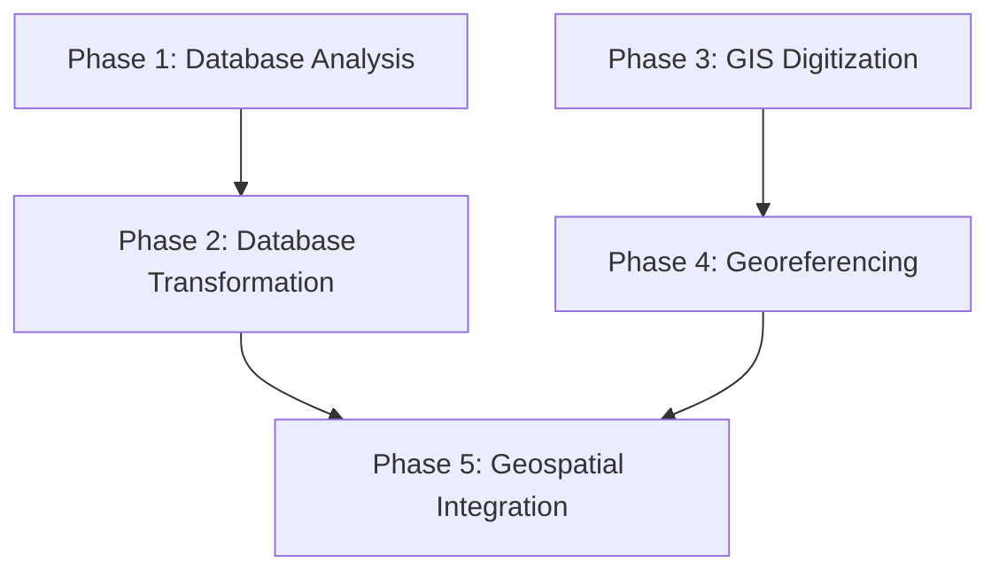

# Teotihuacan Mapping Project (TMP) Project Overview

# Overview

This project presents the integration, modernization, and digital publication of one of the most significant archaeological datasets in the Americas: the Teotihuacan Mapping Project (TMP). Originally led by René Millon in the 1960s, the TMP remains the only full-surface archaeological survey ever conducted for the ancient city of Teotihuacan, encompassing over 5,000 surface collection units across approximately 37.5 square kilometers. Its outputs—1:2,000-scale photogrammetric base maps, extensive artifact counts, and architectural overlays—form the empirical foundation of decades of Mesoamerican research. Yet, despite its legacy, the TMP’s dataset remains fragmented across obsolete file formats, incompatible schemas, and spatial systems that prevent integration with modern digital tools.

The TMP Data Science Integration Initiative addresses this longstanding problem by executing a structured, multi-phase digital transformation pipeline. It systematically converts analog archives and legacy software outputs (including DF8, DF9, and REANS2 databases) into a unified PostgreSQL/PostGIS platform. Vector GIS files—originally digitized in MapInfo and housed in a local “Millon Space” coordinate system—are re-digitized, validated, and georeferenced to global CRS standards (WGS84, UTM Zone 14N). The outcome is a modular, reproducible, and open-access geospatial database supporting SQL-based queries, shapefile and GeoJSON exports, and spatial analyses across artifact, architectural, and typological datasets.

Designed to support a wide spectrum of users, this project benefits archaeologists, GIS analysts, policy planners, and educators. For scholars, it enables new investigations of ceramic distribution, spatial clustering, urban infrastructure, and residential zoning. For INAH and urban planners, the high-accuracy vector base layers serve as tools for heritage conservation and zoning around the site. For students and the broader public, the project will provide interactive maps, reproducible notebooks, and classroom-ready datasets hosted online.

In addition to scholarly infrastructure, this initiative functions as a digital preservation strategy. By unifying and publishing the TMP’s outputs with persistent identifiers and formal metadata, the project safeguards a dataset increasingly threatened by physical degradation and institutional loss. Moreover, the platform is extensible: future excavations, drone photogrammetry, geophysical scans, and legacy INAH materials can be added to the normalized spatial schema.

This project thus represents not only a digital rescue of the TMP’s data corpus but also a long-overdue realization of Millon’s original vision—one made actionable through modern data science, GIS workflows, and a commitment to open research. By creating a scalable infrastructure for integrating archaeological data from Teotihuacan, it invites collaboration, transparency, and innovation in the study of ancient urbanism.

---

# 1. Background

The Teotihuacan Mapping Project (TMP) represents one of the most ambitious and methodologically innovative urban-scale archaeological undertakings of the 20th century. Initiated in the early 1960s under the direction of René Millon, the TMP sought to document, with unprecedented precision and breadth, the entirety of Teotihuacan—the largest and most influential ancient city in Mesoamerica. The project’s goals extended beyond mapping monumental structures; it aimed to provide a holistic cartographic, architectural, and cultural record of the city’s full spatial and social fabric.

Millon’s vision was grounded in the understanding that archaeology had focused too narrowly on monumental centers, neglecting the vast residential and industrial landscapes that defined the lived experiences of past populations. The TMP marked a paradigmatic shift in archaeological method, positioning spatial analysis, aerial photogrammetry, and high-resolution field survey at the forefront of urban archaeology. Over a 37.5 km² area, the team documented over 5,000 individual surface collection units, systematically recorded architectural features, and conducted photogrammetric mapping using aerial surveys flown in 1962.

## 1.1. What Data Was Collected

The TMP generated several distinct but interrelated classes of data:

- **Surface Collection Data**: Each of the 5,046 tracts was surveyed for artifacts visible on the ground. These included ceramic fragments, lithics (especially obsidian), figurines, groundstone tools, and occasional bone and shell materials.
- **Observational and Architectural Data**: Surveyors completed Site Survey Records (SSRs) for each tract, documenting architectural remains, construction materials, vegetation cover, drainage features, slope, and site integrity. These forms often contained field sketches, interpretive notes, and complex observations not easily translatable into structured formats.
- **Mapping and Photogrammetric Data**: The project relied on a grid-based coordinate system overlaid on a large-scale aerial base map. This grid divided the city into 500 × 500 meter “sectors,” oriented 15°25′ east of true north to match the city’s Avenue of the Dead alignment. The base map, created from stereoscopic aerial photos taken in 1962, served both as a survey aid and analytical platform.
- **Excavation and Ethnoarchaeological Records**: Though limited in scope compared to the surface survey, TMP investigators also conducted test excavations in key areas and collected ethnographic observations of modern land use and irrigation practices, tying the ancient city into broader temporal frameworks.

## 1.2. Core TMP Digital Datasets

The transition from analog data to digital structures began in the 1970s and has continued through successive waves of research at Arizona State University’s Teotihuacan Research Lab. The TMP’s electronic data ecosystem comprises multiple generations of databases and GIS files.

### 1.2.1. The TMP Database (DF8, DF9, DF10)

[⚠ !FLAG - INCORRECT INFO ⚠]

The initial database, DF8, was a flat-file structure created by George Cowgill in the 1980s and early 1990s. DF8 encoded observational and artifact data using a set of over 290 variables but lacked relational functionality and was limited to mainframe systems. As computing capabilities evolved, Ian Robertson and collaborators developed DF9, a relational database that integrated spatial geometry from the digitized TMP map with DF8 variables, allowing spatial-analytical queries and enhanced data validation.

The current project proposes the creation of DF10—an integrated, PostgreSQL-based schema that unifies artifact records, architectural data, and spatial layers. DF10 serves as the backbone of the ongoing geospatial integration effort, facilitating cross-referencing and scalable data fusion.

### 1.2.2. The Ceramic Reanalysis Database

[✏ !FLAG - EDITS NEEDED ✏]

One of the most important interpretive refinements of the TMP dataset was the REANS2 ceramic reanalysis. Originally led by Evelyn Rattray in the 1970s–80s and subsequently structured by Ian Robertson, REANS2 reclassified ceramic typologies, corrected original phase attributions, and standardized vessel form interpretations. This dataset has become central for chronological modeling and inter-tract comparative studies.

### 1.2.3. Collection Units GIS File

Robertson’s digitization of the TMP map sheets in the late 1990s (known as MF2) produced the first vector GIS file of the TMP’s surface collection units. These polygon shapefiles—one per tract—were traced from raster scans of the original 1:2,000 TMP base maps and encoded within the TMP’s “Millon Space” coordinate system.

### 1.2.4. Architectural GIS Files

Another key output of the TMP was a set of architectural interpretation overlays—red-ink drawings layered onto transparent sheets atop the 1:2,000 maps. These traced outlines of buildings, walls, and plazas have since been digitized and converted into vector GIS layers across multiple versions. Despite variation in digitization precision and interpretation fidelity, these files represent the most detailed spatial model of Teotihuacan’s urban architecture available today.

## 1.3. Spatial Reference System and Technical Challenges

A major technical challenge in modernizing the TMP dataset lies in its original coordinate system. “Millon Space” is a custom, site-centered Cartesian framework with no link to standard geodetic datums. While internally consistent and analytically effective in the 1960s–90s, this system cannot interface with modern GPS, remote sensing, or GIS workflows without complex georeferencing procedures—a key objective of the current project.

Additionally, the digitized datasets (MF2, architectural GIS, REANS2, etc.) were constructed at different times, for different goals, by rotating personnel. As a result, integration is hindered by inconsistent spatial precision, mismatched IDs, and divergent schema definitions.

## 1.4. Toward Integration and Reproducibility

The TMP datasets—spanning over four decades of data entry, analysis, and reanalysis—require a consolidated approach to achieve interoperability, reproducibility, and public accessibility. This project addresses those challenges by employing a phased methodology of database analysis, GIS digitization, coordinate transformation, and relational integration.

It represents not only a technical endeavor but also a scholarly imperative: to preserve, unify, and expand one of the most important archaeological datasets in the Americas for future generations of researchers and collaborators.

---

# 2. Problems & Motivations

Despite its landmark status in archaeological research, the Teotihuacan Mapping Project (TMP) presents a complex array of legacy challenges that must be resolved in order to unlock its full scholarly potential. These issues span data structure, technological obsolescence, spatial alignment, and systemic fragmentation—most of which stem from the project’s sheer historical depth and multigenerational authorship.

### 2.1. Fragmentation and Interoperability Failures

The most fundamental challenge facing the TMP digital archive is fragmentation. Over the course of 40+ years, different researchers, graduate students, and institutional teams have produced a patchwork of datasets—each with distinct structures, formats, and analytical aims. The primary artifact database (DF8), the GIS vector files (MF1 and MF2), and the ceramic reanalysis database (REANS2) were all developed independently, often using inconsistent variable definitions or spatial keys.

This fractured landscape has severely hindered cross-referencing and system-wide querying. For example, while the REANS2 database includes enhanced ceramic typologies, it does not natively link to the spatial units encoded in MF2. Similarly, DF8’s observational records are only loosely related to geospatial boundaries, and often lack definitive spatial joins. This legacy of parallel, unintegrated data streams now poses a major obstacle to comprehensive archaeological analysis.

### 2.2. Coordinate System Limitations

A second, highly specific technical issue arises from the use of a project-internal spatial reference framework, colloquially termed “Millon Space.” The original TMP survey grid was designed to match Teotihuacan’s architectural orientation—approximately 15° east of true north—rather than any global geodetic datum. While this internal system enabled analytical clarity during the survey’s execution, it is now a major barrier to integration with modern geospatial tools.

Because none of the original TMP maps were georeferenced to real-world coordinates, vector shapefiles derived from the TMP base maps must be retroactively transformed using ground control points and affine or rubber-sheet transformations. As of the start of this project, only a portion of the TMP’s spatial data had undergone this transformation with full positional fidelity.

### 2.3. Data Integrity, Coding Errors, and Metadata Gaps

The TMP’s legacy files are also riddled with interpretive complications due to early computing constraints and field-data transcription methods. The SSRs (Site Survey Records), which formed the backbone of the DF8 dataset, contained many qualitative and subjective assessments by field crew. These included terms like “insubstantial structure” or “possible canal,” which were often misinterpreted or inconsistently encoded by coders unfamiliar with field conditions.

Many database variables also suffer from unclear definitions, truncated labels, or inconsistent units, making metadata reconstruction labor-intensive. In the case of DF8, data field lengths were restricted to 2–4 characters due to early storage limitations. This forced extensive abbreviation and code compression, leading to “gray variables”—ambiguous fields that require consultation of supplementary paper records or legacy codebooks.

Additionally, some records in DF8 and REANS2 reference tracts that do not exist in the MF2 shapefile, and vice versa, due to inconsistent naming conventions or lost mapping crosswalks. These gaps threaten the relational integrity necessary for robust geospatial analysis.

### 2.4. Technological Obsolescence

The TMP data ecosystem was originally designed for a computing environment that no longer exists. Early statistical analyses were conducted using FORTRAN programs running on VAX mainframes. Outputs were produced as ASCII tables, punch card printouts, and flat-file encodings without version control or schema tracking.

Although later phases of the project adopted Microsoft Access and Paradox database systems in the 1990s and early 2000s, these platforms are now largely obsolete. They present serious interoperability issues with modern relational database frameworks like PostgreSQL, and are incompatible with contemporary GIS integration standards like PostGIS.

Similarly, the first-generation vector GIS files were created in MapInfo (a proprietary and now-archaic format), and require reprocessing for use in modern open-source or enterprise GIS software. This introduces additional risks related to conversion loss, data corruption, and transformation error.

### 2.5. Preservation Gaps and Institutional Failures

Despite its recognized scholarly importance, the TMP dataset has never been fully published or archived in a discoverable, interoperable format. Several attempts were made to secure NSF and NEH funding in the late 1990s and early 2000s, including a comprehensive proposal authored by Cowgill, Robertson, and Peter McCartney in 1999. However, these efforts failed to materialize into funded initiatives, delaying systematic digitization and dissemination.

Compounding this is the fact that much of the physical archive—original field maps, survey notebooks, and photographic negatives—remains housed in institutional offices at ASU and the University at Buffalo without comprehensive digital backups. The risk of data loss due to neglect or environmental degradation remains a concern.

### 2.6. Motivations for the Present Project

The challenges outlined above define the rationale for the present data science initiative. This project seeks not only to modernize the TMP dataset but also to unify its disparate components into a single, accessible, and richly documented geospatial database. The core motivation is scholarly: to unlock the potential of one of the most data-rich archaeological surveys ever conducted and make it usable for 21st-century research.

Additionally, the initiative aims to establish a public-facing platform for global collaboration. By publishing the TMP as an open-access, citation-ready geospatial archive, it will support comparative studies in ancient urbanism, cross-site analysis of Mesoamerican cities, and future fieldwork design. The dataset is intended to serve as both an analytical tool and a scaffold for additional datasets—including excavation reports, drone surveys, GPR scans, and new ceramic analyses.

Finally, the project operates as a form of digital heritage preservation. In a region increasingly threatened by modern urban development and agricultural expansion, the georeferenced TMP archive can function as both a historical record and a policy tool for managing cultural landscapes.

---

# 3. Goals / Objectives

The primary aim of the Teotihuacan Mapping Project (TMP) Data Science Integration Initiative is to transform a historically fragmented and technologically obsolete archaeological dataset into a unified, geospatially coherent research infrastructure. At its core, this project endeavors to render the TMP’s rich trove of spatial, typological, and observational data interoperable, reproducible, and accessible for the global research community.

The following sections articulate the specific technical, scholarly, and public-facing goals that guide the architecture and implementation of the project.

### 3.1. Integrate Legacy TMP Datasets into a Unified Spatial Database

The first and most foundational objective of the project is to merge the disparate datasets generated by the TMP across its multi-decade lifespan. This includes the original flat-file database (DF8), its relational successor (DF9), the REANS2 ceramic reanalysis dataset, the collection unit shapefiles (MF2), architectural overlays, and associated raster maps and annotations.

This unification process involves:
- **Schema harmonization** of variable names, types, and value domains
- **Entity key alignment** across tracts, artifact classes, and feature IDs
- **Relational linking** of tabular artifact records to geospatial geometries using PostgreSQL + PostGIS

The outcome will be a fully integrated, queryable, and spatially referenced PostgreSQL/PostGIS database (tentatively DF10), capable of supporting high-level archaeological analysis and modular extension.

### 3.2. Finalize and Georeference GIS Layers with High Positional Accuracy

A major deliverable of this project is the complete, corrected digitization and georeferencing of the TMP’s architectural and collection-unit vector data. Many of the original vectorizations—especially MF2 and the architectural overlays—exist only in a local coordinate system (“Millon Space”) or in non-standard, rotated grids.

The project will:
- Digitize all architectural and natural features from the 1:2,000 TMP base maps using QGIS
- Georeference raster and vector data to a global Coordinate Reference System (CRS), using ground control points and photogrammetric alignment
- Validate vector accuracy and perform feature-level QA/QC on shapefile geometries

These geospatial products will serve as a platform for new spatial analyses and will underpin the broader integration effort.

### 3.3. Enable Public and Scholarly Access through Open Infrastructure

A critical component of this project is its open-access orientation. The finalized spatial database, metadata schemas, and supporting documentation will be published in full through one or more of the following platforms:
- **tDAR (The Digital Archaeological Record)**: for DOI-assigned scholarly archive hosting
- **GitHub/GitLab**: for version-controlled scripts, schema files, and digitization workflows
- **Web-based GIS viewer (e.g., Leaflet or ArcGIS Online)**: for interactive map exploration and outreach

All outputs will be accompanied by formal metadata (e.g., ISO 19115, Dublin Core), educational summaries, and downloadable content in standard formats (CSV, SQL, GeoJSON, PDF).

### 3.4. Support Future Excavation and Fieldwork Planning

One of the most tangible research goals of this initiative is to furnish archaeologists with high-quality spatial base layers that can guide future work at Teotihuacan. The unified dataset will allow field teams to:
- Precisely relocate prior TMP surface tracts and test pits
- Plan excavations using architectural overlays and ceramic distribution heatmaps
- Overlay geophysical scans (GPR, magnetometry) and drone orthophotos onto an aligned TMP basemap

As such, the project provides not just a digital archive but a dynamic planning and exploratory tool.

### 3.5. Establish a Platform for Dataset Integration and Comparative Research

The TMP dataset has long served as the evidentiary backbone for a wide range of research on Teotihuacan. By systematizing and spatially enabling this core dataset, the project opens the door to:
- Layering in TMP excavation records, site maps, and stratigraphic profiles
- Cross-referencing with INAH archival datasets and other surveys in the Basin of Mexico
- Supporting global comparative urbanism projects that seek to understand state formation, residential zoning, infrastructure, and spatial inequality across early cities

In this regard, the project contributes not just to Teotihuacan studies, but to the global comparative study of ancient complex societies.

### 3.6. Enhance Digital Scholarship and Curriculum Development

Lastly, the project aims to produce curated subsets of data and reproducible workflows that support teaching in archaeology, GIS, and digital humanities. These resources will include:
- Annotated sample datasets aligned with curricular goals
- Jupyter Notebooks for data querying, visualization, and statistical analysis
- StoryMaps and WebGIS environments for interactive classroom exploration

This public pedagogical focus is consistent with the ethical responsibility of archaeological data stewards to maximize the impact and accessibility of historical research.

---

# 4. Stakeholders & Use Cases

The Teotihuacan Mapping Project (TMP) Data Integration Initiative has been designed to benefit a broad array of stakeholders across academic, governmental, technical, and public sectors. Its outputs—comprising a unified archaeological database, richly georeferenced GIS files, and structured metadata—address longstanding infrastructural gaps in archaeological research, while simultaneously enabling new forms of data-driven scholarship, policy planning, and education. This section outlines the core user communities and describes how each group stands to gain from the project’s results.

## 4.1. Academic Researchers

### 4.1.1. Mesoamericanists and Field Archaeologists

Archaeologists specializing in Teotihuacan and broader Mesoamerican studies are among the primary beneficiaries of this initiative. The integrated database will allow researchers to analyze ceramic distributions, architectural patterns, and surface collection data with unprecedented precision. For scholars revisiting previously studied areas—such as Plaza One, Oztoyahualco, or the Oaxaca Barrio—the unified platform provides the spatial and typological infrastructure needed to recontextualize earlier interpretations with updated datasets.

### 4.1.2. Comparative Urbanism Scholars

The project also contributes to the expanding field of comparative urbanism. With a spatially normalized dataset, Teotihuacan can now be rigorously compared to other early cities across the world—including sites in the Indus Valley, ancient China, and the Andes. Researchers working on settlement scaling theory, urban density modeling, and infrastructural complexity will be able to incorporate Teotihuacan as a robust, data-rich case study.

### 4.1.3. Digital Archaeologists and Methodologists

As a model of legacy data integration, the TMP project offers a valuable precedent for digital archaeologists working to rescue, transform, and publish large-format analog datasets. The methodological innovations embedded in this project—such as modular ETL pipelines, CRS transformation strategies, and semantic metadata layering—are transferable to other archaeological corpora. Scholars studying digital workflows, version control, and reproducibility in the humanities will find both inspiration and practical templates in the project’s outputs.

## 4.2. Governmental and Policy Institutions

### 4.2.1. INAH (Instituto Nacional de Antropología e Historia)

INAH, as Mexico’s principal archaeological and cultural heritage authority, will gain a precision geospatial record of the ancient city that can be used for regulatory, conservation, and planning purposes. The database can serve as the foundation for drafting site protection zones, evaluating threats from construction or tourism development, and designing sustainable urban policies in the Teotihuacan Valley.

### 4.2.2. Urban Planners and Municipal Authorities

The project also supports municipal and regional planners by providing spatial intelligence tools for navigating the city’s archaeological footprint. The ability to overlay infrastructure projects, land parcels, and zoning maps onto a high-resolution model of Teotihuacan’s urban core facilitates ethically responsible development planning. Planners may also use the architectural layers and elevation models to simulate visual corridors or assess buffer zones around heritage areas.

## 4.3. Technical and Geospatial Analysts

### 4.3.1. GIS Developers and Spatial Scientists

Geospatial technologists will benefit from access to TMP’s cleaned and georeferenced vector datasets. These include polygonal representations of collection tracts, digitized architectural compounds, and layers representing canals, vegetation, and topography. Such data are critical for building spatial queries, conducting proximity analyses, and developing predictive models of site use, artifact clustering, or socio-economic differentiation.

### 4.3.2. Computational Archaeologists

With the full integration of artifact counts, typologies, and spatial geometries, the project enables machine learning and quantitative analysis applications. For example, classification algorithms can be applied to cluster ceramic assemblages by spatial context, or to detect pattern anomalies in the spatial layout of craft production zones. The ability to extract structured datasets for training models makes this project particularly attractive to researchers bridging archaeology and data science.

## 4.4. Educators and the General Public

### 4.4.1. Universities and Teaching Institutions

The unified dataset will be packaged with curriculum-aligned modules that can be deployed in archaeology, digital humanities, and GIS classrooms. Professors will be able to assign real-world datasets to students for spatial analysis projects, and training modules will demonstrate how to navigate, query, and visualize the TMP data using open-source tools like QGIS or Jupyter Notebooks.

### 4.4.2. Public Outreach and Virtual Engagement

By publishing outputs in formats compatible with web-based platforms (e.g., Leaflet, ArcGIS Online), the project will make Teotihuacan accessible to broader audiences. Interactive maps and “story maps” can convey the complexity and richness of the city in ways that invite public engagement, stimulate cultural curiosity, and support site stewardship.

## 4.5. International Data Consortia and Cultural Heritage Networks

### 4.5.1. Global Archives and Interoperability Projects

The TMP initiative aligns with the goals of major international archaeological data repositories such as tDAR, Open Context, and ARIADNE+. These platforms emphasize long-term preservation, discoverability, and reuse of research-grade datasets. By structuring the TMP outputs according to FAIR data principles (Findable, Accessible, Interoperable, Reusable), this project not only joins but also elevates the global infrastructure for archaeological research sharing.

### 4.5.2. Interdisciplinary Collaborations

Finally, the project enables new forms of interdisciplinary partnerships—connecting archaeologists with computer scientists, geographers, environmental modelers, and historians. The open data model invites collaborative layers, from LiDAR visualizations to historical document overlays, and can serve as the spatial anchor point for broader digital heritage ecosystems.

---

# 5. Summary of Approach

The methodological strategy behind the TMP Data Science Integration Initiative is structured as a modular, multi-phase pipeline designed to address the specific historical, technical, and logistical challenges of the original Teotihuacan Mapping Project dataset. Drawing from principles of open science, reproducibility, and geospatial data modeling, the approach provides a systematic framework for converting analog archaeological archives into a unified, query-ready, and extensible digital infrastructure.

The project is divided into five sequential but independently executable phases: **Database Analysis**, **Database Transformation**, **GIS Digitization**, **Georeferencing**, and **Geospatial Integration**. Each phase produces discrete outputs that serve as critical inputs for subsequent stages, allowing for rigorous testing, documentation, and version control at every step.

## 5.1. Modular Workflow Architecture

The project adopts a three-tiered logic of execution:
- **Phases** represent the highest level of workflow organization, each corresponding to a major stage of data transformation.
- **Workflows** define the sequence of operations within a phase (e.g., digitization, attribute validation, schema harmonization).
- **Tasks** are atomic units of labor, often assigned to individual team members or scripts, and tracked for reproducibility.

This tiered structure facilitates collaborative work across research teams and institutions, while enabling fine-grained documentation of decisions and tools used at each stage.

## 5.2. Five Phases of the Integration Process

### 5.2.1. Phase 1 – Database Analysis

This initial stage involves analysis and evaluation of the four main legacy TMP databases:
- DF8, DF9 and DF10, which are seuqential versions of the same data. These databases include survey and locational metadata, surface observations, artifact counts, and archaeological interpretations
- REAN DF2, the most recent version of the ceramic reanalysis database, which is a more detailed re-tabulation of the survey ceramic collections using an updated and revised ceramic typology 

The goal is to migrate each database into PostgreSQL and critically analyze their schema design, data completeness, and interoperability. A major deliverable is a written comparative analysis of these PostgreSQL databases, with the aim of determining the optimal database organization. 

### 5.2.2. Phase 2 – Database Transformation

In this phase, legacy Access and Paradox databases are integrated and transformed into a newly-redesigned database. Scripts written in Python and SQL perform extract-transform-load (ETL) operations, handling:
- Value recoding and standardization
- Typology remapping for ceramics and architectural elements
- Key harmonization across datasets
- Metadata creation
- Validation

The output of this phase includes `TMP_DF12` and `TMP_REANs_DF4`.

### 5.2.3. Phase 3 – GIS Digitization

All 1:2,000 scale TMP map sheets are manually digitized in QGIS to produce vector layers for:
- Collection units (tract boundaries)
- Architectural features (walls, compounds, shrines)
- Environmental and modern features (canals, vegetation, roads)

Custom layer templates and attribute tables are used to ensure consistency across sheets. Digitization is followed by attribute validation and field documentation.

### 5.2.4. Phase 4 – Georeferencing

The goal of this phase is to align TMP’s internal coordinate system (“Millon Space”) with modern global Coordinate Reference Systems (CRS), such as WGS84 or UTM Zone 14N. Key steps include:
- Applying affine transformation matrices to vector layers
- Using aerial imagery and survey control points for accuracy
- Assessing angular distortion and rectifying rotated baselines (15° offset)

### 5.2.5. Phase 5 – Geospatial Integration

This final stage merges the products of the previous phases into a unified PostGIS database. This includes:
- Spatial joins between collection units and artifact tables
- Feature engineering (e.g., artifact density heatmaps, phase clustering)
- Semantic tagging for metadata compliance and FAIR data publication

The unified geodatabase is exported in SQL, GeoJSON, and CSV formats and prepared for deployment to public repositories such as tDAR and GitHub.

## 5.3. Design Principles: Reproducibility, Interoperability, Extensibility

Throughout all phases, the project adheres to a set of guiding principles:

- **Reproducibility**: All transformations are documented in code notebooks and tracked using version control (Git).
- **Interoperability**: Outputs conform to open standards for GIS and tabular data (e.g., Shapefile, CSV, SQL, GeoJSON).
- **Extensibility**: The architecture is modular, allowing future addition of datasets (e.g., TMP excavations, LiDAR, GPR).

By foregrounding these principles, the project transforms the TMP into a long-lived digital infrastructure for collaborative, interdisciplinary research.

---

# 6. Project Architecture

The architectural design of the TMP Data Science Integration Initiative is rooted in a logic of phased modularity and reproducible transformation. It builds on a clear progression from analog legacy formats to fully integrated spatial-database systems, while incorporating modern software engineering practices such as containerization, schema modularity, and versioned documentation. Each project phase is defined by a distinct set of inputs, methods, and deliverables that scaffold the overall research infrastructure.

At the highest level, the project is structured around five sequential and interlinked phases:

1. **Database Analysis**

2. **Database Transformation**

3. **GIS Digitization**

4. **Georeferencing**

5. **Geospatial Integration**

This phase model allows for methodological clarity, team specialization, and error isolation at every stage, while producing internally coherent data products ready for external publication and reuse.

## 6.1. General Structure and Logic

### 6.1.1. Tiered Workflow Logic

The project’s architecture follows a three-tiered execution model:
- **Phases** represent large-scale methodological divisions.
- **Workflows** define modular operations within each phase.
- **Tasks** break workflows into atomic units of computation or manual review.

This structure facilitates collaboration across institutions and supports asynchronous contributions from developers, digitizers, database architects, and domain specialists.

### 6.1.2. Output-Driven Interdependence

Each phase culminates in one or more clearly defined deliverables:
- Schema comparison reports, PostgreSQL data dumps, vector GIS layers, metadata templates, etc.
These deliverables become the structured inputs for the next phase, ensuring traceability and transformation continuity.

## 6.2. Architecture Overview Table

| Phase | Description | Inputs | Outputs |
| --- | --- | --- | --- |
| 1 | Database Analysis | 4 legacy databases (DF8, REANS, etc.) | PostgreSQL schema map + schema audit report |
| 2 | Database Transformation | Parsed legacy tables | Clean tables (`TMP_DF12`, `TMP_REANS_DF4`) |
| 3 | GIS Digitization | Raster map tiles (1:2000 base) | Digitized GIS layers (MF2, architecture) |
| 4 | Georeferencing | Digitized vectors, GCPs, aerial photos | Aligned vector + raster layers in CRS |
| 5 | Geospatial Integration | Tables + georeferenced GIS files | Unified PostGIS database + exportable formats |

Each row in this table corresponds to a formal data-processing step with its own QA routines, data dictionary, and code scripts tracked via Git.

## 6.3. Phase-Level Detail

### 6.3.1. Phase 1 – Database Analysis

- Audit of DF8 (flat-file), REANS2 (ceramic analysis), excavation files, and documentation.
- Output: data lineage records, field variable definitions, schema harmonization plan.

### 6.3.2. Phase 2 – Database Transformation

- Python and SQL scripts transform legacy flat tables into normalized PostgreSQL tables.
- Deliverables include the new `TMP_DF12` and `TMP_REANS_DF4` tables, cleaned for joinability and structured analysis.

### 6.3.3. Phase 3 – GIS Digitization

- Manual tracing of original map sheets in QGIS.
- Feature layers include:
    - Tract polygons (MF2)
    - Architectural outlines
    - Modern features and environmental annotations
- Output includes shapefiles with harmonized attributes and geospatial metadata.

### 6.3.4. Phase 4 – Georeferencing

- Affine transformation and control-point registration to modern CRS.
- Corrections applied for the 15° rotation of TMP’s “Millon Space” grid.
- Output: full spatial alignment with WGS84 or UTM Zone 14N, plus transformation logs.

### 6.3.5. Phase 5 – Geospatial Integration

- Data fusion using PostGIS:
    - Tract geometries linked to ceramic counts
    - Architectural features related to SSR variables
- Output: an exportable, spatially joined PostgreSQL/PostGIS database supporting SQL, GeoJSON, CSV formats.

## 6.4. Architecture Flow Diagram

This diagram reflects both the technical flow and the conceptual scaffolding of the data lifecycle. It ensures that spatial and attribute data converge only after independent quality assurance.

## 6.5. Scalability and Extensibility

The architecture is designed with extensibility in mind. Additional workflows can be appended for:
- Linking TMP excavation unit profiles
- Integrating drone photogrammetry or geophysical survey overlays
- Annotating stratigraphic relationships and temporal phases

All transformation code is housed in Git repositories, and Docker containers are used for build replication across machines, ensuring long-term sustainability and auditability.

---

# 7. Tools, Technologies & Software Stack

The TMP Data Science Integration Initiative is deeply reliant on a carefully selected software ecosystem tailored to archaeological data transformation, spatial modeling, and open-access dissemination. The stack was designed to accommodate the diverse formats of the legacy TMP datasets, while prioritizing long-term maintainability, open-source compatibility, and cross-platform deployment. It includes tools for data normalization, GIS vectorization, database management, code-based reproducibility, and web-based visualization.

This section details the core technical infrastructure organized into five principal domains: backend database architecture, GIS environment, scripting and transformation engines, workflow management, and data dissemination platforms.

## 7.1. Database and Backend Infrastructure

### 7.1.1. PostgreSQL

PostgreSQL functions as the relational data backbone of the project. All legacy tabular data from DF8, DF9, REANS2, and excavation summaries are transformed into structured, queryable tables within PostgreSQL. This provides a scalable, ACID-compliant foundation for relational joins between artifact records, architectural features, and spatial entities.

### 7.1.2. PostGIS

PostGIS serves as the geospatial extension to PostgreSQL, enabling spatial joins, geometry validations, coordinate transformations, and spatial indexing. It facilitates proximity queries, vector raster alignment, and supports exporting to formats like GeoJSON, KML, and GPKG.

## 7.2. GIS Software Environment

### 7.2.1. QGIS

QGIS is the project’s primary environment for GIS editing and visualization. It supports vectorization of map sheets, attribute table design, geometry validation, and CRS transformation. Being open-source, QGIS also aligns with the project’s long-term accessibility goals and is central to the digitization and georeferencing workflows (Phases 3 and 4).

### 7.2.2. ArcGIS (Collaborative & Legacy Use)

While not a core part of the infrastructure, ArcGIS is retained for collaborative compatibility with institutional partners, legacy MapInfo conversions, and certain cartographic exports. Final shapefiles are validated for both QGIS and ArcGIS environments.

## 7.3. Scripting & Transformation Engines

### 7.3.1. Python

Python is used extensively for ETL operations, shapefile processing, and batch transformations. Libraries such as:
- `pandas`, `geopandas` – Data wrangling
- `fiona`, `shapely`, `rasterio` – GIS geometry processing
- `sqlalchemy`, `psycopg2` – Database interfacing with PostgreSQL/PostGIS

Python scripts are used to automate digitization QA, metadata generation, and statistical summaries of artifact distributions.

### 7.3.2. SQL

Direct SQL is used for schema design, data cleaning, and spatial indexing. All database workflows are version-controlled and documented as `.sql` scripts within the project’s Git repository, enabling modular database migrations and reproducibility.

### 7.3.3. R (Optional Analytical Layer)

While not core to the infrastructure, R is occasionally employed for ceramic seriation modeling, PCA, or spatial regression using packages like `sf`, `spatstat`, and `ggplot2`.

## 7.4. Workflow Management & Reproducibility

### 7.4.1. Docker

Docker containers are used to standardize build environments for PostgreSQL/PostGIS deployments. This ensures that collaborators, regardless of platform, can spin up identical environments with all necessary dependencies and configuration scripts.

### 7.4.2. Jupyter Notebooks

Jupyter Notebooks provide an interface for combining narrative documentation, SQL queries, and Python code into reproducible computational notebooks. These are especially useful for tutorials, transformation documentation, and user training materials.

### 7.4.3. Git + GitHub/GitLab

All code, schemas, digitization templates, and metadata are versioned via Git and hosted on GitHub/GitLab. This ensures traceability of all changes and facilitates team-based development of processing scripts and visualization layers.

## 7.5. Data Publishing and Dissemination

### 7.5.1. tDAR (The Digital Archaeological Record)

tDAR is the primary long-term hosting platform for the finalized outputs. It supports DOI generation, metadata tagging, and structured archival of shapefiles, database exports, and project documentation.

### 7.5.2. WebGIS Platforms (Leaflet / ArcGIS Online)

For public and educational engagement, the dataset will be published as interactive online maps via open-source (Leaflet) or institutional (ArcGIS Online) platforms. These maps will allow for tract-level exploration, feature toggling, and popup-based attribute summaries.

### 7.5.3. Exportable Formats

Final datasets will be released in standard, interoperable formats:
- **Spatial**: Shapefile, GeoJSON, GPKG
- **Tabular**: CSV, SQL dump, XLSX
- **Documentation**: PDF, HTML, JSON-LD metadata

---

# 8. Key Outputs

The TMP Data Science Integration Initiative will deliver a comprehensive suite of scholarly, technical, and educational outputs designed to support future archaeological research, digital scholarship, and public access. These outputs mark the culmination of a multi-phase, deeply structured transformation pipeline that integrates legacy analog records, relational databases, and vector geospatial files into a coherent, queryable, and open-access digital research infrastructure.

## 8.1. Unified Geospatial Database (PostGIS)

The centerpiece deliverable is a fully integrated PostgreSQL/PostGIS database containing:
- Cleaned tabular data from DF8, DF9, REANS2, and other legacy sources
- Spatially referenced tract geometries and architectural features
- Artifact count tables, ceramic phase distributions, and observational metadata

This database, referred to internally as `TMP_DF12` and `TMP_REANS_DF4`, allows SQL-based queries across artifact types, spatial units, architectural compounds, and chronological phases. Geometry fields are fully validated and indexed, enabling spatial analysis and rapid geospatial querying.

Deliverables include:
- SQL dump for replication
- CSV and GeoJSON exports for lightweight use
- Complete entity-relationship diagrams and data dictionaries

## 8.2. Digitized and Georeferenced GIS Layers

The initiative will also deliver a full suite of digitized and georeferenced spatial vector layers, including:

### 8.2.1. Collection Unit Shapefiles

- 5,046 polygons representing all TMP surface collection tracts
- Attribute data for tract ID, sector, survey year, and observational flags

### 8.2.2. Architectural Feature Layers

- Digitized from TMP’s 1:2,000 red-ink overlays
- Includes buildings, compounds, walls, and plazas
- GIS topology validated and compatible with both QGIS and ArcGIS

### 8.2.3. Environmental and Infrastructure Features

- Layers for canals, vegetation zones, slope, and topographic contours
- Derived from base maps and field annotations

All vector layers are aligned to WGS84 or UTM Zone 14N, with CRS transformation logs and control-point metadata included.

## 8.3. Public Research Portal and Access Tools

To ensure accessibility, outputs will be published via multiple channels:

### 8.3.1. tDAR Repository

- Archival storage of datasets, schema documentation, and transformation logs
- Persistent DOIs for citation and long-term discoverability

### 8.3.2. GitHub or GitLab Repository

- Hosting of transformation scripts, notebooks, and metadata files
- Version-controlled access for technical users and collaborators

### 8.3.3. Interactive Map Viewer (Planned)

- Web-based map explorer using Leaflet or ArcGIS Online
- Layer toggles for tract boundaries, architectural features, ceramic distributions
- Pop-up tables and metadata previews for public exploration

## 8.4. Educational and Reproducibility Assets

The project includes an educational deliverable track intended for use in university teaching, graduate training, and digital archaeology workshops. These include:

- **Jupyter Notebooks**: Reproducible workflows for querying the database, visualizing artifact patterns, and generating exportable figures
- **Sample Datasets**: Curated subsets for in-class exercises in GIS or spatial statistics
- **Tutorials**: Step-by-step guides for working with PostGIS, QGIS, and Python-based archaeological analysis

These resources will be packaged with annotated data, simplified schemas, and simplified vector sets for pedagogy.

## 8.5. Expansion Scaffold for Future Research

Finally, the unified dataset is explicitly designed as a modular scaffold for future additions. It provides:
- A relational schema to accommodate excavation unit records, trench profiles, and stratigraphic matrices
- GIS capacity for adding geophysical datasets (e.g., GPR, magnetometry)
- Compatibility with orthophotography and drone photogrammetry layers

Future collaborators will be able to “plug in” additional data without compromising the normalized core, facilitating ongoing expansion of the TMP’s research utility and digital heritage legacy.