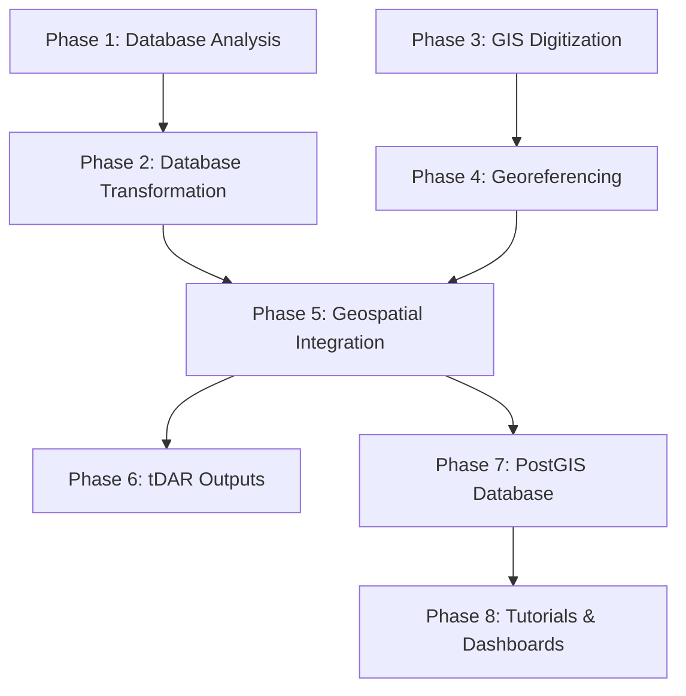

# Digital TMP - Project Overview (Draft v2.0 -- 6/3/2025)

---
**Author:** Rudolf Cesaretti
**Affiliation:** ASU Teotihuacan Research Laboratory
**Date:** June 3, 2025
**Project Environment:** TMP_geo_db (Conda)
---

## Abstract

The Teotihuacan Mapping Project (TMP) stands as one of the most ambitious archaeological survey and mapping efforts ever undertaken, providing an unparalleled dataset for the study of one of the ancient world's largest and most influential cities. Initiated in the 1960s, the project generated vast quantities of attribute data from surface collections and detailed geospatial information through comprehensive mapping. Over several decades, this data has transitioned from analog formats through multiple generations of digital databases and GIS files, managed primarily at Arizona State University’s Teotihuacan Research Laboratory. Despite numerous efforts to preserve, enhance, and integrate these datasets, significant challenges related to data fragmentation, quality, technological obsolescence, and incomplete documentation persist. This document outlines the **TMP Data Integration Initiative**, a comprehensive project aimed at addressing these legacy issues. By systematically analyzing, transforming, integrating, and archiving the TMP's diverse digital assets, this initiative seeks to create a unified, accurate, well-documented, and accessible digital research infrastructure. The project employs a phased methodology, encompassing database analysis and transformation, GIS digitization and georeferencing, geospatial integration, and robust outputs for archival and dissemination through platforms like tDAR and PostGIS. The ultimate goal is to unlock the full scholarly potential of the TMP data for future generations of researchers, enabling new forms of data-driven inquiry into the urbanism, society, and history of Teotihuacan, while adhering to principles of open science and reproducibility.

# 1. Background: The Teotihuacan Mapping Project and its Evolving Data Landscape

## 1.1. The Teotihuacan Mapping Project: A Legacy of Urban Archaeology

Teotihuacan, flourishing in the Basin of Mexico from ca. 100 BCE to 650/750 CE, was an urban center of unparalleled scale and influence in the pre-Columbian Americas. Its comprehensive study was the goal of the Teotihuacan Mapping Project (TMP), initiated in 1962 by René Millon. The TMP was a groundbreaking archaeological endeavor, involving intensive, full-coverage survey of nearly 20 square kilometers, meticulous mapping of architectural and topographical features, and the systematic collection of over one million artifacts from more than 5,000 distinct tracts. This work culminated in the landmark 1973 publication, "Urbanization at Teotihuacan, Mexico, Volume 1: The Teotihuacan Map" ([Millon 1973; Millon, Drewitt, and Cowgill 1973](C:\Users\rcesa\ASU Dropbox\Rudolf Cesaretti\GitHubRepos\TeoMappingProject\knowledge_base\Technical Report - Unfinished TMP Geospatial Data Across Three NSF Grants (1999-2020).md)), which remains a foundational resource.

The data generated by the TMP is inherently dual in nature, comprising rich **attribute data** (detailed observations from "Site Survey Record" (SSR) forms, artifact counts, classifications) and fundamental **geospatial data** (the published maps, field maps, and 147 detailed "interpretation" sheets). The analytical power of the TMP data hinges on the precise linkage of these two components, a central theme throughout its history.

## 1.2. Evolution of the TMP Digital Ecosystem: From Analog to Relational Data

The transition from analog records to digital formats began early in the TMP's history, spearheaded by George Cowgill's visionary adoption of computational methods in 1965. This evolution spanned over five decades, resulting in a complex, multi-generational digital ecosystem.

### 1.2.1. Early Computational Efforts (1960s-1970s): DF1-DF8

The initial foray into digital data management involved transcribing coded information from SSRs onto punch cards for processing on mainframe computers like the IBM 7094.
-   **DF1-DF4**: These were preliminary, sequentially constructed, and often incomplete files used for methodological exploration and early statistical analyses (e.g., using SYMAP for distribution studies), as detailed in the [TMP Database Genealogy Report (v2)](C:\Users\rcesa\ASU Dropbox\Rudolf Cesaretti\GitHubRepos\TeoMappingProject\knowledge_base\TMP_DB_Genealogy_v2.md).
-   **DF5**: Created by transferring data from approximately 50,000 punch cards to magnetic tape.
-   **DF6-DF7**: Involved complex FORTRAN programming for editing and reformatting, which sometimes led to unintended data loss due to the complexity of a single-program approach.
-   **DF8**: Established between 1975-1977, DF8 became the core research database, superseding earlier files. It resided on VAX mainframes and introduced a "random access" file structure. A critical, and later problematic, feature was the "merging" of data from ~5,500 original collections into ~5,046 "cases" or "sites" to represent analytically meaningful structural units. This merging process was "not always clearly documented" ([Technical Report - Unfinished Core Database Work...](C:\Users\rcesa\ASU Dropbox\Rudolf Cesaretti\GitHubRepos\TeoMappingProject\knowledge_base\Technical Report - Unfinished Core Database Work of the TMP Across Three NSF Grants (1999-2020).md)) and complicated later data integration. DF8's ceramic classifications were also recognized as too broad for nuanced analysis.

### 1.2.2. The Ceramic Reanalysis (REANS)

To address the limitations of DF8's ceramic data, a comprehensive reanalysis (REANS) was initiated in the 1970s under Dr. Evelyn Rattray.
-   **Rationale**: To provide more detailed typological and chronological information than available in DF8.
-   **Methodology**: REANS was based on original, individual collection lots, not DF8's merged units, creating a fundamental difference for integration. Data entry was complex, involving transfer from paper forms to intermediate code sheets, then to ASCII files.
-   **Challenges**: Undocumented or ambiguously documented removal of sherds to "specials" collections created count discrepancies. Ian Robertson completed the first robust electronic versions in the 1990s.

### 1.2.3. Relational Databases and GIS Integration (1990s): DF9 and MF2

The 1990s saw a shift to PC-based relational database systems and GIS.
-   **DF9**: Developed by Ian Robertson, DF9 migrated data from DF8 into Paradox and later Microsoft Access. It implemented a relational structure, incorporated error corrections, and, crucially, integrated with digitized spatial data.
-   **MF2**: Robertson also created MF2, a digital map file of TMP collection tract boundaries (in MapInfo and ArcView formats), enabling GIS-supported spatial analyses by linking tract polygons to DF9 attribute data.

### 1.2.4. Ongoing Refinements and Challenges (2000s-Present): DF10 and Advanced GIS

Efforts to refine and manage the TMP data continued into the 21st century.
-   **DF10**: Initiated by Anne Sherfield in 2022, DF10 (an evolution of DF9) aims to reduce database complexity, enhance user-friendliness (e.g., by minimizing zero values using "long" table formats), and systematically document known inherited data problems ([TMP Database Genealogy Report (v2)](C:\Users\rcesa\ASU Dropbox\Rudolf Cesaretti\GitHubRepos\TeoMappingProject\knowledge_base\TMP_DB_Genealogy_v2.md)).
-   **Geospatial Data Evolution**:
    -   The 147 "interpretation" sheets were scanned, and their georeferencing as GeoTIFFs was initiated under a 1999 NSF grant, though this process was reported as "underway" in 2002 and its final validation remains a key task ([Technical Report - Unfinished TMP Geospatial Data...](C:\Users\rcesa\ASU Dropbox\Rudolf Cesaretti\GitHubRepos\TeoMappingProject\knowledge_base\Technical Report - Unfinished TMP Geospatial Data Across Three NSF Grants (1999-2020).md)).
    -   Michael Smith later digitized the main TMP architectural map. Further GIS work was conducted by researchers like Huster, Dennehy, and notably Anne Sherfield, who undertook significant redigitization and methodological refinements to address inconsistencies and improve spatial accuracy, as detailed in [Finalizing the GIS Digitization of the TMP Data Files v0](C:\Users\rcesa\ASU Dropbox\Rudolf Cesaretti\GitHubRepos\TeoMappingProject\knowledge_base\report_drafts\Finalizing the GIS Digitization of the TMP Data Files v0.md).

## 1.3. Previous NSF-Funded Interventions (1999-2020): Progress and Persistent Gaps

Three significant NSF grants awarded to Arizona State University (ASU) between 1999 and 2020 aimed to preserve, enhance, and make accessible the TMP's digital legacy.
-   **NSF #SBR-9816263 (1999-2002)**: Focused on data rescue, structural improvement, and initial web accessibility. Key outcomes included the creation of DF9 (MS Access) from DF8, an MS Access version of REANS, reconciliation of most records between DF9, REANS, and MF2 (all but ~50 cases), reprojection of MF2 into standard coordinate systems, scanning of the 147 interpretation sheets and initiation of their georeferencing, and development of an "integrated mapping" prototype. However, full error resolution, complete REANS documentation, finalized EML metadata, completion of the ArcIMS website, and full georeferencing of all interpretation sheets remained unfinished ([Technical Report - Unfinished Core Database Work...](C:\Users\rcesa\ASU Dropbox\Rudolf Cesaretti\GitHubRepos\TeoMappingProject\knowledge_base\Technical Report - Unfinished Core Database Work of the TMP Across Three NSF Grants (1999-2020).md)).
-   **NSF #0004286 (2001-2002)**: Primarily an infrastructure grant that expanded and upgraded the ASU Teotihuacan Research Laboratory, ensuring the physical preservation of original analog maps, field notes, aerial photos, and artifact collections—the primary referents for all digital data ([Technical Report - Unfinished TMP Geospatial Data...](C:\Users\rcesa\ASU Dropbox\Rudolf Cesaretti\GitHubRepos\TeoMappingProject\knowledge_base\Technical Report - Unfinished TMP Geospatial Data Across Three NSF Grants (1999-2020).md)).
-   **NSF #1723322 (2017-2020)**: Aimed to complete unfinished analyses, archive data in tDAR, and publish findings. This grant inherited DF10, which was still "far from optimal in organization and content." A critical new task (Task 2F) was to "Clean the map GIS, link to the database" due to "problems that inhibit easy linkage" with Smith's digitized architectural map. While some progress was made (e.g., identifying outdated DF10 fields, readying some maps for tDAR), the final cleaning of DF10, full integration of problematic REANS cases, and complete "fixing" of the architectural map GIS to resolve linkage issues remained "ongoing" or "uncompleted tasks" ([Technical Report - Unfinished Core Database Work...](C:\Users\rcesa\ASU Dropbox\Rudolf Cesaretti\GitHubRepos\TeoMappingProject\knowledge_base\Technical Report - Unfinished Core Database Work of the TMP Across Three NSF Grants (1999-2020).md); [Technical Report - Unfinished TMP Geospatial Data...](C:\Users\rcesa\ASU Dropbox\Rudolf Cesaretti\GitHubRepos\TeoMappingProject\knowledge_base\Technical Report - Unfinished TMP Geospatial Data Across Three NSF Grants (1999-2020).md)).

These decades of effort laid crucial groundwork but also highlighted the depth and persistence of the data challenges, setting the stage for the current comprehensive integration initiative.

# 2. Problems & Motivations: Addressing a Complex Legacy

Despite its landmark status and decades of dedicated data management efforts, the Teotihuacan Mapping Project's digital archive presents a complex array of legacy challenges. These issues, stemming largely from the project's historical depth, multi-generational development, and evolving technologies, must be systematically resolved to unlock its full scholarly potential. This initiative is motivated by the imperative to overcome these hurdles and create a unified, reliable, and accessible research resource.

## 2.1. Data Fragmentation and Interoperability Failures

The most fundamental challenge is the fragmentation of the TMP digital ecosystem. Over 50+ years, different researchers and teams produced a patchwork of datasets, often with distinct structures, formats, and analytical aims.
-   **Heterogeneous Datasets**: The primary attribute database (DF8, evolving to DF9 and DF10), the GIS vector files (MF2, various architectural map versions), and the ceramic reanalysis database (REANS) were often developed independently.
-   **Inconsistent Definitions and Keys**: This has led to inconsistent variable definitions, spatial keys, and attribute coding across datasets, severely hindering robust cross-referencing and system-wide querying. For instance, REANS uses original collection lots while DF8/DF9/DF10 use merged "sites," and resolving these differences for all cases remains a challenge ([Technical Report - Unfinished Core Database Work...](C:\Users\rcesa\ASU Dropbox\Rudolf Cesaretti\GitHubRepos\TeoMappingProject\knowledge_base\Technical Report - Unfinished Core Database Work of the TMP Across Three NSF Grants (1999-2020).md)).

## 2.2. Data Quality and Integrity Deficiencies

Ensuring the accuracy and reliability of the data is paramount.
-   **Attribute Data Issues**:
    -   The main attribute database (DF10) was described in 2020 as "one of the biggest uncompleted tasks" and "far from optimal in organization and content," with only "slight progress" made on its cleaning during the 2017-2020 NSF grant. Issues include outdated/unreliable fields, typographical and coding errors, and inconsistencies in architectural categorizations ([Technical Report - Unfinished Core Database Work...](C:\Users\rcesa\ASU Dropbox\Rudolf Cesaretti\GitHubRepos\TeoMappingProject\knowledge_base\Technical Report - Unfinished Core Database Work of the TMP Across Three NSF Grants (1999-2020).md)).
    -   Approximately 350 "particularly problematic collections" in the REANS ceramic database remain unresolved and unintegrated with DF10 due to complex historical data ambiguities ([Technical Report - Unfinished Core Database Work...](C:\Users\rcesa\ASU Dropbox\Rudolf Cesaretti\GitHubRepos\TeoMappingProject\knowledge_base\Technical Report - Unfinished Core Database Work of the TMP Across Three NSF Grants (1999-2020).md)).
-   **Geospatial Data Issues**:
    -   The digitized architectural map GIS was found to have "problems that inhibit easy linkage with the database," requiring a dedicated "fixing the map" effort (Task 2F of the 2017 grant) that was ongoing as of 2020 ([Technical Report - Unfinished Core Database Work...](C:\Users\rcesa\ASU Dropbox\Rudolf Cesaretti\GitHubRepos\TeoMappingProject\knowledge_base\Technical Report - Unfinished Core Database Work of the TMP Across Three NSF Grants (1999-2020).md)). These problems could include geometric errors, attribute inconsistencies within GIS tables, or topological issues.
    -   While the MF2 tract map was topologically cleaned, its comprehensive spatial accuracy validation against a finalized architectural map or other control sources remains to be fully documented ([Technical Report - Unfinished TMP Geospatial Data...](C:\Users\rcesa\ASU Dropbox\Rudolf Cesaretti\GitHubRepos\TeoMappingProject\knowledge_base\Technical Report - Unfinished TMP Geospatial Data Across Three NSF Grants (1999-2020).md)).

## 2.3. Geospatial Data Complexities

The spatial nature of the TMP data introduces specific challenges critical to its interpretation.
### 2.3.1. Georeferencing and Spatial Accuracy

Achieving and validating high-accuracy spatial referencing for all GIS layers is a non-negotiable prerequisite for reliable analysis.
-   The georeferencing of the 147 "interpretation" sheets, initiated under the 1999 NSF grant, was reported as "underway" in 2002. Their final, validated georeferencing status across all sheets, including accuracy assessments (e.g., RMSE), remains unconfirmed ([Technical Report - Unfinished TMP Geospatial Data...](C:\Users\rcesa\ASU Dropbox\Rudolf Cesaretti\GitHubRepos\TeoMappingProject\knowledge_base\Technical Report - Unfinished TMP Geospatial Data Across Three NSF Grants (1999-2020).md)).
-   Legacy map data often contains inherent local and systematic distortions that require sophisticated transformation methods (e.g., Thin Plate Spline, as explored in [Report_Georeferencing_TMP_Database.md](C:\Users\rcesa\ASU Dropbox\Rudolf Cesaretti\GitHubRepos\TeoMappingProject\knowledge_base\tmp_gis\georef\Report_Georeferencing_TMP_Database.md)) to ensure accurate alignment with modern coordinate systems.

### 2.3.2. Geometric and Topological Integrity

GIS layers must be free of errors that compromise spatial calculations and relationships.
-   Digitized features may suffer from imprecise shapes, incorrect placements, or erroneous orientations relative to original sources.
-   Topological errors (e.g., unclosed polygons, overlaps, gaps) must be systematically identified and corrected to ensure data integrity for analysis.

### 2.3.3. Inconsistent Digitization Efforts

The long history of the TMP means GIS datasets were often constructed at different times, by various personnel with differing goals and levels of precision. This can result in mismatched feature IDs, divergent schema definitions, and varied spatial precision across layers ([docs/overview.md](C:\Users\rcesa\ASU Dropbox\Rudolf Cesaretti\GitHubRepos\TeoMappingProject\docs\overview.md) original text).

## 2.4. Metadata Deficiencies and Documentation Gaps

Comprehensive documentation is essential for data interpretability and long-term usability.
-   Much of the TMP data lacks complete, standardized metadata. The 1999 NSF grant initiated extensive documentation for DF9 and planned EML metadata, but this was not fully finalized for all datasets ([Technical Report - Unfinished Core Database Work...](C:\Users\rcesa\ASU Dropbox\Rudolf Cesaretti\GitHubRepos\TeoMappingProject\knowledge_base\Technical Report - Unfinished Core Database Work of the TMP Across Three NSF Grants (1999-2020).md)).
-   Effective use has often relied on "insider knowledge," susceptible to loss as original researchers age or depart.
-   "Gray variables"—ambiguous fields with unclear definitions or truncated labels due to early storage limitations—require painstaking reconstruction from legacy codebooks or paper records.

## 2.5. Technological Obsolescence

The TMP data ecosystem was designed for computing environments that are now archaic.
-   Early analyses used FORTRAN on VAX mainframes. Later phases adopted platforms like Paradox and Microsoft Access, which present interoperability challenges with modern systems like PostgreSQL and PostGIS.
-   Proprietary and outdated file formats (e.g., early MapInfo versions) require careful conversion, risking data loss or corruption.

## 2.6. Preservation and Accessibility Gaps

Despite its scholarly importance, the TMP dataset has never been fully published or archived in a comprehensively discoverable, interoperable, and reusable format.
-   Previous NSF-funded efforts made progress but did not achieve complete, integrated archival and dissemination for all core components.
-   The physical archive (original maps, notebooks, negatives) also faces preservation risks without comprehensive digital backups.

## 2.7. Motivation for the Current Initiative: Realizing the TMP's Full Potential

The Teotihuacan Mapping Project dataset is an irreplaceable global heritage resource. The persistence of the aforementioned challenges has, however, hindered its full utilization. This **TMP Data Integration Initiative** is motivated by the scholarly imperative to:
-   **Preserve and Secure**: Safeguard this unique dataset from degradation and loss.
-   **Unify and Integrate**: Consolidate the fragmented data into a coherent, internally consistent research infrastructure.
-   **Enhance and Validate**: Improve data quality, accuracy, and completeness through systematic cleaning and validation.
-   **Document Comprehensively**: Create robust metadata to ensure long-term interpretability.
-   **Enable Future Research**: Unlock the dataset for new generations of researchers and innovative analytical approaches, as envisioned in the project's multi-phase [architecture](C:\Users\rcesa\ASU Dropbox\Rudolf Cesaretti\GitHubRepos\TeoMappingProject\docs\architecture.md).

By addressing these long-standing issues, this project aims to transform the TMP's complex legacy into a powerful, accessible, and enduring resource for understanding one of the ancient world's most significant cities.

# 3. Project Goals and Objectives: Building a Unified Digital Infrastructure

The overarching vision of the Teotihuacan Mapping Project (TMP) Data Integration Initiative is to transform the project's vast and complex legacy data into a unified, accurate, thoroughly documented, and readily accessible digital research infrastructure. This initiative aims to empower new generations of researchers to explore Teotihuacan with unprecedented depth and analytical power, ensuring the long-term preservation and scholarly impact of this unique archaeological dataset.

## 3.1. Core Technical Objectives

To achieve this vision, the project will pursue the following interconnected technical objectives, drawing upon the systematic methodologies outlined in the [project architecture document](C:\Users\rcesa\ASU Dropbox\Rudolf Cesaretti\GitHubRepos\TeoMappingProject\docs\architecture.md):

### 3.1.1. Attribute Database Finalization and Integration

-   **Complete DF10 Cleaning and Validation**: Execute a systematic, field-by-field and record-by-record audit of the main TMP attribute database (DF10) to identify and correct remaining errors (typographical, coding, computational), purge outdated or unreliable data fields, and standardize categorical variables. This addresses "one of the biggest uncompleted tasks" identified in prior work ([Technical Report - Unfinished Core Database Work...](C:\Users\rcesa\ASU Dropbox\Rudolf Cesaretti\GitHubRepos\TeoMappingProject\knowledge_base\Technical Report - Unfinished Core Database Work of the TMP Across Three NSF Grants (1999-2020).md)).
-   **Finalize REANS Data Integration**: Achieve full resolution of data ambiguities within the approximately 350 "particularly problematic collections" in the REANS ceramic database and complete their verified, seamless integration into the finalized DF10 structure.
-   **Structural Optimization**: Ensure the final database (e.g., DF12 as per [architecture.md](C:\Users\rcesa\ASU Dropbox\Rudolf Cesaretti\GitHubRepos\TeoMappingProject\docs\architecture.md) Workflow 2.2) possesses optimal relational integrity and query performance, potentially involving denormalization strategies where justified for analytical efficiency.

### 3.1.2. Geospatial Data Remediation, Validation, and Standardization

-   **Complete and Validate Georeferencing**: Ensure all core TMP map products—including the primary architectural map, the MF2 tract map, and crucially, all 147 "interpretation" sheets—are georeferenced to a high, documented standard of absolute and relative spatial accuracy using robust methodologies (as explored in [tmp_gis/georef/Report_Georeferencing_TMP_Database.md](C:\Users\rcesa\ASU Dropbox\Rudolf Cesaretti\GitHubRepos\TeoMappingProject\knowledge_base\tmp_gis\georef\Report_Georeferencing_TMP_Database.md)).
-   **Comprehensive Spatial Cleaning**: Perform rigorous spatial cleaning of all GIS layers. This includes correcting geometric errors in features, ensuring topological integrity (e.g., resolving overlaps, gaps), and standardizing feature representations. This addresses the "fixing the map" task for the architectural GIS identified as ongoing in 2020 ([Technical Report - Unfinished Core Database Work...](C:\Users\rcesa\ASU Dropbox\Rudolf Cesaretti\GitHubRepos\TeoMappingProject\knowledge_base\Technical Report - Unfinished Core Database Work of the TMP Across Three NSF Grants (1999-2020).md)).
-   **Standardize Coordinate Systems and Precision**: Ensure all geospatial datasets adhere to consistent, well-documented coordinate reference systems and levels of spatial precision.

### 3.1.3. Robust Data Integration and Interoperability

-   **Achieve Verified Linkage**: Establish and meticulously verify seamless, accurate, and bidirectional linkage between the finalized attribute databases (DF10/REANS derivatives) and all cleaned, validated geospatial layers (architectural map, MF2, interpretation sheets). This is critical for resolving the "problems that inhibit easy linkage" previously identified ([Technical Report - Unfinished Core Database Work...](C:\Users\rcesa\ASU Dropbox\Rudolf Cesaretti\GitHubRepos\TeoMappingProject\knowledge_base\Technical Report - Unfinished Core Database Work of the TMP Across Three NSF Grants (1999-2020).md)).
-   **Implement Consistent Identifiers**: Ensure unique, consistent, and reliable linking keys (e.g., structure IDs, tract IDs) are employed across all database tables and GIS attribute tables to guarantee relational integrity.

### 3.1.4. Comprehensive Metadata Development

-   **Create Standardized Metadata**: Develop comprehensive, standardized, machine-readable metadata for all data components (attribute tables, GIS layers, source documents). This metadata will cover provenance, methodology, data structure, variable definitions, coding schemes, georeferencing parameters, spatial accuracy assessments, and access/use conditions.
-   **Ensure Archival Compliance**: Adhere to archival best practices and specific requirements of repositories like tDAR to ensure discoverability, interoperability, and long-term usability (FAIR principles).

### 3.1.5. Advanced Data Transformation and Enhancement (as per `architecture.md`)

-   **Systematic ETL Processes**: Implement robust Extract, Transform, Load (ETL) pipelines for data cleaning, schema harmonization, and structural reorganization from legacy formats to analysis-ready datasets (Phases 1-2, [architecture.md](C:\Users\rcesa\ASU Dropbox\Rudolf Cesaretti\GitHubRepos\TeoMappingProject\docs\architecture.md)).
-   **Database Profiling and Schema Optimization**: Conduct thorough analysis of database structures, optimize schemas, and standardize controlled vocabularies to enhance data quality and analytical coherence.
-   **Feature Engineering**: Derive new analytical variables through consolidation, decomposition, or computation from existing data fields to support advanced research questions (Phase 5, [architecture.md](C:\Users\rcesa\ASU Dropbox\Rudolf Cesaretti\GitHubRepos\TeoMappingProject\docs\architecture.md)).

## 3.2. Broader Project Aims

Beyond the core technical objectives, this initiative aims to achieve wider scholarly and societal impacts:

### 3.2.1. Long-Term Preservation and Archival

-   **Ensure Sustainable Preservation**: Formally archive the complete, integrated, and documented TMP dataset in trusted digital repositories (e.g., tDAR, as outlined in Phase 6, [architecture.md](C:\Users\rcesa\ASU Dropbox\Rudolf Cesaretti\GitHubRepos\TeoMappingProject\docs\architecture.md)) to ensure its long-term viability and protection against loss or obsolescence.

### 3.2.2. Enhanced Accessibility and Dissemination

-   **Provide Multiple Access Pathways**: Offer diverse methods for data access, including downloadable datasets in standard formats, a production-grade PostGIS database for advanced querying (Phase 7, [architecture.md](C:\Users\rcesa\ASU Dropbox\Rudolf Cesaretti\GitHubRepos\TeoMappingProject\docs\architecture.md)), and user-friendly web applications or dashboards for interactive exploration and visualization (Phase 8, [architecture.md](C:\Users\rcesa\ASU Dropbox\Rudolf Cesaretti\GitHubRepos\TeoMappingProject\docs\architecture.md)).

### 3.2.3. Fostering Reproducibility and Open Science

-   **Adhere to Open Science Principles**: Employ transparent methodologies, well-documented workflows (as emphasized in the modular workflow architecture, Section 5.1), and version control to ensure the reproducibility of all data transformations and analytical outputs.

### 3.2.4. Enabling New Research and Pedagogical Applications

-   **Unlock Advanced Analyses**: Facilitate new research avenues by providing a robust dataset suitable for advanced quantitative methods, spatial modeling, machine learning applications, and interdisciplinary investigations.
-   **Support Educational Use**: Develop curriculum-aligned modules and tutorials to enable the use of TMP data in educational settings for archaeology, digital humanities, and GIS (Section 4.2.4).

By achieving these goals and objectives, the TMP Data Integration Initiative will not only address the persistent challenges of a complex archaeological legacy but also establish a new benchmark for the management, integration, and dissemination of large-scale archaeological datasets.

# 4. Stakeholders & Use Cases

The Teotihuacan Mapping Project (TMP) Data Integration Initiative has been designed to benefit a broad array of stakeholders across academic, governmental, technical, and public sectors. Its outputs—comprising a unified archaeological database, richly georeferenced GIS files, and structured metadata—address longstanding infrastructural gaps in archaeological research, while simultaneously enabling new forms of data-driven scholarship, policy planning, and education. This section outlines the core user communities and describes how each group stands to gain from the project's results.

## 4.1. Formal Project Stakeholders

### 4.1.1. ASU Teotihuacan Research Laboratory

The ASU Teotihuacan Research Laboratory serves as the primary institutional stakeholder and project host. As the repository of the original TMP datasets and ongoing Teotihuacan research, the lab directly benefits from the integration and modernization of these critical archaeological resources. The unified database infrastructure supports the lab's continued research activities, provides a foundation for future fieldwork planning, and establishes a lasting digital legacy for the laboratory's decades of scholarly contributions.

### 4.1.2. Digital Antiquity and tDAR

Digital Antiquity, through The Digital Archaeological Record (tDAR), serves as the formal archival partner for long-term data preservation and dissemination. As a leading archaeological data repository, tDAR provides essential infrastructure for ensuring the project's outputs meet professional archival standards, receive persistent identifiers, and remain accessible to the global research community. This partnership exemplifies best practices in archaeological data stewardship and digital preservation.

## 4.2. Academic Stakeholders

### 4.2.1. Mesoamerican Archaeologists

Archaeologists specializing in Teotihuacan and broader Mesoamerican studies represent the primary beneficiaries of this initiative. The integrated database allows researchers to analyze ceramic distributions, architectural patterns, and surface collection data with unprecedented precision. For scholars revisiting previously studied areas—such as Plaza One, Oztoyahualco, or the Oaxaca Barrio—the unified platform provides the spatial and typological infrastructure needed to recontextualize earlier interpretations with updated datasets.

### 4.2.2. Comparative Urbanism Scholars

The project contributes significantly to the expanding field of comparative urbanism. With a spatially normalized dataset, Teotihuacan can now be rigorously compared to other early cities across the world—including sites in the Indus Valley, ancient China, and the Andes. Researchers working on settlement scaling theory, urban density modeling, and infrastructural complexity will be able to incorporate Teotihuacan as a robust, data-rich case study.

### 4.2.3. Computational Archaeologists

As a model of legacy data integration, the TMP project offers a valuable precedent for digital archaeologists working to rescue, transform, and publish large-format analog datasets. The methodological innovations embedded in this project—such as modular ETL pipelines, CRS transformation strategies, and semantic metadata layering—are transferable to other archaeological corpora. Scholars studying digital workflows, version control, and reproducibility in the humanities will find both inspiration and practical templates in the project's outputs. With the full integration of artifact counts, typologies, and spatial geometries, the project enables machine learning and quantitative analysis applications. Classification algorithms can be applied to cluster ceramic assemblages by spatial context, or to detect pattern anomalies in the spatial layout of craft production zones. The ability to extract structured datasets for training models makes this project particularly attractive to researchers bridging archaeology and data science.

### 4.2.4. Universities and Teaching Institutions

The unified dataset will be packaged with curriculum-aligned modules that can be deployed in archaeology, digital humanities, and GIS classrooms. Professors will be able to assign real-world datasets to students for spatial analysis projects, and training modules will demonstrate how to navigate, query, and visualize the TMP data using open-source tools like QGIS or Jupyter Notebooks.

### 4.2.5. Public Outreach and Virtual Engagement

By publishing outputs in formats compatible with web-based platforms (e.g., Leaflet, ArcGIS Online), the project will make Teotihuacan accessible to broader audiences. Interactive maps and "story maps" can convey the complexity and richness of the city in ways that invite public engagement, stimulate cultural curiosity, and support site stewardship.

## 4.3. Governmental and Policy Organizations (Informal Stakeholders)

While not formal project partners, several governmental organizations may benefit from project outputs:

### 4.3.1. INAH (Instituto Nacional de Antropología e Historia)

INAH, as Mexico's principal archaeological and cultural heritage authority, may find value in the precision geospatial record of the ancient city for regulatory, conservation, and planning purposes. The database could potentially serve as a foundation for drafting site protection zones, evaluating threats from construction or tourism development, and designing sustainable urban policies in the Teotihuacan Valley.

### 4.3.2. INEGI and Regional Planning Authorities

The Mexican National Institute of Statistics and Geography (INEGI) and other regional planning entities may find the spatial intelligence tools useful for navigating the city's archaeological footprint. The ability to overlay infrastructure projects, land parcels, and zoning maps onto a high-resolution model of Teotihuacan's urban core could facilitate ethically responsible development planning.

## 4.4. Global Research Impact

The TMP initiative aligns with the goals of major international archaeological data repositories and emphasizes long-term preservation, discoverability, and reuse of research-grade datasets. By structuring the TMP outputs according to FAIR data principles (Findable, Accessible, Interoperable, Reusable), this project not only joins but also elevates the global infrastructure for archaeological research sharing, enabling new forms of interdisciplinary partnerships and collaborative research across institutions and borders.

The open data model invites collaborative layers, from LiDAR visualizations to historical document overlays, and can serve as the spatial anchor point for broader digital heritage ecosystems, ultimately transforming how ancient urban sites are studied, preserved, and shared with global audiences.

---

# 5. Summary of Approach

The methodological strategy behind the TMP Data Science Integration Initiative is structured as a modular, multi-phase pipeline designed to address the specific historical, technical, and logistical challenges of the original Teotihuacan Mapping Project dataset. Drawing from principles of open science, reproducibility, and geospatial data modeling, the approach provides a systematic framework for converting legacy archaeological archives into a unified, query-ready, and extensible digital infrastructure.

The project is divided into eight sequential but independently executable phases: **Database Analysis**, **Database Transformation**, **GIS Digitization**, **Georeferencing**, **Geospatial Integration**, **tDAR Outputs**, **PostGIS Database**, and **Tutorials & Dashboards**. Each phase builds sequentially toward a fully reproducible, multi-format archaeological database that serves diverse stakeholder needs—from advanced researchers requiring programmatic access to public audiences seeking interactive visualization tools.

## 5.1. Modular Workflow Architecture

The project adopts a three-tiered logic of execution:
- **Phases** represent the highest level of workflow organization, each corresponding to a major stage of data transformation that systematically transforms legacy archaeological databases into a modern, integrated geospatial data infrastructure.
- **Workflows** define the sequence of operations within a phase (e.g., digitization, attribute validation, schema harmonization), representing processes within each phase.
- **Tasks** are the smallest units of execution, often assigned to individual team members or scripts, and tracked for reproducibility.

This tiered structure facilitates collaborative work across research teams and institutions, while enabling fine-grained documentation of decisions and tools used at each stage. The architecture follows a data science pipeline approach, beginning with legacy database analysis and transformation, advancing through spatial data creation and georeferencing, achieving full geospatial integration with advanced feature engineering, preparing archival-ready outputs for long-term preservation, implementing a production-grade PostGIS database, and culminating in user-facing applications and comprehensive tutorials.

## 5.2. Eight Phases of the Integration Process

The Digital TMP project architecture represents a comprehensive data modernization initiative that addresses the complex challenges of integrating legacy archaeological databases with contemporary geospatial technologies. The eight-phase approach ensures systematic quality control, maintains data provenance, and produces multiple distribution formats to serve diverse research and public engagement needs.

### 5.2.1. Data Foundation (Phases 1-2)

**Phase 1 – Database Analysis** establishes the analytical groundwork through rigorous evaluation of legacy MS Access databases (TMP_DF8, TMP_DF9, TMP_DF10, and TMP_REAN_DF2). This phase implements database profiling, schema optimization, and produces actionable insights into the quality, complexity, and suitability of the legacy schemas for downstream analytical workflows. Through automated database profiling, structural visualization, and quantitative schema analysis, this phase produces reproducible PostgreSQL versions of all legacy databases, automated Entity-Relationship Diagrams (ERDs), and a comprehensive denormalization white paper with schema optimization recommendations.

**Phase 2 – Database Transformation** follows with systematic ETL processes that produce clean, analysis-ready datasets. This comprehensive transformation process consolidates complementary information from three versions of the legacy database (DF8, DF9, DF10) to produce a provisional consolidated dataset (DF11), cleans and validates the REANs database to produce REANs DF3, and then undertakes intensive, variable-by-variable redesign to produce the final DF12 and REAN DF4 datasets. The phase implements controlled vocabulary standardization and automated validation frameworks to ensure data quality and analytical coherence.

### 5.2.2. Spatial Data Creation (Phases 3-4)

**Phase 3 – GIS Digitization** addresses the manual digitization of archaeological features from historical maps. Operating within a pre-georeferenced context, this phase focuses on the labor-intensive process of manually digitizing spatial features using QGIS, guided by assembled raster basemaps including scanned maps, aerial imagery, and legacy documentation. The digitized features include archaeological (floors, walls, plazas, etc.), environmental (terraces, canals, drainage), and modern features (buildings, roads, infrastructure) from the Teotihuacan Mapping Project. These phases overcome the limitations of legacy cartographic materials through custom transformation pipelines.

**Phase 4 – Georeferencing** implements high-precision georeferencing workflows to spatially align the digitized raster and vector layers. This phase incorporates ground control points (GCPs), develops custom NTv2 grid shift transformations, and establishes spatial accuracy standards for all subsequent analyses. The process includes sensitivity analysis to evaluate transformation performance, recursive georeferencing error assessment, and the generation of custom CRS transformation pipelines using PROJ with NTv2 grid shift capabilities.

### 5.2.3. Integration and Enhancement (Phase 5)

**Phase 5 – Geospatial Integration** merges tabular and spatial datasets while implementing advanced feature engineering to derive new analytical variables. This phase establishes the spatial foundation for all downstream analytical and distributional workflows by integrating the cleaned, transformed non-spatial dataset (DF12) with its corresponding georeferenced spatial geometries. It leverages spatial relationships to enhance interpretive capacity, conducts final classification of architectural features through spatial cross-referencing, and validates all integrated outputs through automated quality assurance protocols.

### 5.2.4. Preservation and Distribution (Phases 6-8)

**Phase 6 – tDAR Outputs** ensures long-term accessibility through formal archival submission to tDAR (The Digital Archaeological Record). This phase focuses on the preparation, transformation, and packaging of the project's spatial and non-spatial datasets for long-term archival and dissemination. Given tDAR's emphasis on data preservation, discoverability, and accessibility, this phase ensures that all data products meet strict archival standards and are accompanied by comprehensive metadata and documentation.

**Phase 7 – PostGIS Database** implements deployment of a production-grade PostGIS database as the analytical and distributional backend for the project. The database integrates previously processed geospatial datasets and metadata, enabling complex spatial queries, analytical workflows, and efficient data dissemination through multiple distribution mechanisms. This architecture ensures both reproducibility for advanced research users and accessibility for public stakeholders through Docker containerization, SQL dumps, and API endpoints.

**Phase 8 – Tutorials & Dashboards** provides pathways for both technical users requiring full analytical capabilities and public audiences seeking interactive exploration tools. This phase focuses on developing comprehensive tutorials and an interactive WebGIS dashboard to facilitate the effective use and exploration of the PostGIS database. Through multiple tutorial formats (Python, R, QGIS) and an intuitive WebGIS interface, the project ensures wide accessibility and encourages further analytical engagement with the distributed datasets.

## 5.3. Design Principles: Reproducibility, Interoperability, Extensibility

The architecture incorporates modern data science principles throughout, including reproducible computational environments (Docker containers), automated validation frameworks, version-controlled workflows, and comprehensive documentation standards. Throughout all phases, the project adheres to a set of guiding principles:

- **Reproducibility**: All transformations are documented in code notebooks and tracked using version control (Git). Reproducible computational environments ensure exact replication of the database environment across various platforms.
- **Interoperability**: Outputs conform to open standards for GIS and tabular data (e.g., Shapefile, GeoJSON, CSV, SQL). The architecture prioritizes long-term preservation requirements, with exports to standard formats ensuring compatibility with future technological environments.
- **Extensibility**: The architecture is modular, allowing future addition of datasets (e.g., TMP excavations, LiDAR, GPR, drone photogrammetry). The resulting infrastructure can accommodate future technological evolution while maintaining backward compatibility and data integrity.
- **Scalability**: The system is designed to handle the complexity of the full TMP dataset while maintaining performance for analytical and distributional purposes.
- **Accessibility**: Multiple distribution mechanisms balance preservation requirements with contemporary access patterns, providing pathways for diverse user communities.

By foregrounding these principles, the project transforms the TMP into a long-lived digital infrastructure for collaborative, interdisciplinary research that can accommodate future technological evolution while maintaining full provenance and enabling future extensibility.

---

# 6. Project Architecture

The architectural design of the TMP Data Science Integration Initiative is rooted in a logic of phased modularity and reproducible transformation. It builds on a clear progression from legacy archaeological databases to fully integrated spatial-database systems, while incorporating modern software engineering practices such as containerization, schema modularity, and versioned documentation. The architecture represents a comprehensive data modernization initiative that addresses the complex challenges of integrating legacy archaeological databases with contemporary geospatial technologies.

The project progresses through eight (n = 8) methodologically distinct phases that systematically transform legacy archaeological databases into a modern, integrated geospatial data infrastructure. Each phase builds sequentially toward a fully reproducible, multi-format archaeological database that serves diverse stakeholder needs—from advanced researchers requiring programmatic access to public audiences seeking interactive visualization tools.

## 6.1. General Structure and Logic

### 6.1.1. Tiered Workflow Logic

The project's architecture follows a three-tiered execution model based on modular structure:
- **Phases** represent major units of the project, large-scale methodological divisions that correspond to distinct stages of data transformation.
- **Workflows** define processes within each phase, representing modular operations within each phase (e.g., digitization, attribute validation, schema harmonization).
- **Tasks** are the smallest unit of execution, atomic units of computation or manual review that break workflows into manageable components.

This tiered structure facilitates collaboration across institutions and supports asynchronous contributions from developers, digitizers, database architects, and domain specialists, while enabling fine-grained documentation of decisions and tools used at each stage.

### 6.1.2. Output-Driven Interdependence

Each phase culminates in one or more clearly defined deliverables that serve as structured inputs for subsequent phases, ensuring traceability and transformation continuity. The architecture emphasizes reproducibility, scalability, and interoperability, incorporating modern data science practices including automated validation, version control, containerized deployment, and comprehensive metadata management.

## 6.2. Phase Overview Summary Table

| Phase | Description | Inputs | Outputs |
|-------|-------------|--------|---------|
| Phase 1: Database Analysis | Systematic evaluation and profiling of legacy MS Access databases to inform optimal schema design and transformation strategies | 4 MS Access DBs, historical documentation | PostgreSQL migration, ERDs, schema profiling reports, denormalization white paper |
| Phase 2: Database Transformation | Comprehensive ETL and feature engineering to produce analysis-ready tabular datasets with standardized vocabularies | PostgreSQL tables, controlled vocabularies | TMP_DF12, TMP_REANs_DF4, transformation logs, validation reports |
| Phase 3: GIS Digitization | Manual digitization of archaeological, environmental, and modern features from historical raster maps | Raster basemaps, legacy documentation | Digitized vector layers, provisional attribute schemas, digitization metadata |
| Phase 4: Georeferencing | High-precision georeferencing using custom NTv2 transformations and spatial accuracy validation | Digitized vectors, GCPs, raster tiles | Spatially-aligned datasets, transformation grids, accuracy assessments |
| Phase 5: Geospatial Integration | Integration of tabular and spatial data with advanced feature engineering and architectural classification | GIS layers, TMP_DF12, REANs_DF4 | Fully integrated geospatial datasets, derived spatial attributes, classification schemes |
| Phase 6: tDAR Outputs | Preparation and packaging of archival-ready datasets with comprehensive metadata for long-term preservation | Integrated datasets, metadata | tDAR-compliant packages, controlled vocabularies, documentation, tutorials |
| Phase 7: PostGIS Database | Design and deployment of production-grade spatial database with optimized schemas and performance tuning | Integrated geospatial datasets | PostGIS database, Docker containers, SQL dumps, API endpoints |
| Phase 8: Tutorials & Dashboards | Development of user-facing applications and comprehensive tutorials for diverse analytical workflows | PostGIS database, static exports | WebGIS dashboard, REST API, Python/R/QGIS tutorials |

## 6.3. Architecture Overview

The Digital TMP project architecture addresses the complex challenges of integrating legacy archaeological databases with contemporary geospatial technologies through a systematic approach organized into three major components:

**Data Foundation (Phases 1-2)** establishes the analytical groundwork through rigorous evaluation of legacy MS Access databases, followed by systematic ETL processes that produce clean, analysis-ready datasets. These phases implement database profiling, schema optimization, and controlled vocabulary standardization to ensure data quality and analytical coherence.

**Spatial Data Creation (Phases 3-4)** addresses the manual digitization of archaeological features from historical maps and implements high-precision georeferencing workflows. These phases overcome the limitations of legacy cartographic materials through custom transformation pipelines and establish spatial accuracy standards for all subsequent analyses.

**Integration and Enhancement (Phase 5)** merges tabular and spatial datasets while implementing advanced feature engineering to derive new analytical variables. This phase leverages spatial relationships to enhance interpretive capacity and validates all integrated outputs through automated quality assurance protocols.

**Preservation and Distribution (Phases 6-8)** ensure long-term accessibility through multiple complementary approaches: formal archival submission to tDAR, deployment of a production-grade PostGIS database, and creation of user-friendly web applications. These phases balance preservation requirements with contemporary access patterns, providing pathways for both technical users requiring full analytical capabilities and public audiences seeking interactive exploration tools.

## 6.4. Phase-Level Detail

### 6.4.1. Phase 1 – Database Analysis
- Systematic evaluation of legacy TMP databases (DF8, DF9, DF10, REAN_DF2) to inform schema design
- Output: Reproducible PostgreSQL versions, automated ERDs, schema profiling reports, denormalization white paper

### 6.4.2. Phase 2 – Database Transformation
- ETL operations transforming legacy databases into normalized, analysis-ready datasets
- Output: Final TMP_DF12 and TMP_REANs_DF4 datasets with controlled vocabularies and validation reports

### 6.4.3. Phase 3 – GIS Digitization
- Manual digitization of archaeological, environmental, and modern features from TMP raster maps
- Output: Comprehensive vector datasets with standardized attribute schemas and digitization metadata

### 6.4.4. Phase 4 – Georeferencing
- High-precision georeferencing using custom NTv2 transformations and ground control points
- Output: Spatially-aligned datasets in global coordinate reference systems with accuracy assessments

### 6.4.5. Phase 5 – Geospatial Integration
- Integration of tabular and spatial datasets with advanced feature engineering
- Output: Fully integrated geospatial datasets with derived spatial attributes and architectural classifications

### 6.4.6. Phase 6 – tDAR Outputs
- **Output:** Archival-ready spatial and non-spatial datasets in Shapefile, CSV, and compressed GeoTIFF formats, accompanied by comprehensive metadata and supporting documentation
- **Distribution Strategy:** Direct upload to tDAR for compliant datasets; external repository hosting for large datasets with permanent DOIs
- **Supporting Materials:** ReadMe files, data dictionaries, methodological reports, controlled vocabulary files, entity-relationship diagrams, and user tutorials

### 6.4.7. Phase 7 – PostGIS Database
- **Output:** A fully integrated, spatially enabled PostgreSQL/PostGIS database supporting multiple export formats
- **Distribution Mechanisms:** Docker containerized deployment, SQL dump files for technical users, static dataset exports for non-technical users
- **Accessibility:** Public-facing REST API for programmatic data access and interactive WebGIS dashboard for exploratory visualization

### 6.4.8. Phase 8 – Tutorials & Dashboards
- **Output:** Comprehensive tutorials supporting database setup, data ETL processes, and spatial analysis workflows across Python, R, and QGIS environments
- **Public-Facing Resources:** Interactive WebGIS dashboard, RESTful API, and publicly available data exports with documentation

## 6.5. Architecture Flow Diagram

This diagram reflects both the technical flow and the conceptual scaffolding of the data lifecycle, ensuring that spatial and attribute data converge only after independent quality assurance. The architecture incorporates modern data science principles throughout, including reproducible computational environments, automated validation frameworks, version-controlled workflows, and comprehensive documentation standards.

## 6.6. Scalability and Extensibility

The architecture is designed with extensibility in mind, ensuring that the resulting infrastructure can accommodate future technological evolution while maintaining backward compatibility and data integrity. The modular design allows for additional workflows to be appended for:
- Linking TMP excavation unit profiles and stratigraphic relationships
- Integrating drone photogrammetry, LiDAR, or geophysical survey overlays
- Annotating temporal phases and chronological relationships
- Incorporating external datasets from INAH or other regional surveys

All transformation code is housed in Git repositories with comprehensive version control, and Docker containers are used for build replication across machines, ensuring long-term sustainability, auditability, and reproducible deployment environments. This approach ensures that the Digital TMP serves not only as a digital rescue of legacy data but as a long-term infrastructure for collaborative archaeological research.

---

# 7. Tools, Technologies & Software Stack

The TMP Data Science Integration Initiative leverages a comprehensive technology stack combining industry-standard geospatial tools, modern data science frameworks, and cloud-native deployment strategies. The software architecture is deeply tailored to archaeological data transformation, spatial modeling, and open-access dissemination, while accommodating the diverse formats of the legacy TMP datasets. Software selection prioritizes reproducibility, scalability, and long-term maintainability while ensuring compatibility with both research and archival infrastructure requirements.

This section details the core technical infrastructure organized by functional domains: database and backend infrastructure, geospatial processing environment, programming and analysis frameworks, deployment and containerization, and data dissemination platforms.

## 7.1. Software Used by Phase

The project employs a strategic, phase-specific approach to technology selection, ensuring optimal tools are applied at each stage of the data transformation pipeline:

| Phase | Core Technologies | Specialized Tools & Libraries |
|-------|-------------------|-------------------------------|
| **Phase 1: Database Analysis** | **PostgreSQL 17, Python 3.11+** | SQLAlchemy, psycopg2, Pandas, SQLParse (schema parsing), Graphviz (ERD generation), Jupyter Notebooks |
| **Phase 2: Database Transformation** | **PostgreSQL 17, Python 3.11+** | Pandas, GeoPandas, SQLAlchemy, Great Expectations (validation), dbt (optional), Jupyter Notebooks, regex libraries |
| **Phase 3: GIS Digitization** | **QGIS 3.40.5** | QGIS Topology Checker, Geometry Validation tools, Python (GeoPandas, Shapely) for QA/visualization |
| **Phase 4: Georeferencing** | **QGIS 3.40.5, GDAL 3.8+, PROJ 9.0+** | QGIS Georeferencer, gdal_warp, gdal_translate, pyproj, custom NTv2 grid tools, spatial statistics libraries (R/Python) |
| **Phase 5: Geospatial Integration** | **PostgreSQL 17 + PostGIS 3.4, Python 3.11+** | GeoPandas, Shapely, psycopg2, rasterstats, QGIS (visualization), SQL spatial functions |
| **Phase 6: tDAR Outputs** | **PostgreSQL + PostGIS, GDAL, Python/R** | ogr2ogr, GeoPandas, sf (R), tidyverse (R), Pandoc (documentation), LaTeX/Markdown, 7-Zip |
| **Phase 7: PostGIS Database** | **PostgreSQL 17 + PostGIS 3.4, Docker** | ogr2ogr, raster2pgsql, psycopg2, SQLAlchemy, FastAPI, Docker Compose, pg_dump utilities |
| **Phase 8: Tutorials & Dashboards** | **FastAPI, Leaflet.js, Python 3.11+, R 4.3+** | Folium, Plotly, sf, ggplot2, tmap, DBI, RPostgreSQL, Jupyter Notebooks, RMarkdown, QGIS |

## 7.2. Core Technology Domains

### 7.2.1. Database and Backend Infrastructure

**PostgreSQL with PostGIS** serves as the foundational database architecture, providing enterprise-grade spatial capabilities, ACID compliance, and excellent performance for complex analytical queries. Version 17 offers enhanced spatial indexing and improved JSON handling for metadata management.

**Key Components:**
- PostgreSQL 17 for relational data management and complex querying
- PostGIS 3.4 extension for spatial data types, functions, and spatial indexing
- Automated validation frameworks using Great Expectations and custom SQL constraints
- Docker containerization for reproducible database deployment environments

### 7.2.2. Geospatial Processing Environment

**GDAL/OGR** serves as the foundational library for spatial data I/O and transformations, ensuring compatibility across diverse formats and providing the backbone for all spatial data processing operations.

**QGIS** provides essential manual digitization capabilities, visualization tools for quality assurance, and a user-friendly interface for complex geospatial operations. Version 3.40.5 offers enhanced topology checking and geometry validation tools critical for archaeological feature digitization.

**Key Components:**
- GDAL 3.8+ and PROJ 9.0+ for coordinate transformations and spatial data format handling
- QGIS 3.40.5 for manual digitization, georeferencing, and spatial visualization
- Custom NTv2 grid transformation tools for high-precision coordinate system alignment
- Advanced spatial statistics libraries for accuracy assessment and validation

### 7.2.3. Programming and Analysis Frameworks

**Python Ecosystem** offers comprehensive geospatial analysis capabilities through specialized libraries, while supporting reproducible research through Jupyter Notebooks and robust data processing pipelines.

**R Environment** provides specialized statistical and visualization tools particularly suited for archaeological analysis, including advanced spatial statistics and publication-quality graphics.

**Key Components:**
- **Python 3.11+**: GeoPandas, Shapely, Folium, Plotly, psycopg2, SQLAlchemy, Pandas
- **R 4.3+**: sf, tidyverse, ggplot2, tmap, DBI, RPostgreSQL packages
- **Jupyter Notebooks and RMarkdown** for reproducible computational workflows
- **LaTeX/Markdown with Pandoc** for comprehensive documentation generation

### 7.2.4. Deployment and Containerization

**Docker** containerization ensures reproducible deployment environments and facilitates collaborative development across diverse computing platforms. This approach minimizes deployment complexity and ensures consistent behavior across development, testing, and production environments.

**Key Components:**
- Docker Compose for multi-service deployment orchestration
- Standardized container images for PostgreSQL/PostGIS environments
- Version-controlled deployment scripts and configuration management
- Automated backup and restoration procedures using pg_dump utilities

### 7.2.5. Data Dissemination and Web Services

**FastAPI** provides lightweight, high-performance API services for programmatic data access, while **Leaflet.js** enables cross-platform web mapping without external dependencies or licensing restrictions.

**Key Components:**
- FastAPI for RESTful API development and automated API documentation
- Leaflet.js for interactive web mapping and visualization
- Static site hosting solutions for long-term accessibility
- Multiple export formats supporting diverse user needs (GeoJSON, CSV, Shapefile, GeoTIFF)

## 7.3. Technology Stack Rationale

### 7.3.0. Project Environment - TMP_geo_db

The Digital TMP project utilizes a dedicated Conda environment named **TMP_geo_db** to ensure reproducibility and consistent dependency management across all development workstations. This environment is defined in the project's `environment.yml` file and includes all necessary Python packages, geospatial libraries, and analytical tools required for the project's eight-phase workflow.

**Key Features:**
- Python 3.11+ with extensive geospatial and data science packages
- Complete PostgreSQL/PostGIS client libraries for database integration
- GDAL/OGR and related geospatial libraries pre-configured with correct versions
- Visualization tools for both analytical and presentation-quality outputs
- Strict version control to ensure computational reproducibility

The environment can be recreated on any workstation using the `conda env create -f environment.yml` command, ensuring a consistent foundation for all project contributors and maintaining the integrity of analytical outputs across different computing environments.

### 7.3.1. Open Source Priority
The technology stack prioritizes open-source solutions to ensure long-term accessibility, reduce licensing dependencies, and support the project's commitment to open science principles. This approach facilitates reproducibility and enables global collaboration without institutional barriers.

### 7.3.2. Archaeological Domain Alignment
Tool selection specifically addresses the unique requirements of archaeological data, including complex temporal relationships, spatial hierarchies, and the need for detailed provenance tracking. The combination of relational database capabilities with advanced spatial analysis tools supports both traditional archaeological workflows and innovative digital approaches.

### 7.3.3. Scalability and Performance
The architecture supports both the current scope of the TMP dataset and anticipated future expansion. PostgreSQL/PostGIS provides proven scalability for large spatial datasets, while containerized deployment ensures consistent performance across diverse computational environments.

### 7.3.4. Long-term Preservation
Technology choices emphasize compatibility with archival standards and long-term preservation requirements. Standard file formats, comprehensive metadata support, and version-controlled workflows ensure that project outputs remain accessible and usable across technological evolution cycles.

### 7.3.5. Multi-User Accessibility
The technology stack accommodates diverse user communities, from advanced researchers requiring programmatic access to public audiences seeking intuitive visualization tools. Multiple access pathways—including direct database connections, API endpoints, and interactive web interfaces—ensure broad usability across technical skill levels.

## 7.4. Quality Assurance and Validation

**Data Quality Framework:** Great Expectations and custom validation routines provide automated data quality assurance throughout the transformation pipeline, while dbt (optional) supports advanced data transformation workflows with built-in testing capabilities.

**Spatial Validation:** PostGIS spatial functions, QGIS topology checkers, and custom Python/R scripts ensure geometric validity and spatial integrity throughout all processing stages.

**Version Control and Reproducibility:** Git-based version control for all code, Docker containers for environment reproducibility, and comprehensive logging ensure full traceability and reproducibility of all data transformations.

This comprehensive technology stack ensures that the Digital TMP project delivers a robust, scalable, and sustainable digital infrastructure that serves both immediate research needs and long-term preservation goals while maintaining the highest standards of data quality and analytical capability.

---

# 8. Key Outputs

The TMP Data Science Integration Initiative delivers a comprehensive suite of scholarly, technical, and educational outputs designed to support future archaeological research, digital scholarship, and public access. These outputs represent the culmination of an eight-phase, deeply structured transformation pipeline that integrates legacy analog records, relational databases, and vector geospatial files into a coherent, queryable, and open-access digital research infrastructure. The deliverables span from technical database products for advanced researchers to interactive visualization tools for public engagement, ensuring broad accessibility and long-term preservation.

## 8.1. Database Analysis and Transformation Outputs (Phases 1-2)

### 8.1.1. Legacy Database Analysis Products
- **Reproducible PostgreSQL Versions**: Fully migrated versions of all four legacy databases (TMP_DF8, TMP_DF9, TMP_DF10, TMP_REAN_DF2) with validated schemas and data integrity
- **Automated Entity-Relationship Diagrams (ERDs)**: Visual documentation of relational structures for each database version using Graphviz
- **Schema Profiling Reports**: Quantitative analysis of table cardinalities, data type distributions, null value frequencies, and constraint evaluations stored in the `tmp_db_metrics` schema
- **Denormalization White Paper**: Comprehensive analysis including performance benchmarks, Join-Dependency Index (JDI) calculations, and schema optimization recommendations

### 8.1.2. Transformed Analytical Datasets
- **TMP_DF12**: Final analysis-ready dataset representing the complete integration and transformation of the legacy TMP databases with standardized vocabularies, cleaned variables, and enhanced analytical framework
- **TMP_REANs_DF4**: Finalized ceramic reanalysis dataset with updated typologies, comprehensive metadata, and alignment with TMP_DF12 through shared SSN identifiers
- **Controlled Vocabulary Glossaries**: Comprehensive lookup tables and human-readable PDFs documenting all categorical variables and their standardized terminology
- **Variable Transformation Logs**: Detailed documentation of all modifications, engineering steps, and data quality decisions made during the transformation process

## 8.2. Spatial Data Creation and Georeferencing Outputs (Phases 3-4)

### 8.2.1. Digitized Vector Datasets
**Comprehensive GIS Layers** representing the complete spatial documentation of Teotihuacan:

- **Archaeological Features**: Floors, walls, taludes and tableros, plazas, pits, mounds, stone concentrations, excavations, staircases
- **Environmental Features**: Terraces, tepetate, drains, dams, reservoirs, canals, rivers, barrancas
- **Modern Features**: Buildings, roads, railroads, power lines, agricultural areas, industrial zones
- **Survey Annotations**: Collection unit boundaries, "Nada" and "Almost Nada" surface density zones, unsurveyed areas

All vector layers include standardized attribute schemas, provisional metadata records, and topology validation ensuring geometric integrity.

### 8.2.2. Georeferencing and Transformation Products
- **Spatially-Aligned Datasets**: All vector and raster layers transformed from "Millon Space" to global coordinate reference systems (EPSG:32614 for analysis, EPSG:4326 for web distribution)
- **Custom NTv2 Grid Shift Files**: High-precision transformation grids (`.gsb` files) enabling accurate, reproducible georeferencing between Millon Space and modern coordinate systems
- **Transformation Metadata**: Complete documentation of ground control points, transformation parameters, and accuracy assessments with RMSE calculations and spatial error analysis
- **Custom CRS Definitions**: PROJ-compatible definitions for the 'Millon Space' coordinate system enabling future integration with external datasets

## 8.3. Integrated Geospatial Database (Phase 5)

### 8.3.1. Unified Spatial-Attribute Integration
- **Fully Integrated Geospatial Datasets**: Complete merger of tabular data (TMP_DF12, REANs_DF4) with georeferenced spatial geometries, enabling SQL-based spatial queries across artifact types, architectural features, and temporal phases
- **Architectural Feature Classifications**: Final classification system for architectural polygons through spatial cross-referencing with collection unit interpretations, including hierarchical functional interpretation schemas
- **Derived Spatial Attributes**: New variables including geometric measurements, locational descriptors, spatial complexity indices, coordinates in multiple CRS, and spatial density metrics
- **Enhanced Dataset Documentation**: Updated data dictionaries, spatial metadata records, and comprehensive validation reports ensuring analytical robustness

## 8.4. Archival and Preservation Outputs (Phase 6)

### 8.4.1. tDAR-Compliant Archival Packages
**Comprehensive Digital Archive** meeting long-term preservation standards:

- **Spatial Datasets**: Shapefile, GeoJSON, and compressed GeoTIFF formats with standardized metadata and accompanying CSV attribute extensions
- **Metadata Documentation**: Project-level, dataset-level, and file-level metadata capturing research context, spatial coverage, data collection methodologies, and variable definitions
- **Supporting Documentation**: ReadMe files, data dictionaries, methodological reports, controlled vocabulary glossaries, and entity-relationship diagrams
- **User Resources**: Step-by-step tutorials for rejoining CSV attributes with Shapefiles, quick-start guides for GIS environments, and instructional materials supporting dataset interpretation

### 8.4.2. External Repository Integration
- **High-Resolution Dataset Hosting**: Complete datasets hosted on Zenodo and Figshare with persistent DOIs for materials exceeding tDAR file size limitations
- **Cross-Referenced Documentation**: tDAR metadata records linking to external repositories ensuring complete discoverability and citation pathways
- **Version-Controlled Access**: Archival packages organized with standardized naming conventions and compression for long-term digital preservation

## 8.5. Production Database Infrastructure (Phase 7)

### 8.5.1. PostGIS Database Deployment
**Enterprise-Grade Spatial Database** supporting multiple access pathways:

- **Dockerized Database Environment**: Complete PostgreSQL/PostGIS deployment with standardized configuration, automated backup procedures, and cross-platform compatibility
- **SQL Database Dumps**: Both schema-only and full-data exports enabling technical users to replicate the complete database environment
- **Optimized Performance**: Spatial indexing using GIST and BRIN indexes, materialized views for complex queries, and query optimization for analytical workloads

### 8.5.2. Multi-Format Data Distribution
**Flexible Access Mechanisms** accommodating diverse user needs:

- **Static Dataset Exports**: GeoJSON, CSV, and GeoTIFF formats with comprehensive metadata for non-technical users
- **RESTful API Services**: FastAPI-powered endpoints providing programmatic access to curated datasets with automated documentation
- **Direct Database Access**: Connection protocols and authentication systems for advanced research applications

## 8.6. Public Engagement and Educational Resources (Phase 8)

### 8.6.1. Interactive WebGIS Dashboard
**Public-Facing Visualization Platform** enabling intuitive data exploration:

- **Interactive Map Interface**: Leaflet.js-powered dashboard with spatial filtering, attribute-based querying, and dynamic visualization of artifact densities and architectural features
- **Data Download Integration**: Direct access to static datasets and API endpoints from the dashboard interface
- **Educational Features**: Popup tables, metadata previews, and guided exploration tools for diverse audiences

### 8.6.2. Comprehensive Tutorial Suite
**Multi-Platform Learning Resources** supporting diverse analytical workflows:

- **Python Tutorials**: Jupyter Notebooks demonstrating database setup, connection management with psycopg2/SQLAlchemy, spatial analysis with GeoPandas, and interactive visualization with Folium/Plotly
- **R Tutorials**: RMarkdown workflows covering database connections via DBI/RPostgreSQL, spatial data manipulation with sf, advanced statistical analysis, and publication-quality visualization with ggplot2/tmap
- **QGIS Tutorials**: Comprehensive PDF guides with annotated screenshots covering database connections, spatial querying, advanced spatial operations, and map export procedures
- **Pre-Configured Resources**: Sample datasets, template project files, and deployment scripts enabling immediate hands-on learning

## 8.7. Long-Term Research Infrastructure

### 8.7.1. Extensibility Framework
**Modular Architecture** designed for future expansion:

- **Integration Pathways**: Relational schema designed to accommodate TMP excavation records, stratigraphic profiles, and external INAH datasets
- **Spatial Compatibility**: GIS infrastructure supporting integration of LiDAR data, drone photogrammetry, geophysical surveys, and modern remote sensing
- **Temporal Framework**: Database structure enabling incorporation of chronological data, ceramic seriation results, and radiocarbon dating

### 8.7.2. Collaborative Research Platform
**Open Science Infrastructure** facilitating global collaboration:

- **Version-Controlled Development**: Git repositories hosting all transformation code, metadata schemas, and documentation with comprehensive change tracking
- **Reproducible Workflows**: Docker containers and automated deployment scripts ensuring consistent environments across research teams
- **Citation Framework**: Persistent identifiers (DOIs) for all major dataset releases with formal citation protocols and version tracking

## 8.8. Impact and Accessibility

The comprehensive output suite ensures that the Digital TMP serves multiple user communities simultaneously: advanced researchers gain access to a fully integrated, queryable spatial database with programmatic interfaces; GIS practitioners receive high-quality, validated vector datasets with comprehensive spatial accuracy documentation; educators obtain curriculum-ready materials with guided tutorials and sample datasets; and the global public accesses interactive visualization tools that communicate the complexity and significance of Teotihuacan's urban landscape.

This multi-tiered approach transforms the TMP from a fragmented collection of legacy files into a dynamic, extensible research infrastructure that preserves the project's historical significance while enabling innovative archaeological analysis and ensuring long-term digital preservation. The outputs collectively represent not only a digital rescue of invaluable archaeological data but also a foundation for future collaborative research in ancient urbanism and Mesoamerican archaeology.

---
