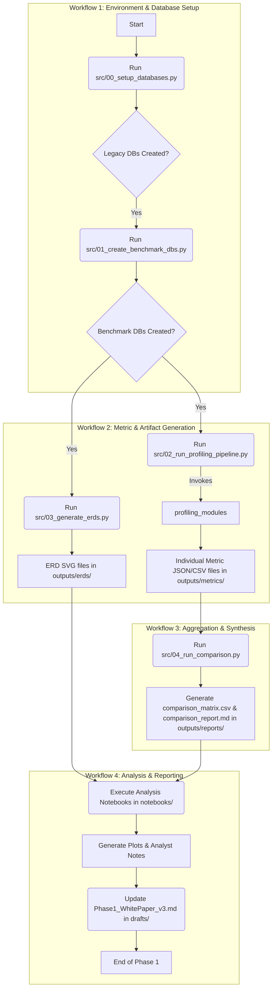

# Phase 1: Legacy Database Profiling & Architectural Analysis

> **Version:** 3.0
> **Author:** Rudolf Cesaretti
> **Last Updated:** June 11, 2025

## 1. Purpose & Core Objective

This phase focuses on the systematic, quantitative evaluation of the four legacy Teotihuacan Mapping Project (TMP) databases: `DF8`, `DF9`, `DF10`, and `REAN_DF2`. The primary goal is to produce a set of actionable, data-driven insights into their quality, structural complexity, data content, and analytical performance.

The outcomes of this phase are not merely descriptive; they are prescriptive. They directly inform the strategic decisions for Phase 2, guiding the schema redesign, justifying the move to a denormalized architecture, and establishing a reproducible, quantitative baseline for validating all future data transformations.

### 1.1 Architectural Philosophy

The architecture of the scripts and workflows in this phase is guided by a set of core data engineering principles:

* **Modularity & Reusability**: All code is broken down into single-responsibility scripts and modules. Logic for calculating specific metrics is separated from the orchestration scripts that run the pipeline, making the system easier to maintain, test, and extend.
* **Configuration over Hardcoding**: All environment-specific details (database connections, file paths) are managed in a central `config.ini` file, allowing the pipeline to be run in different environments without code changes.
* **Reproducibility & Automation**: The entire pipeline, from database setup to final report generation, is designed to be fully automated and reproducible, ensuring consistent results.
* **Resilience & Robustness**: The pipeline is designed to be resilient to errors. A failure in processing one database or calculating a single metric will be logged and will not halt the entire process, ensuring maximum data collection even in the presence of partial failures.

---

## 2. Architectural Overview

The Phase 1 process is implemented as an automated data pipeline executed across four distinct, sequential workflows. Each workflow represents a major logical stage of the project, from initial setup to final analysis.

### 2.1 The Four Workflows of Phase 1

1.  **Workflow 1: Environment & Database Setup**: This initial workflow focuses on preparing the analytical environment. It involves creating the local PostgreSQL instances of the four legacy databases from their SQL dump files and generating two denormalized "benchmark" databases from `TMP_DF9` for performance comparison.
2.  **Workflow 2: Metric & Artifact Generation**: This is the core data-gathering workflow. A primary orchestration script runs a comprehensive suite of profiling modules against all six databases. This workflow also generates the visual Entity-Relationship Diagrams (ERDs) for each schema. The output is a complete set of raw, granular metric files.
3.  **Workflow 3: Aggregation & Synthesis**: This workflow takes the dozens of raw metric files generated by Workflow 2 and synthesizes them. It aggregates the detailed data into high-level summaries and produces the two key machine-readable and human-readable reports for the entire phase.
4.  **Workflow 4: Analysis & Reporting**: The final workflow moves from automated scripting to interactive analysis. It uses a set of Jupyter Notebook templates to load, visualize, and interpret the aggregated data, culminating in the analytical conclusions that will be used to draft the final Phase 1 White Paper.

### 2.2 Architectural Flowchart

The following flowchart visually represents the sequence of these four workflows and the key tasks within them.



### 2.3 Directory Structure

The files for this phase are organized within the `phases/01_LegacyDB/` directory according to the following structure:

```
phases/01_LegacyDB/                                 # Main directory containing all assets for Phase 1.
├── src/                                            # Contains all executable Python source code.
│   ├── 00_setup_databases.py                       # Orchestrator: Sets up the 4 legacy databases from .sql dumps.
│   ├── 01_create_benchmark_dbs.py                  # Orchestrator: Creates 2 wide-format benchmark DBs from TMP_DF9.
│   ├── 02_run_profiling_pipeline.py                # Orchestrator: Runs all profiling modules against all 6 databases.
│   ├── 03_generate_erds.py                         # Orchestrator: Generates ERD SVGs for all 6 databases.
│   ├── 04_run_comparison.py                        # Orchestrator: Aggregates all raw metric files into final summary reports.
│   ├── config.ini                                  # Centralized configuration for database connections, file paths, etc.
│   ├── config.ini.example                          # Template configuration; duplicate as config.ini and fill in your credentials.
│   └── profiling_modules/                          # Python package containing all reusable metric calculation logic.
│       ├── __init__.py                             # Makes the directory a Python package.
│       ├── base.py                                 # Shared utility functions for discovering DB objects (e.g., table names).
│       ├── metrics_basic.py                        # Calculates high-level database/schema statistics (size, object counts).
│       ├── metrics_schema.py                       # Calculates structural metrics for tables/columns (row counts, sizes, bloat).
│       ├── metrics_profile.py                      # Calculates data content profiles (NULLs, cardinality) using pg_stats.
│       ├── metrics_interop.py                      # Calculates custom heuristic metrics for complexity (JDI, LIF, NF).
│       └── metrics_performance.py                  # Runs and times the canonical benchmark queries.
├── notebooks/                                      # Contains Jupyter Notebooks for analysis and reporting.
│   ├── template_individual_db_analysis.ipynb       # Template for deep-dive analysis of a single database.
│   └── template_comparative_analysis.ipynb         # Template for comparing all databases and making the final recommendation.
├── outputs/                                        # Stores all generated files from the pipeline. Should be in .gitignore.
│   ├── erds/                                       # Stores generated Entity-Relationship Diagrams as SVG files.
│   ├── metrics/                                    # Stores raw, detailed metric data as intermediate CSV and JSON files.
│   └── reports/                                    # Stores final, aggregated summary reports (comparison_matrix.csv and .md).
├── sql/                                            # Contains all SQL scripts used by the Python pipeline.
│   ├── canonical_queries/                          # Performance benchmark queries
│   │   ├── _categories.json                        # Query metadata and mappings
│   │   ├── canonical_queries_df8.sql               # TMP_DF8 specific queries
│   │   ├── canonical_queries_df9.sql               # TMP_DF9 specific queries
│   │   ├── canonical_queries_df10.sql              # TMP_DF10 specific queries
│   │   ├── canonical_queries_rean_df2.sql          # TMP_REAN_DF2 queries
│   │   └── canonical_queries_benchmark.sql         # Benchmark database queries
│   ├── canonical_queries.sql                       # A set of representative queries for performance benchmarking.
│   ├── flatten_df9.sql                             # The complex query to flatten TMP_DF9 into a wide, numeric format.
│   └── flatten_df9_text_nulls.sql                  # The query to flatten TMP_DF9 with text descriptions and proper NULLs.
├── drafts/                                         # Contains working drafts of narrative reports.
│   └── Phase1_WhitePaper_RoughDraft_v2.md          # The working draft of the final deliverable white paper for this phase.
└── README.md                                       # This file. The main documentation for Phase 1.
```

---

## 3. Key Workflows, Scripts, & Files

This section details the purpose and function of each key file, organized by the workflow in which it is used.

### 3.1 Workflow 1: Assets for Environment & Database Setup

* **`src/00_setup_databases.py`**:
    * **Objective**: To create and populate the four legacy TMP databases.
    * **Description**: Connects to the local PostgreSQL server, creates four new empty databases, and executes the corresponding `.sql` dump scripts (`TMP_DF8.sql`, etc.) to build the schemas and load the data. It is idempotent and will not fail if the databases already exist.
    * **Inputs**: `phases/01_LegacyDB/src/config.ini`, `.sql` dump files.
    * **Outputs**: Four populated PostgreSQL databases.

* **`src/01_create_benchmark_dbs.py`**:
    * **Objective**: To create the two wide-format benchmark databases.
    * **Description**: Executes the two `flatten_df9...` SQL queries against the live `TMP_DF9` database, loads the results into pandas DataFrames, creates two new databases, and writes the flattened data into them.
    * **Inputs**: `phases/01_LegacyDB/src/config.ini`, live `TMP_DF9` database, `sql/flatten_df9*.sql` files.
    * **Outputs**: Two populated benchmark PostgreSQL databases.

* **`sql/flatten_df9.sql` & `sql/flatten_df9_text_nulls.sql`**: These two powerful, hand-crafted SQL scripts perform the complex ETL process of transforming the highly normalized `TMP_DF9` database into a single, wide-format table. They are used by `01_create_benchmark_dbs.py` to create the two performance benchmark databases.

### 3.2 Workflow 2: Assets for Metric & Artifact Generation

* **`src/02_run_profiling_pipeline.py`**:
    * **Objective**: The main engine; orchestrates the execution of all profiling tasks.
    * **Description**: Iterates through all six databases (4 legacy + 2 benchmark). For each one, it calls the various metric-gathering functions from the `profiling_modules` package, passing database-specific context like schema name, and saves the output of each function to a distinct `.csv` or `.json` file in the `outputs/metrics/` directory.
    * **Inputs**: `phases/01_LegacyDB/src/config.ini`, all six live databases, `profiling_modules/`, `sql/canonical_queries/` directory.
    * **Outputs**: A complete set of raw metric data files (~40 total) in `outputs/metrics/`.

* **`src/03_generate_erds.py`**:
    * **Objective**: To automatically generate schema visualizations.
    * **Description**: Iterates through all six databases, reflects their schemas, and uses `Graphviz` to render and save high-quality ERDs as SVG files. For the complex `tmp_df9`, it also generates several smaller, focused ERDs of specific data subsystems.
    * **Inputs**: `phases/01_LegacyDB/src/config.ini`, all six live databases.
    * **Outputs**: A set of SVG files in `outputs/erds/`.

* **`src/profiling_modules/` (The Profiling Engine)**: This Python package is the analytical core of the pipeline. It contains a library of functions, organized by theme, each responsible for calculating a specific set of metrics.
    * **`base.py`**: Contains shared utility functions for discovering database objects (e.g., listing all tables in a schema).
    * **`metrics_basic.py`**: Calculates high-level summary stats (e.g., total database size, object counts).
    * **`metrics_schema.py`**: Gathers structural information about tables and columns (e.g., row counts, data types, bloat).
    * **`metrics_profile.py`**: Profiles the actual data content within columns (e.g., NULL percentages, cardinality) using the efficient `pg_stats` catalog.
    * **`metrics_interop.py`**: Calculates the custom, heuristic metrics for complexity and normalization (JDI, LIF, NF).
    * **`metrics_performance.py`**: Implements a sophisticated, metadata-driven benchmark runner. It dynamically selects a set of hand-optimized SQL queries specific to the database being profiled, executes them, and records categorized latency metrics. This ensures a fair and powerful comparison of performance across different database schemas.

* **`sql/canonical_queries/`**: This directory contains the database-specific, categorized queries for performance benchmarking.
    * **`_categories.json`**: A metadata file that maps database names (e.g., `tmp_df9`) to their corresponding SQL query files (e.g., `canonical_queries_df9.sql`) and defines descriptive categories for the queries (e.g., `baseline`, `join_performance`).
    * **`canonical_queries_*.sql`**: A series of SQL files, each containing queries hand-tuned for a specific database schema. This allows the performance benchmarks to accurately test the architectural trade-offs of each design.

### 3.3 Workflow 3: Assets for Aggregation & Synthesis

* **`src/04_run_comparison.py`**:
    * **Objective**: To aggregate and synthesize all raw metric data.
    * **Description**: This script does not connect to any database. It scans the `outputs/metrics/` directory, intelligently loads all available data, and aggregates it to produce the two final summary reports for the phase.
    * **Inputs**: All `.csv` and `.json` files in `outputs/metrics/`.
    * **Outputs**: `comparison_matrix.csv` and `comparison_report.md` in `outputs/reports/`.

### 3.4 Workflow 4: Assets for Analysis & Reporting

* **`notebooks/template_individual_db_analysis.ipynb`**: A reusable template for conducting a deep-dive analysis of a single database. It is run once for each of the six databases to produce a standardized report.
* **`notebooks/template_comparative_analysis.ipynb`**: The capstone analytical notebook that synthesizes all results to quantitatively compare the database architectures and provide the evidence for the final redesign recommendation.
* **`drafts/Phase1_WhitePaper_RoughDraft_v2.md`**: The initial draft of the final narrative report for this phase. The outputs of Workflow 4 are used to revise and complete this document.

### 3.5 General Configuration

* **`phases/01_LegacyDB/src/config.ini`**: The central configuration file for the entire pipeline. It defines PostgreSQL connection credentials and file paths for all inputs and outputs, allowing the system to run in any environment without code modification. Paths within this file are relative to `phases/01_LegacyDB/src/`.

---

## 4. Analytical Assets & Deliverables

The execution of this phase produces a rich set of data files, reports, and analytical notebooks.

### 4.1 Notebook Templates (`notebooks/`)

* **`template_individual_db_analysis.ipynb`**: A reusable template for conducting a deep-dive analysis of a single database. It is run once for each of the six databases to produce a standardized report.
* **`template_comparative_analysis.ipynb`**: The capstone analytical notebook that synthesizes all results to quantitatively compare the database architectures and provide the evidence for the final redesign recommendation.

### 4.2 Data Outputs (`outputs/`)

| Output Category | Description | Format | Location |
| :--- | :--- | :--- | :--- |
| **Raw Metrics** | A comprehensive set of granular metric files, one per metric-type per database. The primary data source for all analysis. | CSV, JSON | `outputs/metrics/` |
| **ERDs** | High-quality, scalable vector diagrams of database schemas. Includes full and focused diagrams. | SVG | `outputs/erds/` |
| **Summary Reports**| Aggregated, final reports summarizing the entire analysis. The primary deliverables of the automated pipeline. | CSV, Markdown | `outputs/reports/` |
| **Final White Paper** | A detailed document outlining the analysis, rationale, and proposed target schema. | Markdown | `drafts/` |

---

## 5. Master List of Profiling Metrics

The following metrics are systematically collected by the profiling pipeline.

### Part A: Database & Schema-Level Metrics
| Metric Name | Category | Description | Source Table/Query |
| :--- | :--- | :--- | :--- |
| Database Name | Metadata | The name of the database being profiled. | `current_database()` |
| Schema Name | Metadata | The specific schema being profiled (e.g., `tmp_df8`, `tmp_df9`). | `information_schema.schemata` |
| Database Size (MB) | Basic Stats | Total disk space used by the database. | `pg_database_size(current_database())` |
| SQL Dump File Size (MB) | Basic Stats | The file size of the source `.sql` dump file used for creation. | `os.path.getsize()` |
| Table Count | Basic Stats | Total number of user-defined tables in the schema. | `information_schema.tables` |
| View Count | Basic Stats | Total number of views in the schema. | `information_schema.views` |
| Index Count | Basic Stats | Total number of indexes in the schema. | `pg_indexes` |
| Total Index Size (MB) | Basic Stats | Total disk space used by all indexes in the schema. | `SUM(pg_relation_size(indexrelid))` |
| Foreign Key Count | Relationships | Total number of foreign key constraints in the schema. | `information_schema.table_constraints` |
| Function/Procedure Count | Schema Objects | Total number of user-defined functions or procedures. | `information_schema.routines` |
| Sequence Count | Schema Objects | Total number of sequences. | `information_schema.sequences` |
| Join Dependency Index (JDI) | Interoperability | Composite score measuring schema complexity based on FKs. | Custom Logic on `information_schema.referential_constraints` |
| Logical Interoperability Factor (LIF) | Interoperability | Quantifies potential for joining based on column name/type similarity. | Custom Heuristic on `information_schema.columns` |
| Normalization Factor (NF) | Interoperability | Composite score indicating the degree of normalization. | Custom Heuristic (JDI, Table Counts) |

### Part B: Table-Level Metrics (Generated for each table)
| Metric Name | Category | Description | Source Table/Query |
| :--- | :--- | :--- | :--- |
| Table Name | Metadata | The name of the table. | `information_schema.tables` |
| Row Count | Basic Stats | Number of rows in the table. | `pg_class.reltuples` (estimate) or `COUNT(*)` (exact) |
| Column Count | Schema Structure | Number of columns in the table. | `information_schema.columns` |
| Table Size (MB) | Basic Stats | Disk space used by the table's data (heap). | `pg_relation_size(oid)` |
| Indexes Size (MB) | Basic Stats | Disk space used by all indexes on the table. | `pg_indexes_size(oid)` |
| Total Table Size (MB)| Basic Stats | Sum of table size and all its indexes. | `pg_total_relation_size(oid)` |
| Table Bloat (MB / %) | Health | Estimated dead space within the table file. | `pgstattuple` or Community Bloat Query |
| Index Bloat (MB / %) | Health | Estimated dead space within the table's indexes. | `pgstattuple` or Community Bloat Query |
| Has Primary Key? | Relationships | Boolean indicating if the table has a primary key. | `information_schema.table_constraints` |
| Incoming FK Count | Relationships | Number of other tables that have a foreign key pointing to this table. | `information_schema.referential_constraints` |
| Outgoing FK Count | Relationships | Number of foreign keys this table has pointing to other tables. | `information_schema.referential_constraints` |

### Part C: Column-Level Metrics (Generated for each column)
| Metric Name | Category | Description | Source Table/Query |
| :--- | :--- | :--- | :--- |
| Table Name | Metadata | The parent table of the column. | `information_schema.columns` |
| Column Name | Metadata | The name of the column. | `information_schema.columns` |
| Ordinal Position | Metadata | The numeric position of the column in the table. | `information_schema.columns` |
| Data Type | Schema Structure | The PostgreSQL data type of the column. | `information_schema.columns` |
| Is Nullable? | Schema Structure | Boolean indicating if the column allows NULL values. | `information_schema.columns` |
| Is Primary Key? | Relationships | Boolean indicating if this column is part of the primary key. | `information_schema.key_column_usage` |
| Is Foreign Key? | Relationships | Boolean indicating if this column is part of a foreign key. | `information_schema.key_column_usage` |
| Null Count | Data Profile | The absolute number of NULL values in the column. | `COUNT(*) WHERE column IS NULL` |
| Null Percentage | Data Profile | The percentage of rows that are NULL. | `(COUNT(*) WHERE column IS NULL) / COUNT(*)` |
| Distinct Values | Data Profile | Number of unique, non-null values (cardinality). | `pg_stats.n_distinct` or `COUNT(DISTINCT column)` |
| Most Common Values | Data Profile | A list of the most frequent values in the column. | `pg_stats.most_common_vals` |
| Most Common Freqs | Data Profile | Frequencies corresponding to the most common values. | `pg_stats.most_common_freqs` |
| Histogram Bounds | Data Profile | Array of values that divide the column's data into equal-frequency bins. | `pg_stats.histogram_bounds` |

#### 5.3.4. Part D: Performance Metrics

The performance benchmarking system generates additional metrics that enable direct comparison of query efficiency across different database architectures:

| Metric Name | Category | Description | Source |
| :--- | :--- | :--- | :--- |
| Canonical Query Latency | Performance | Execution time (in milliseconds) for a set of predefined, representative queries. | Custom SQL script (`sql/canonical_queries.sql`) executed via Python. |
| Query Category | Performance | Functional classification of the benchmark query (baseline/join_performance/complex_filtering) | Query metadata in `sql/canonical_queries/_categories.json` |
| Database-Specific Query ID | Performance | Unique identifier for tracking equivalent queries across schemas (e.g., "1.1", "2.1", "3.1") | Query headers in database-specific SQL files |
| Schema Efficiency Factor | Performance | Relative performance comparing normalized vs. denormalized schemas for the same analytical task | Calculated: (normalized_latency / denormalized_latency) |
| Join Complexity Impact | Performance | Performance degradation caused by multi-table joins compared to baseline scans | Calculated: (join_query_latency / baseline_query_latency) |
| Query Success Rate | Performance | Percentage of benchmark queries that execute successfully for each database | Calculated from status field: (successful_queries / total_queries) × 100 |
| Performance Improvement Factor | Performance | Percentage improvement of wide-format over normalized schemas | Calculated: ((normalized_latency - denormalized_latency) / normalized_latency) × 100 |

These comparative metrics are essential for the Phase 1 white paper's quantitative argument for database denormalization. The performance differences between highly normalized schemas (like TMP_DF9 with its 18 core tables and 45 lookup tables) and the wide-format benchmark databases provide empirical evidence for the proposed architectural changes.


---

## 6. Tools & Technologies

* **Databases**: PostgreSQL (v17+)
* **Programming**: Python 3.11+ (with libraries: Pandas, SQLAlchemy, Psycopg2), SQL
* **Schema Visualization**: Graphviz
* **Development Environment**: Jupyter Notebooks
* **Version Control**: Git

---

## 7. How to Execute Phase 1

To run the entire automated analysis pipeline, execute the scripts in the `src/` directory in the following sequence. This sequence follows the four major workflows defined in the architecture. Ensure the environment is configured first as detailed in the script-specific notes.
At a minimum, copy `src/config.ini.example` to `phases/01_LegacyDB/src/config.ini` and update the connection details before running any scripts.

1.  **Execute Workflow 1: Environment & Database Setup**
    * Run `python 00_setup_databases.py` to create the four legacy databases.
    * Run `python 01_create_benchmark_dbs.py` to create the two wide-format benchmark databases.
2.  **Execute Workflow 2: Metric & Artifact Generation**
    * Run `python 02_run_profiling_pipeline.py` to generate all raw metric files. **(This is the longest-running step)**.
    * Run `python 03_generate_erds.py` to generate all schema diagrams.
3.  **Execute Workflow 3: Aggregation & Synthesis**
    * Run `python 04_run_comparison.py` to aggregate all raw metrics into the final summary reports.
4.  **Execute Workflow 4: Analysis & Reporting**
    * Use the templates in the `notebooks/` directory to explore the generated reports and synthesize the final analysis for the white paper.

---

## 4. Project Setup & Execution

### 4.1 Configuration (`config.ini`)

For Phase 1, the primary configuration file is `config.ini`, located within the `phases/01_LegacyDB/src/` directory. Python scripts in `phases/01_LegacyDB/src/` expect to find it here. This file centralizes all environment-specific settings (database credentials, file paths, etc.), allowing scripts to be run in different environments without code modification. It is **critical** to add `config.ini` to your `.gitignore` file to prevent committing sensitive information like database passwords to version control. A `config.ini.example` is provided as a template.

All paths defined within this `config.ini` (e.g., for SQL dumps, output directories) are relative to the `phases/01_LegacyDB/src/` directory.

**Key Configuration Sections:**
